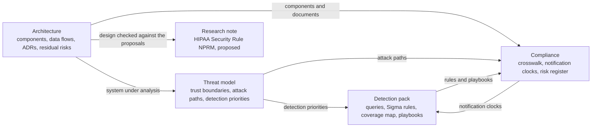

# Contoso Regional Health (fictional): a connected Zero Trust reference set

> **Reference work.** Fictional scenario built for a public portfolio. Not deployed in, derived from, or describing any employer environment. Not professional advice.

**AI-assisted.** Anthropic's Claude researched and drafted this repository, and Jacob Welch decided its scope questions and what to publish (see [AI assistance](#ai-assistance)).

One fictional health system, worked through in five connected parts: a Zero Trust reference architecture, a threat model of that architecture, a detection pack that answers the threat model, a compliance crosswalk that ties the architecture and the detections to the HIPAA Security Rule, NIST CSF 2.0, and PCI DSS v4.0.1, and a sourced research note on the proposed changes to the HIPAA Security Rule. Each part cites its sources and records what it leaves open.

## The scenario

Contoso Regional Health is a not-for-profit regional health system and HIPAA covered entity: 3 hospitals, 22 outpatient clinics, about 9,500 workforce members, and about 6,000 connected medical devices, most of which cannot run an endpoint agent. Some clinical applications still need Kerberos or NTLM, and the EHR vendor, biomedical device vendors, and a revenue-cycle outsourcer all need access. The stack is Microsoft Entra ID P2 (hybrid with on-premises Active Directory), Microsoft 365 E5, Intune, Microsoft Defender XDR, and Microsoft Sentinel as the SIEM. Card payments at registration desks and online create a PCI DSS cardholder data environment.

The fixed scenario, and the 19 assumptions the design depends on, are in [01-scenario-and-assumptions.md](architecture/zero-trust-healthcare/01-scenario-and-assumptions.md).

## What is here

| Part | Folder | Contents |
|---|---|---|
| Architecture | [architecture/zero-trust-healthcare/](architecture/zero-trust-healthcare/) | A logical Zero Trust architecture on the NIST SP 800-207 component model, with a frozen component glossary that every other part reuses. Identity and access design, including a reference Conditional Access set (CA-01 to CA-22) and privileged access tiering. Segmentation for clinical, medical device, legacy, and cardholder data zones. A CISA Zero Trust Maturity Model v2.0 roadmap. Nine architecture decision records (ADRs), each with at least one rejected alternative. |
| Threat model | [threat-models/zero-trust-healthcare/](threat-models/zero-trust-healthcare/) | Nine trust boundaries with STRIDE per boundary (TB-6 is analyzed within TB-2's table, and TB-9, the recovery-plane boundary, waits for the recovery design), seven ranked attack paths mapped to MITRE ATT&CK Enterprise v19.2 (current as of 2026-10-04), 20 detection priorities in three tiers, and a purple team plan that specifies behaviors and expected telemetry, with no attack procedures. |
| Detection pack | [detections/zero-trust-healthcare/](detections/zero-trust-healthcare/) | 22 rules, all untested templates: 9 Microsoft Defender XDR advanced hunting queries, 7 Microsoft Sentinel analytics queries, and 6 Sigma rules. A coverage map that records the gaps. Two incident response playbooks aligned to NIST SP 800-61 Rev. 3, for identity compromise and for ransomware, and a ransomware tabletop exercise kit; none has been exercised. |
| Compliance | [grc/zero-trust-healthcare/](grc/zero-trust-healthcare/) | A crosswalk of all 65 HIPAA Security Rule standards and implementation specifications to NIST CSF 2.0, the architecture, the detections, and PCI DSS v4.0.1 (cardholder data environment only), with a relationship strength on every CSF 2.0 and PCI DSS link. A JSON schema, a PowerShell validator, and its test suite. A breach and incident notification clock matrix, and a register of 12 risks. |
| Research | [research/zero-trust-healthcare/](research/zero-trust-healthcare/) | The status of the January 2025 HIPAA Security Rule notice of proposed rulemaking as of 2026-10-07 (proposed, not final), what it proposes, and how the design lines up with it, plus a consolidated source list. |

Three IDs used here are ATT&CK v19 additions that readers who know v18 may not recognize: TA0112, the Defense Impairment tactic (v19 split the former Defense Evasion tactic into Stealth, TA0005, and Defense Impairment); T1685, Disable or Modify Tools, a technique under Defense Impairment; and T1684.001, Social Engineering: Impersonation, which v19 places under Stealth.

The folders keep a nested `<part>/zero-trust-healthcare/` layout on purpose: the crosswalk validator finds its companion folders through relative paths in `crosswalk.yaml` (`metadata.paths`, such as `../../architecture/zero-trust-healthcare`), and the documents cite each other by these paths.

## How the parts connect



- **Architecture.** It defines the component IDs (such as `PE-IDENTITY` and `PEP-VENDOR-BROKER`), data flows, Conditional Access policy IDs, and residual risks (RR-01 to RR-16) that the other parts reuse.
- **Threat model.** It analyzes the architecture as designed. Each attack path step names the data source that would see it and the component that breaks the path, or the residual risk if none does.
- **Detection pack.** It responds to the threat model's 20 detection priorities, which are grouped in three tiers, with 19 covered by at least one rule. The coverage map ties each rule to its technique, data source, and attack path, and records where coverage is partial or missing.
- **Compliance.** The crosswalk maps each HIPAA provision to CSF 2.0 and to the architecture components, documents, and detections that support it, and adds PCI DSS v4.0.1 for the cardholder data environment only. The risk register ties its risks to the attack paths and residual risks, and the notification clock matrix supplies the regulatory clocks for the playbooks' decision points.
- **Research note.** It checks the design against the proposed HIPAA Security Rule changes, without treating any proposal as a requirement.

## A suggested reading path

A suggested order; the last entry shows where the design stops.

| # | Read | What it shows |
|---|---|---|
| 1 | [ADR-001](architecture/zero-trust-healthcare/adr/ADR-001-decision-planes-and-zta-approach.md) and [ADR-008](architecture/zero-trust-healthcare/adr/ADR-008-clinical-continuity-failure-modes.md) | Keeps clinical care local-first through an internet or Entra ID outage, because the backup authentication service issues no new sessions and a shift change is all new sessions, and fails remote and administrative access closed |
| 2 | [ADR-003](architecture/zero-trust-healthcare/adr/ADR-003-phishing-resistant-mfa-and-clinical-badges.md) and the [Conditional Access set](architecture/zero-trust-healthcare/03-identity-and-access.md#3-reference-conditional-access-policy-set) | Chooses certificate badges over FIDO2 keys for shared clinical workstations, because a badge signs in against the local domain without internet, and starts every policy (CA-01 to CA-22) in report-only mode |
| 3 | [The clinical safety gate](architecture/zero-trust-healthcare/04-segmentation.md#containment-with-a-clinical-safety-gate) | Never lets automation disconnect a medical device in active patient use, and excludes the medical device segments from automatic attack disruption so that a person decides |
| 4 | [ADR-007](architecture/zero-trust-healthcare/adr/ADR-007-cde-scope-reduction-p2pe-redirect.md) | Shrinks PCI DSS scope to P2PE terminals and a full redirect to a payment service provider before adding controls, while billing records stay PHI under HIPAA |
| 5 | [AP-4](threat-models/zero-trust-healthcare/attack-paths.md#ap-4-ransomware-against-clinical-operations) | Ranks ransomware against clinical operations first, walks it step by step, and names recovery as the decisive control for impact |
| 6 | [Ransomware playbook](detections/zero-trust-healthcare/playbooks/ir-ransomware.md) | Turns AP-4 into decisions: containment under the clinical safety gate, downtime with the clinical consequence of each broad containment action (from ADR-008 where it defines one), recovery steps that name the unbuilt ADR-009 requirements they depend on, a breach analysis that starts from HHS's presumption, and the ransom demand framed for executives with no recommendation |
| 7 | [SN-01](detections/zero-trust-healthcare/kql/sentinel/sn01-mfa-method-change-then-new-country-or-inbox-rule.kql) | Alerts on a chain rather than its noisy links (an MFA method change, then within 24 hours a new-country sign-in or a mail-hiding or forwarding rule), and names the link it cannot see |
| 8 | [Notification clocks](grc/zero-trust-healthcare/notification-clocks.md) | Runs every HIPAA and card brand clock from one incident timeline, and starts the HIPAA clock at the earliest knowledge, including what reasonable diligence would have revealed |
| 9 | [HIPAA Security Rule NPRM note](research/zero-trust-healthcare/hipaa-security-rule-nprm-status.md) | Treats every proposal as proposed, backs the status with dated primary checks, and names the sharpest tension with the design: no active scanning of medical devices |
| 10 | [Reference architecture, section 13](architecture/zero-trust-healthcare/02-reference-architecture.md#13-what-this-architecture-does-not-solve) and [coverage map, section 4](detections/zero-trust-healthcare/coverage-map.md#4-what-the-pack-cannot-see-yet) | Shows the limits: 16 residual risks, each with the reason it stays open, and what the detection pack cannot see yet |

## Run the crosswalk validator

The validator and its tests need Windows PowerShell 5.1 and no modules, and they have not been tested under PowerShell 7. From `grc/zero-trust-healthcare/`:

```powershell
powershell -NoProfile -ExecutionPolicy Bypass -File .\validate-crosswalk.ps1
powershell -NoProfile -ExecutionPolicy Bypass -File .\tests\run-tests.ps1
```

- **Validator.** It checks `crosswalk.yaml` in six stages: text rules; a parse under a strict YAML subset; structure against `crosswalk.schema.json` (JSON Schema draft-07); content (all 65 HIPAA rows present once with the right titles and designations, identifiers from the catalogs, PCI DSS targets only on rows scoped to the cardholder data environment, every citation resolving to a source); references into the architecture and detection folders; and agreement with `crosswalk.md`. Exit code 0 means no failures, 1 means one or more failures, and 2 means the validator could not run. Add `-Json` for a single line of JSON output.
- **Tests.** The suite runs the validator against the fixtures in `tests/fixtures/`. Most failing fixtures are a known-good file with exactly one change, and a case passes only when its exit code and its complete list of findings match. Add `-Case <pattern>` to run some of the cases, or `-Detail` to print every finding.
- **Line endings.** The repository's `.gitattributes` turns off line-ending conversion, because two test cases compare fixture text that contains LF line breaks.

## Limitations

- **Fictional and untested.** This is reference work for a fictional organization, and nothing in the design set has been tested. The risk register's likelihood and impact scores are illustrative judgments with no measured data behind them, and its residual scores describe intent, not evidence.
- **Detections are untested templates.** Every rule was written against Microsoft's published table schemas, the Sigma specification v2.1.0, and ATT&CK v19.2 data. Claude ran static checks on 2026-10-05: all 16 KQL queries parse and pass semantic analysis with Microsoft's Kusto.Language library (version 12.4.1) against table schemas built from Microsoft Learn's reference pages; all six Sigma rules pass `sigma check` (sigma-cli 3.1.0, pySigma 1.5.1); and the four process-creation rules convert to Defender XDR queries with `sigma convert -t kusto -p microsoft_xdr` (pySigma-backend-kusto 1.0.1), while the two Windows Security log rules do not, as their notes predict. No rule has been run against any tenant, workspace, or lab. Severities are suggestions, and no rule carries tuning from real telemetry. Neither incident response playbook has been exercised in a tabletop or a lab, and the ransomware tabletop kit has not been run.
- **The purple team plan is a design, not a record.** It describes how the rules and controls would be validated in a lab. Its exercises have not been run, which is why every rule is still an untested template.
- **Policies need report-only validation before enforcement.** Every Conditional Access policy in the reference set starts in report-only mode and is reviewed against sign-in logs before enforcement. Some carry specific conditions: before CA-13b is enforced, a report-only run must show a vendor's activation request and the Temporary Access Pass registration flow completing, and CA-19 must be validated against the Windows Hello for Business and macOS Platform SSO registration flows.
- **Some design points wait on lab tests.** For example, whether a device's registered owner can write the device tag that marks a privileged access workstation, and whether two Temporary Access Pass read permissions can create a pass (`03-identity-and-access.md` sections 3 and 4).
- **Time-sensitive facts were last checked on 2026-10-03, 2026-10-04, or 2026-10-07.** The current ATT&CK version, the preview and rollout status of Microsoft features, announced Microsoft changes such as the NTLMv1 enforcement default in KB5066470, the status of the proposed HIPAA Security Rule changes, and the status of the CIRCIA final rule can all change after those dates. Documents list their sources, with check dates, in a Sources section, or point to the companion documents whose Sources sections they rely on.
- **Open design items.** The design does not yet say whether Microsoft Defender for Endpoint runs on the Tier 0 servers (threat model TM-A4, and section 9 item 8), so the logon and process signals of rule DX-07 need telemetry the design does not yet state. Managed identity sign-in monitoring is not built (coverage map, section 3, item 11). Recovery is specified as requirements only, so recovery capability is unverified until restores are tested (ADR-009, RR-11). The ransomware playbook does not change that: its recovery steps depend on copies and restore evidence that do not exist yet (coverage map, section 7).
- **Out of scope by design.** Detailed network engineering, backup and recovery implementation, key management products, most physical safeguards, EHR internals, and state breach-notification law (`01-scenario-and-assumptions.md`, Out of scope).
- **An analysis, not an audit.** The crosswalk's relationship strengths are an analysis of the published texts, not an official mapping by HHS, NIST, or PCI SSC, and the crosswalk certifies nothing about any organization.

## License

- **Code: [MIT License](LICENSE).** Covers the KQL queries (`.kql`), the Sigma rules (`.yml`), the PowerShell validator and test runner (`.ps1`), `crosswalk.schema.json`, and everything under `grc/zero-trust-healthcare/tests/`. Why: it is short and permissive, so the queries, rules, and scripts can be reused and adapted as long as the copyright and license notice travel with them.
- **Documentation and data: [CC BY 4.0](LICENSE-docs).** Covers the Markdown documents outside `grc/zero-trust-healthcare/tests/`, `crosswalk.yaml`, and `risk-register.csv`. Why: it allows reuse and adaptation of the written analysis and data with credit, and unlike a software license it is designed for written works and data.

Copyright 2026 Jacob Welch. Both licenses cover original content only. Third-party names, identifiers, and quoted material stay under their owners' terms, as [NOTICE.md](NOTICE.md) records.

## AI assistance

Anthropic's Claude researched, drafted, and revised the documents, detection rules, queries, and scripts in this repository, and checked their cited facts against their sources. Jacob Welch owns the project, decided its scope questions and what to publish, and is named as the accountable author, including in the Sigma rules' `author` field. Decisions he made include these three:

- **Recovery as requirements only.** [ADR-009](architecture/zero-trust-healthcare/adr/ADR-009-recovery-requirements.md) sets four recovery requirements and designs no product, rather than designing recovery in full or leaving it out of scope.
- **At-rest encryption, designed but bounded.** The design sets one requirement for each class of data store ([reference architecture, section 7](architecture/zero-trust-healthcare/02-reference-architecture.md#data-at-rest-by-data-store-class)) rather than recording encryption as out of scope, and carries medical devices that cannot encrypt as residual risk RR-15.
- **Card brand sources.** The notification clock matrix cites the American Express policy, which American Express marks confidential, by title, edition, and section only, and gives no Mastercard time limit rather than one that could not be verified.

Before the initial publication on 2026-10-07, Jacob Welch read the README, ADR-001, ADR-003, ADR-007, ADR-008, and the Conditional Access policy set.

## Author

**Jacob Welch.** 17+ years in IT and systems administration, including regulated healthcare and financial services. Current role: Associate Director of Security and Compliance. [LinkedIn](https://www.linkedin.com/in/jacobwelch21)

The identity and access design, the Defender XDR advanced hunting queries, and the HIPAA crosswalk draw on the skill areas closest to his own work: Conditional Access and Privileged Identity Management (PIM) in Microsoft Entra ID, KQL threat hunting in Microsoft Defender, and HIPAA Security Rule compliance, where he serves as a designated HIPAA Security Officer and runs the HIPAA Security Risk Analysis. Like the rest of the repository, those parts were written for the fictional scenario from public sources and contain no employer configuration.

The scenario deliberately reaches beyond his hands-on experience into areas such as hospital clinical operations, clinical engineering, medical device network segmentation and admission (NAC and 802.1X), SIEM analytics in Microsoft Sentinel, detection engineering, threat modeling, and PCI DSS; those parts of the repository are design and analysis work.

Certifications:

- Certified Information Security Manager (CISM), ISACA
- Microsoft Certified: Cybersecurity Architect Expert (SC-100)
- Microsoft Certified: Security Operations Analyst Associate (SC-200)
- Microsoft Certified: Identity and Access Administrator Associate (SC-300)
- Microsoft Certified: Azure Security Engineer Associate (AZ-500)
- Microsoft 365 Certified: Administrator Expert
- CompTIA Security+ ce
- ITIL 4 Foundation in IT Service Management
