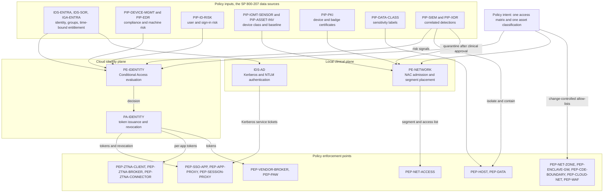
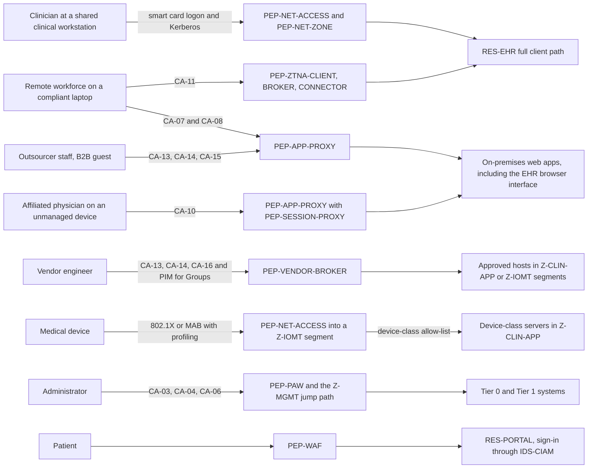
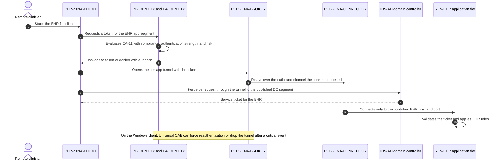
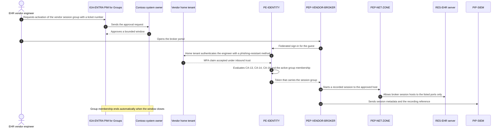

# Contoso Regional Health (fictional): Zero Trust reference architecture

> **Reference work.** Fictional scenario built for a public portfolio. Not deployed in, derived from, or describing any employer environment. Not professional advice.

This document defines the logical Zero Trust architecture for Contoso Regional Health (fictional), using the component model of NIST SP 800-207 (August 2020). Scenario facts and assumptions A-01 to A-19 are in `01-scenario-and-assumptions.md`. Section 11 holds the component glossary. Its IDs are frozen, and every companion artifact (threat model, detections, compliance crosswalk) uses them.

## 1. Architecture at a glance

- **Two decision planes, one policy intent.** A cloud identity plane, with Microsoft Entra Conditional Access as the policy engine, governs remote, federated, external, administrative, and cloud access. A local clinical plane (Active Directory authentication, network admission control, zone firewalls, and the EHR's own role-based access) governs on-site clinical access from clinical workstations in `Z-CLIN-USER`. The local plane keeps working when a hospital loses its internet circuit or the cloud identity service is unavailable. Both planes are authored from one access matrix. (ADR-001, ADR-008)
- **Identity-centric where an identity exists.** Phishing-resistant MFA rolls out by risk tier. Administrators go first; shared clinical workstations go last and use certificate badges. Privileged access is just-in-time through PIM, from privileged access workstations. (ADR-003, ADR-004)
- **Network-enforced where it does not.** About 6,000 medical devices are discovered passively, classified, and placed in device-class segments with allow-listed flows. Containing a device that is in clinical use requires a clinical decision. (ADR-006)
- **No network-level remote access for users.** Each remote access type gets its own path:
  - Web apps: an identity-aware proxy.
  - Non-web apps: per-app ZTNA, which is a licensed add-on.
  - Unmanaged devices: browser sessions with in-session controls.
  - Vendors: a recorded broker.

  User VPN is retired. (ADR-002)
- **Legacy contained, not trusted.** Applications that need Kerberos or NTLM sit in a gateway-enforced enclave on an NTLM retirement path. (ADR-005)
- **Scope reduced before controls added.** The CDE shrinks to P2PE terminals, plus a full redirect to a payment service provider for online payments. (ADR-007)
- **Signals feed decisions.** Defender XDR and Sentinel feed risk back into the policy engine and trigger response actions. Clinical-safety gates apply to any action that could interrupt care.
- **Recovery is specified, not designed.** Copies must be immutable and offline, administered outside production Tier 0's reach, restore-tested with evidence, and monitored as Tier 0. Products and recovery objectives are Contoso's, and recovery stays unverified until restores are tested. (ADR-009)
- **Every class of ePHI store has an at-rest requirement.** Medical devices that cannot encrypt are owned, dated exceptions, and segmentation limits network access to them. (Section 7, RR-15)

## 2. Approach (SP 800-207 Section 3.1)

SP 800-207 describes three approaches: enhanced identity governance (3.1.1), micro-segmentation (3.1.2), and network infrastructure and software defined perimeters (3.1.3). Contoso uses each where it fits, rather than forcing one model onto subjects it cannot serve.

| Approach | Where Contoso uses it | Why |
|---|---|---|
| Enhanced identity governance (3.1.1) | Primary approach for every subject that can carry an identity: workforce, affiliated physicians, vendors, the outsourcer, administrators, and workload identities | Identity is where Contoso already has the richest decision inputs: device compliance, identity risk, and time-bound entitlement |
| Micro-segmentation (3.1.2) | Medical devices, the legacy clinical enclave, the CDE, and per-application segments in the datacenter | Agentless devices and legacy protocols cannot take part in identity-based decisions, so the network is the only enforcement point available |
| Network infrastructure and software defined perimeters (3.1.3) | Per-app ZTNA for remote access to non-web private apps | Replaces network-level VPN access with per-application tunnels admitted by the identity policy engine |

## 3. Logical components (SP 800-207 Section 3)

SP 800-207 splits the policy decision point (PDP) into a policy engine (PE) and a policy administrator (PA), places policy enforcement points (PEPs) in the data path, and lists the data sources that feed the engine. The table maps each element to Contoso. Component IDs are defined in section 11.

| SP 800-207 element | Contoso realization | Notes |
|---|---|---|
| Policy engine (PE) | `PE-IDENTITY` for the cloud identity plane. `PE-NETWORK` for network admission. On the local clinical plane, `IDS-AD` acts as the authentication decision point for Kerberos and NTLM. | The local plane decides with fewer inputs (no Conditional Access risk evaluation). This is a deliberate tradeoff, recorded in ADR-001 and ADR-008. |
| Policy administrator (PA) | `PA-IDENTITY` issues and revokes tokens. `PE-NETWORK` pushes its own decisions to switches, since NAC platforms combine the PE and PA roles. `PEP-ZTNA-BROKER` performs PA functions when it sets up per-app tunnels. | |
| Policy enforcement points (PEP) | The `PEP-` components in section 11 | Enforcement is layered: application, session, ZTNA, broker, access layer, zone boundary, host, cloud network, and data |
| Data source: continuous diagnostics and mitigation (CDM) system | `PIP-DEVICE-MGMT`, `PIP-EDR`, `PIP-VULN`, `PIP-ASSET-INV`, `PIP-IOMT-SENSOR` | Device compliance, machine risk, vulnerability state, and device class |
| Data source: industry compliance system | HIPAA and PCI DSS obligations, expressed as rules in Conditional Access, segmentation, and data protection policy | Traced in the companion compliance crosswalk |
| Data source: threat intelligence feed(s) | `PIP-TI` | Consumed through `PIP-XDR` and `PIP-SIEM` |
| Data source: network and system activity logs | Collected by `PIP-SIEM` | Identity, endpoint, firewall, NAC, and IoMT sensor logs |
| Data source: data access policies | `PIP-DATA-CLASS`, plus the EHR's role-based access model | EHR role design is out of scope |
| Data source: enterprise public key infrastructure (PKI) | `PIP-PKI` | Device certificates for 802.1X and smart card badge certificates |
| Data source: ID management system | `IDS-AD`, `IDS-ENTRA`, `IDS-SYNC`, `IDS-SOR`, `IGA-ENTRA` | Identity, group, and entitlement state |
| Data source: security information and event management (SIEM) system | `PIP-SIEM`, with `PIP-XDR` | Correlation and response automation |

### Diagram 1: decision planes, inputs, and enforcement

## 4. Deployment variations (SP 800-207 Section 3.2)

| Variation | Used | Where and why |
|---|---|---|
| 3.2.1 Device agent/gateway-based deployment | Yes | Managed endpoints run `PEP-ZTNA-CLIENT`. `PEP-ZTNA-CONNECTOR` fronts the published apps. |
| 3.2.2 Enclave-based deployment | Yes | The legacy clinical enclave (`PEP-ENCLAVE-GW`), the IoMT device-class segments, and the CDE. SP 800-207 notes that this model suits enterprises with legacy applications or on-premises data centers that cannot place an individual gateway in front of each resource. That describes Contoso's legacy apps and medical devices. |
| 3.2.3 Resource portal-based deployment | Yes | `PEP-APP-PROXY` with `PEP-SESSION-PROXY` for unmanaged devices, and `PEP-VENDOR-BROKER` for vendors (note 1). |
| 3.2.4 Device application sandboxing | No | Considered for affiliated physicians' personal devices. Rejected in favor of browser sessions with in-session controls, which need no Contoso software on a device Contoso does not own. Revisit if browser controls prove insufficient. |

**Notes to the deployment variations table.**

1. **3.2.3 Resource portal-based deployment.** This relates to the SP 800-207 use cases for contracted services and nonemployee access (Section 4.3) and for collaboration across enterprise boundaries (Section 4.4), both of which point to this model. Section 3.2.3 itself calls the portal model more flexible for BYOD policies and inter-organizational collaboration projects, because no software component has to be installed on client devices. It also notes the cost: the enterprise sees a device only while it is connected to the portal, which is why CA-10 limits what an unmanaged session can do.

## 5. Trust algorithm (SP 800-207 Section 3.3)

SP 800-207 distinguishes criteria-based from score-based trust algorithms, and singular from contextual ones (Section 3.3.1). Contoso's identity plane is criteria-based and contextual:

- Conditional Access combines conditions with grant and session controls.
- Risk arrives as levels (low, medium, high), computed by the signal providers from history and behavior.

No component computes a single numeric trust score, and the design does not pretend one exists.

| Input | Source component | Consumed by | Example effect |
|---|---|---|---|
| Subject identity, groups, and persona | `IDS-ENTRA`, `IDS-SOR` | `PE-IDENTITY` | Selects the persona-specific policies in the Conditional Access set (03) |
| Time-bound entitlement | `IGA-ENTRA` | `PE-IDENTITY` | A vendor's session group exists only while a Contoso owner has approved its activation |
| Authentication method used | `PA-IDENTITY` | `PE-IDENTITY` | Administrators, ZTNA users, and vendors must present a phishing-resistant method |
| Device compliance and machine risk | `PIP-DEVICE-MGMT`, `PIP-EDR` | `PE-IDENTITY` | A noncompliant laptop loses desktop-client access to ePHI apps |
| User and sign-in risk | `PIP-ID-RISK` | `PE-IDENTITY` | Step-up authentication, block, or risk remediation |
| Network location | Named locations in `PE-IDENTITY` | `PE-IDENTITY` | External identities are limited to contract-approved countries. This is a coarse signal, not a boundary. |
| Application sensitivity | Authentication contexts and app assignment | `PE-IDENTITY` | Phishing-resistant reauthentication on a compliant device when a privileged role is activated (CA-06). Microsoft documents a 10-minute window in which a further activation does not prompt again. |
| Device certificate | `PIP-PKI` | `PE-NETWORK` | A managed clinical workstation joins `Z-CLIN-USER` |
| Device class and communication baseline | `PIP-IOMT-SENSOR`, `PIP-ASSET-INV` | `PE-NETWORK` | An infusion pump lands in `Z-IOMT-INFUSION` |
| Correlated detections | `PIP-SIEM`, `PIP-XDR` | `PA-IDENTITY`, `PEP-HOST`, `PE-NETWORK` | Revoke sessions, contain a device, or quarantine a medical device after clinical approval |

Precedence rules:
- Conditional Access: a block beats a grant, and every applicable policy must be satisfied.
- Network plane: NAC policy places a device in exactly one segment, and a device it cannot classify goes to `Z-IOMT-ONBOARD`.

## 6. Access paths

### Diagram 2: who reaches what, through which enforcement points

Policy IDs (CA-01 to CA-22) are defined in `03-identity-and-access.md`.

## 7. Trust zones

Zone details, allowed flows, and the zone diagram are in `04-segmentation.md`. Summary:

| Zone ID | Name | Contents | Entry enforcement | Posture |
|---|---|---|---|---|
| `Z-INET` | Internet and untrusted networks | Remote users, patients, unmanaged devices | None (untrusted) | Untrusted |
| `Z-MSCLOUD` | Microsoft cloud services | Entra ID, Intune, Defender XDR, Sentinel, Purview, Microsoft 365, the Global Secure Access edge | Microsoft-operated. Contoso controls the tenant configuration. | Trusted provider, shared responsibility |
| `Z-EXTERNAL` | Third parties | PSP, P2PE provider, telehealth service, vendor and outsourcer environments, partner tenants | Contracts and cross-tenant settings | Untrusted except as contracted |
| `Z-GUEST` | Guest and patient Wi-Fi | Visitor and patient devices | `PEP-NET-ACCESS` | Internet only, client isolation |
| `Z-CORP` | Corporate endpoints | Assigned laptops and desktops | `PEP-NET-ACCESS` (802.1X EAP-TLS) | Managed, verified per request |
| `Z-CLIN-USER` | Clinical user zone | Shared clinical workstations, workstations on wheels, Contoso-owned clinical mobile devices | `PEP-NET-ACCESS` (802.1X EAP-TLS) | Managed, local clinical plane |
| `Z-CLIN-APP` | Clinical application zone | EHR, PACS, LIS, pharmacy, integration engine, device-class servers, micro-segmented per application | `PEP-NET-ZONE` | High value, allow-listed |
| `Z-LEGACY` | Legacy clinical enclave | Applications that need Kerberos or NTLM | `PEP-ENCLAVE-GW` | Contained, on a retirement path |
| `Z-IOMT` | Medical device segments | Device-class sub-segments, listed in 04 | `PE-NETWORK` through `PEP-NET-ACCESS`, then `PEP-NET-ZONE` | No identity, network-enforced allow-lists |
| `Z-CDE` | Cardholder data environment | P2PE terminals | `PEP-CDE-BOUNDARY` | Outbound only, to the P2PE provider |
| `Z-IOT-ENT` | Enterprise IoT and facilities | Printers, badge readers, cameras, building systems | `PEP-NET-ACCESS`, `PEP-NET-ZONE` | Contained. Detailed design is out of scope. |
| `Z-CORP-APP` | Corporate applications | HR and credentialing systems, file services, configuration management database | `PEP-NET-ZONE` | Allow-listed |
| `Z-CONNECTOR` | Connector segments | ZTNA and application proxy connector groups, one per published zone | `PEP-NET-ZONE` | Outbound to the broker, no inbound, reach limited to published apps |
| `Z-VENDOR` | Vendor access zone | `PEP-VENDOR-BROKER` and its session hosts | `PEP-NET-ZONE` | Reaches approved targets only during approved windows |
| `Z-MGMT` | Management zone | PAWs, jump hosts, NAC policy servers, IoMT sensor management, log collectors, infrastructure management interfaces | `PEP-NET-ZONE` | Administrative origin, management plane |
| `Z-T0` | Tier 0 identity zone | Domain controllers, directory synchronization servers, PKI issuing CAs | `PEP-NET-ZONE` | Highest trust. Reachable for authentication, administered only from Tier 0 PAWs. |
| `Z-DMZ` | Internet-facing services | Portal web tier behind `PEP-WAF`, managed file transfer gateway | `PEP-WAF`, `PEP-CLOUD-NET`, `PEP-NET-ZONE` | Exposed, with no direct path to data tiers |
| `Z-AZURE` | Azure workloads | Portal back end, integration services, analytics | `PEP-CLOUD-NET` | Allow-listed, private endpoints for platform services |

`SVC-BACKUP` sits outside every zone in this table. ADR-009 decision 2 defines the boundary between the production zones and the recovery plane: copies cross it inbound, restores cross it back as writes into production, and no management connection crosses it from production. The companion threat model records it as trust boundary TB-9.

### Data at rest by data-store class

Each class of store that holds ePHI has one at-rest requirement. The requirements are vendor-neutral, and any implementation that meets one satisfies it. The last column names one example from the scenario stack, checked at Microsoft Learn on 2026-10-04. Two limits apply to every row:

- **What encryption at rest covers.** It protects data on media that leave Contoso's control: a lost or stolen device, a removed or discarded drive, or a copied disk image, database file, or backup. It does not protect data from an identity or process that is authorized to read it on a running system. Access control, segmentation, and detection cover that case.
- **What it does not decide.** Meeting a requirement is not, on its own, a finding that ePHI is secured under the HHS guidance on unsecured PHI. That depends on the encryption process and on the key not being compromised, and it is decided case by case in Contoso's breach risk assessments (companion `notification-clocks.md` section 2).

| Data-store class | Components | Zone | Encryption at rest in this design set | Example implementation (one option) |
|---|---|---|---|---|
| Microsoft 365 data | `RES-M365` | `Z-MSCLOUD` | Required for all content: the provider's managed encryption at rest, confirmed in Contoso's risk analysis rather than assumed. Labeled ePHI is also encrypted by its sensitivity label, which stays with the content when it leaves the service (`PEP-DATA`, phase 3, WP-3.3). | Microsoft-managed volume, file, and mailbox encryption in Microsoft 365, plus Purview sensitivity labels with encryption |
| File services | `RES-FILES` | `Z-CORP-APP` | Required: volume encryption on every file server volume that holds shares. Labeled ePHI files are also encrypted by label (`PEP-DATA`, WP-3.3). The scanner labels files on each scan cycle, not in real time, and by default encrypts only Office and PDF files. | BitLocker on Windows Server data volumes, plus the Purview Information Protection scanner |
| Managed endpoints | Assigned laptops and desktops; shared clinical workstations and clinical mobile devices | `Z-CORP`, `Z-CLIN-USER` | Required: full-disk or platform encryption on every managed device, set by device configuration and checked by the compliance policy (`PIP-DEVICE-MGMT`), with recovery keys escrowed in the directory. `PEP-DATA` on endpoints controls what users do with labeled content; it does not encrypt device storage. | BitLocker (Windows) and FileVault (macOS) through Intune disk encryption policy; a required passcode on iOS and iPadOS, which turns on device encryption; Android Enterprise devices, which enforce encryption |
| Personal phones under app protection | Organization data in policy-managed apps on personal phones (CA-09) | `Z-INET` | Required: organization data inside policy-managed apps is encrypted by the app protection policy. Contoso does not manage the rest of the device. | Intune app protection policy with "Encrypt org data" set to Require |
| Datacenter clinical stores | `RES-EHR` database tier, `RES-PACS` archive, `RES-LIS`, `RES-PHARM`, `RES-INTEGRATION`, `RES-LEGACY` | `Z-CLIN-APP`, `Z-LEGACY` | Required: every volume, virtual disk, and database file that holds ePHI is encrypted at the guest volume or database layer, and the keys that unlock a copy are held outside it. Where only storage-layer encryption is possible, it is an owned, dated exception: it protects removed drives, not a copy taken through the storage platform. A legacy platform that cannot encrypt is an exception on its ADR-005 retirement plan. | BitLocker on Windows Server volumes; transparent data encryption (TDE) where the database engine is SQL Server |
| Azure workloads | `RES-AZ-WORKLOADS`, including the portal back end | `Z-AZURE` | Required: platform encryption on every storage account, managed disk, and database, verified continuously rather than assumed. Virtual machines that process ePHI also encrypt their temporary disks and disk caches. | Azure Storage service-side encryption; encryption at host for virtual machines; TDE for Azure SQL Database |
| Managed file transfer | `RES-RCM-EXCHANGE` | `Z-DMZ` | Required: files are encrypted at rest on the transfer platform and deleted after the partner confirms receipt, within a retention period Contoso sets, so `Z-DMZ` does not accumulate ePHI. | Vendor-neutral. Where the platform runs on Azure storage or disks, the Azure workloads example applies. |
| Medical devices | `RES-IOMT` | `Z-IOMT` | Required where the device supports it. Each device's status is recorded in `PIP-ASSET-INV` from the manufacturer's disclosures, and new purchase contracts require it (ADR-006 decision 6). A device that cannot encrypt is an owned, dated exception (RR-15). | Manufacturer-specific (A-11) |
| Backup copies | `SVC-BACKUP` | Outside the production zones (ADR-009 decision 2) | Required: copies are encrypted at rest, and their keys are held apart from them and can be recovered without production Tier 0 (ADR-009 decision 1). | Not specified: recovery products are not designed here (ADR-009) |

Requirements for every class:

- **Key custody.** Keys and recovery keys are held outside the system they protect, and never in the same volume or backup set. A recovery key escrowed only in `IDS-AD` or `IDS-ENTRA` is lost or exposed along with the directory, so escrowed keys are within ADR-009's scope.
- **Key and password reads.** Every read of a recovery key is logged, and read rights follow the device's tier. Recovery keys for PAWs and Tier 0 servers are readable by Tier 0 roles only, and so are the local administrator passwords that Windows LAPS manages on them. A configuration check confirms it before those devices are encrypted or enrolled in Windows LAPS (appendix: recovery key and local administrator password read rights).
- **Rotation and inventory.** Keys are rotated on a schedule Contoso sets, after any suspected exposure, and after a recovery key is used. A key inventory records, for each class, where each key lives, who can use it, its algorithm, and its last rotation. The inventory is the starting point for replacing an algorithm later (cryptographic agility), which this design does not otherwise address.
- **Exceptions.** A store that cannot meet its requirement is an exception with an owner and an expiry (P-5), recorded with the reason and its compensating controls. Encryption and decryption is an addressable implementation specification (45 CFR 164.312(a)(2)(iv)). Where it is not reasonable and appropriate for a store, 45 CFR 164.306(d)(3) requires documenting why, and implementing an equivalent alternative measure if that is reasonable and appropriate.

Class notes:

- **Shared clinical workstations** use TPM-protected encryption without a pre-boot PIN or startup key. Microsoft notes that a startup PIN or key requires user interaction, and a workstation that waits for one after an overnight restart is a care-continuity failure (P-1). The tradeoff: a stolen workstation is protected by TPM-bound keys and Windows sign-in, not by a pre-boot secret. Assigned laptops, which leave the building, may add pre-boot authentication where Contoso's risk analysis calls for it.
- **Compliance gates cloud access, not the local plane.** For cloud-plane access, a device without encryption fails the compliant-device requirement (CA-08, CA-09, CA-12). On-site EHR access from `Z-CLIN-USER` runs on the local plane, where compliance does not gate access (ADR-001, RR-02), so encryption on shared workstations is reported there, not enforced at sign-in. Microsoft notes that its BitLocker compliance check is measured at boot, so a newly encrypted device reports compliant only after a restart; WP-2.8 plans enforcement around that delay.
- **Database-layer encryption has gaps.** Microsoft documents that SQL Server TDE does not encrypt FILESTREAM data, and that an Azure SQL database exported to a BACPAC file is not encrypted. On Contoso's own servers, volume-layer encryption therefore stays the baseline under database-layer encryption, and exports are treated as copies that need their own protection.
- **Azure defaults are verified, not assumed.** Microsoft documents that Azure Storage encryption is enabled for every storage account and cannot be disabled, and that new Azure SQL databases have TDE on by default while older ones were not encrypted by default. Temporary disks are not covered by server-side encryption unless encryption at host is on, although Microsoft notes that version 5 and later virtual machine sizes encrypt them automatically.
- **Medical devices (RR-15).** Segmentation (`04-segmentation.md` section 3) limits who can reach data on a device over the network: only its device-class servers. It does nothing for a device or drive that leaves the building. For that case the controls are physical safeguards, location records in `PIP-ASSET-INV`, and sanitization of device media before disposal, re-use, or return to the manufacturer (ADR-006). ePHI on a lost or stolen unencrypted device is unsecured PHI, so the loss is assessed as a possible breach of unsecured PHI, and notification follows unless an exclusion applies or a documented risk assessment shows a low probability of compromise (companion `notification-clocks.md` section 2).

## 8. Key data flows

| Flow | Subject to resource | Enforcement path | Decision inputs | ADR |
|---|---|---|---|---|
| F-01 | On-site clinician at a shared workstation to the EHR full client | Smart card logon validated by `IDS-AD`. The device was admitted by `PE-NETWORK` through `PEP-NET-ACCESS`. `PEP-NET-ZONE` allows `Z-CLIN-USER` to `Z-CLIN-APP`. `RES-EHR` validates the Kerberos ticket and applies its own roles. | Badge certificate, AD account state, device certificate, EHR roles | ADR-001, ADR-003, ADR-008 |
| F-02 | On-site clinician to Microsoft 365 | `PE-IDENTITY` evaluates CA-12, then `PA-IDENTITY` issues a token to `RES-M365` | Compliant device, phishing-resistant method (certificate-based authentication), risk | ADR-003 |
| F-03 | Remote workforce on a compliant laptop to the EHR full client or PACS viewer | `PEP-ZTNA-CLIENT`, `PEP-ZTNA-BROKER` (CA-11 on the per-app enterprise app), `PEP-ZTNA-CONNECTOR`, `PEP-NET-ZONE`, `RES-EHR`. Kerberos SSO works through the published domain controller segment. | Compliance, phishing-resistant method, risk, app assignment | ADR-002, ADR-005 |
| F-04 | Remote workforce to an on-premises web app that uses Integrated Windows Authentication | `PEP-APP-PROXY` pre-authenticates (CA-07, CA-08), then the connector uses Kerberos constrained delegation to the app | Compliance, authentication strength, risk | ADR-002, ADR-005 |
| F-05 | Affiliated physician on an unmanaged device to the EHR browser interface | `PEP-APP-PROXY` with `PEP-SESSION-PROXY` (CA-10). Download, print, and copy are restricted. | Authentication strength, unmanaged-device state, risk | ADR-002 |
| F-06 | EHR vendor engineer to EHR servers | `IGA-ENTRA` (PIM for Groups activation approved by the Contoso system owner), then `PE-IDENTITY` (CA-13, CA-14, CA-16), `PEP-VENDOR-BROKER` (recorded), `PEP-NET-ZONE` (broker session hosts to listed hosts and ports), `RES-EHR` | Home-tenant phishing-resistant MFA under inbound trust, active group membership, location | ADR-002, ADR-004 |
| F-07 | Biomedical vendor technician to an imaging modality | Same as F-06, with three differences: a per-vendor session group, a target in `Z-IOMT-IMAGING`, and Contoso-managed member accounts for vendors with no Entra tenant (note 1). | As F-06, plus device maintenance state. For a Contoso-managed member account, the Contoso-issued security key replaces home-tenant MFA under inbound trust. | ADR-006 |
| F-08 | Medical device to its device-class server | `PE-NETWORK` admits the device (802.1X where supported, otherwise MAB with profiling) and places it in its segment. `PEP-NET-ZONE` allows only the documented flows, for example modality to PACS. `PIP-IOMT-SENSOR` watches mirrored traffic. | Device class, baseline, certificate where present | ADR-006 |
| F-09 | Outsourcer staff to EHR billing work queues | B2B guest under inbound trust, then `PE-IDENTITY` (CA-13, CA-14, CA-15), `PEP-APP-PROXY`, `RES-EHR` browser interface with billing roles only. Files move through `RES-RCM-EXCHANGE`. | Home-tenant MFA and compliance claims, location | ADR-002 |
| F-10 | Patient card payment at a registration desk | Card to `RES-POI` (P2PE terminal). Data is encrypted at the terminal and leaves through `PEP-CDE-BOUNDARY` to `EXT-P2PE`. The registration workstation never handles card data. | None at the identity layer; the scope boundary is architectural | ADR-007 |
| F-11 | Patient online payment | Patient browser to `RES-PORTAL` (behind `PEP-WAF`), full URL redirect to the `EXT-PSP` hosted payment page, transaction reference returned to the portal | Patient session in `IDS-CIAM` | ADR-007 |
| F-12 | Tier 0 administrator activation | `PEP-PAW`, then `IGA-ENTRA` (PIM activation with approval), then `PE-IDENTITY` (CA-03, CA-04, and CA-06 with sign-in frequency set to every time), then admin portals and, for on-premises tasks, the `Z-MGMT` jump path to `Z-T0` | PAW device tag, phishing-resistant method, approval | ADR-004 |
| F-13 | Azure integration service to platform services | Managed identity with no stored secret, through a private endpoint enforced by `PEP-CLOUD-NET` | Workload identity, network path | 03 |
| F-14 | Patient sign-in to the portal | `IDS-CIAM` (separate tenant), then `RES-PORTAL` | Patient credentials per the CIAM policy | 03 |

**Notes to the data flow table.**

1. **F-07.** Same as F-06, with three differences. The PIM for Groups activation is in that vendor's own session group (`grp-vendor-biomed-<vendor>-session`, 03 section 7), approved by clinical engineering. The target is in `Z-IOMT-IMAGING`, and the session runs when the device is out of clinical use or with clinical approval. A technician whose vendor has no Entra tenant signs in with a Contoso-managed member account in `grp-vendor-members`: CA-13b confines it to `PEP-VENDOR-BROKER` and the PIM for Groups activation surface, and CA-14 requires phishing-resistant MFA on both, met by its Contoso-issued security key.

### Diagram 3: F-03, remote clinician to the EHR full client through ZTNA

### Diagram 4: F-06, just-in-time vendor session

## 9. Session revocation and continuous evaluation

Continuous access evaluation (CAE) lets a resource act on a revocation event without waiting for token expiry, but only where both the client and the resource implement it. The design is explicit about where that holds and where it does not.

- **Microsoft resources.** Exchange Online, SharePoint Online, and Teams evaluate five critical events:
  - The account is disabled or deleted.
  - The password is changed or reset.
  - MFA is enabled for the user.
  - An administrator revokes refresh tokens.
  - ID Protection detects high user risk.

  IP-location evaluation also covers Microsoft Graph. Only IP-based named locations are CAE-aware.
- **The EHR platform and other third-party apps.** Microsoft documents that both the app and the resource API must be CAE-enabled. The design therefore treats the federated EHR browser interface as not CAE-enforced; the EHR's own session lifetime governs. Compensating controls:
  - An EHR inactivity timeout aligned to the HIPAA automatic logoff implementation specification, 45 CFR 164.312(a)(2)(iii) (addressable).
  - Sign-in frequency on the federated path.
  - An incident response step that terminates EHR sessions through the EHR's administrative function (A-07).
- **Idle browser sessions on unmanaged devices (CA-10).** Sign-in frequency limits how long a session can last, but it is not an inactivity timeout, and `PEP-SESSION-PROXY` restricts download, print, and copy without ending idle sessions. Inactivity is handled by the applications:
  - The EHR browser interface uses the EHR's own inactivity timeout.
  - Microsoft 365 web apps, including Outlook Web App and SharePoint, use Microsoft 365 idle session timeout. Microsoft documents that it applies to the whole organization and does not affect desktop or mobile apps. It does not sign out users on a compliant or domain-joined managed device with a supported browser, so in practice it acts mainly on the unmanaged browsers that CA-10 serves.

  Microsoft also documents two limits. The timeout does not sign out users who chose to stay signed in, so Contoso hides that option on its sign-in page. It does not work when the browser blocks third-party cookies, which Contoso cannot control on a device it does not manage; there, the CA-10 sign-in frequency is the bound. Microsoft's page does not say whether the timeout works for sessions routed through a session proxy, so a pilot group confirms it with `PEP-SESSION-PROXY` before CA-10 is enforced.
- **ZTNA traffic.** Universal continuous access evaluation in Global Secure Access extends revocation to any app reached through the tunnel. It forces reauthentication or drops the tunnel, without the app being CAE-aware. Limits, from Microsoft's Known Limitations page for Global Secure Access:
  - Only the Global Secure Access client for Windows, version 1.8.239.0 or later, supports it. Clients on other platforms use regular access tokens.
  - The page puts the whole flow at approximately ten minutes before a disconnect, including three reauthentication prompts with a two-minute grace period each. Microsoft's Universal CAE concept page describes only a single two-minute window after which the tunnels disconnect. The design plans on the longer figure.
  - For private apps it depends on the Private Access licensing that `PEP-ZTNA-BROKER` already requires.
- **External identities.** CAE does not support guest accounts, so external identities get shorter sign-in frequency instead (CA-14).
- **Local clinical plane.** Disabling an AD account stops new Kerberos tickets, but tickets already issued stay usable until they expire under the domain's ticket lifetime policy. On-site, the effective revocation controls are:
  - Workstation lock when the badge is removed.
  - The EHR inactivity timeout.
  - EHR session termination.
- **Not used.** CAE strict location enforcement is in public preview, so the design does not use it.

## 10. Failure modes

Summary of ADR-008. Each row states what happens when a component fails and how the design behaves.

| Failure | Effect | Designed behavior | ADR |
|---|---|---|---|
| Microsoft Entra ID outage | New cloud sign-ins fail. The backup authentication service issues tokens for existing sessions only. It does not serve new sessions or guests, and does not evaluate authentication strengths. | On-site clinical access from `Z-CLIN-USER` continues on the local plane, and cloud apps continue for existing sessions. Remote access fails closed and remote staff follow downtime procedures. Sign-ins the backup service served are identifiable in sign-in logs and reviewed afterward. | ADR-008 |
| A hospital loses its internet circuit | The same as an Entra outage, for that site | The local plane is unaffected. Microsoft 365 is unavailable at that site. The WAN keeps datacenter clinical apps reachable from `Z-CLIN-USER`, including the local-first set in ADR-008 (EHR, PACS, LIS, pharmacy, and the integration engine flows among them). On-site `Z-CORP` laptops are not in that set: their ZTNA client carries the CA-11 apps through the cloud on site as well, so those apps fail closed on the laptops, and staff move to `Z-CLIN-USER` workstations under downtime procedures. | ADR-008 |
| ZTNA service unavailable | Remote non-web access stops, and so does on-site `Z-CORP` laptop access to the CA-11 apps | Fails closed, with downtime procedures. There is no automatic fallback to VPN. | ADR-002, ADR-008 |
| NAC policy server unreachable | Ports cannot be authorized | Admitted ports keep their last authorized segment. Unknown devices go to `Z-IOMT-ONBOARD`. Never fails open to an unrestricted segment. The chosen NAC platform must be confirmed to support this behavior. | ADR-006 |
| Hospital domain controllers unavailable | Local sign-in fails | Clients fall back to other sites' domain controllers over the WAN. If none is reachable, clinical downtime procedures apply. | ADR-008 |
| PKI revocation data unreachable on-site | Smart card logon can fail closed | Revocation data is published on-site, with redundancy and monitoring | ADR-003 |
| Sentinel or Defender XDR degraded | Detection gap | Decisions continue on current state. No enforcement change follows from the outage. | ADR-008 |

## 11. Component glossary

These IDs are frozen for this design set and its companion artifacts. Prefix meanings:

| Prefix | Meaning |
|---|---|
| `PE` | Policy engine (SP 800-207) |
| `PA` | Policy administrator (SP 800-207) |
| `PEP` | Policy enforcement point (SP 800-207) |
| `PIP` | Policy information point. The term comes from XACML usage. SP 800-207 calls these inputs data sources. |
| `IDS` | Identity store (not intrusion detection) |
| `IGA` | Identity governance |
| `RES` | Protected resource |
| `EXT` | Third-party or external service |
| `SVC` | Supporting security service |

Example implementations name the scenario's stack first. Any implementation that performs the same logical function satisfies the component.

| ID | Name | SP 800-207 role | Function at Contoso | Example implementation | Zone |
|---|---|---|---|---|---|
| `PE-IDENTITY` | Identity policy engine | Policy engine | Evaluates every request to cloud, federated, ZTNA, vendor-broker, and administrative resources against the Conditional Access set. Inputs: identity, device, risk, location, application, and entitlement. | Microsoft Entra Conditional Access with Microsoft Entra ID Protection risk. Alternative: another identity provider's conditional access engine. | `Z-MSCLOUD` |
| `PA-IDENTITY` | Identity policy administrator | Policy administrator | Issues, scopes, refreshes, and revokes tokens and sessions on `PE-IDENTITY` decisions. Propagates revocation to CAE-capable resources. | Microsoft Entra ID token issuance, session management, and continuous access evaluation | `Z-MSCLOUD` |
| `IGA-ENTRA` | Identity governance service | Data source and administrative workflow | Holds time-bound entitlements: PIM role and group eligibility and activation, access packages with approval and expiry, and access reviews | Microsoft Entra Privileged Identity Management and entitlement management (Entra ID P2). Some features need Microsoft Entra ID Governance. | `Z-MSCLOUD` |
| `PE-NETWORK` | Network admission policy engine | Policy engine and administrator for network admission | Places a device in a segment from its certificate (802.1X EAP-TLS) or its MAC address plus classification. Pushes segment and access-list decisions to switches and wireless controllers, and re-places devices when they change. | RADIUS-based network access control (NAC) policy server, vendor-neutral | `Z-MGMT` |
| `PEP-ZTNA-CLIENT` | ZTNA client | Enforcement point (device agent) | Captures traffic for published private apps on managed devices and requests per-app tokens | Global Secure Access client (Windows, macOS, iOS, Android; the mobile clients ship inside Defender for Endpoint) | `Z-CORP`, `Z-INET` |
| `PEP-ZTNA-BROKER` | ZTNA broker | Enforcement point (cloud edge) with administrator functions for tunnel setup | Admits a per-app tunnel only with a valid token for that app segment | Microsoft Entra Private Access, a licensed add-on not included in Microsoft 365 E5. Alternative: a third-party ZTNA service. | `Z-MSCLOUD` |
| `PEP-ZTNA-CONNECTOR` | ZTNA and application proxy connector | Enforcement point (resource-side gateway) | Outbound-only relay from Contoso networks to the broker that reaches only published app segments | Microsoft Entra private network connector, shared by Private Access and application proxy | `Z-CONNECTOR` |
| `PEP-APP-PROXY` | Web application publishing proxy | Enforcement point (resource portal) | Publishes on-premises web apps with pre-authentication and Conditional Access. Provides Kerberos constrained delegation SSO to Integrated Windows Authentication apps. | Microsoft Entra application proxy, included with Entra ID P1 and P2 | `Z-MSCLOUD`, `Z-CONNECTOR` |
| `PEP-SSO-APP` | Application-level enforcement | Enforcement point inside the resource | Accepts only identity-provider-issued credentials: SAML or OIDC tokens from `PA-IDENTITY`, or Kerberos tickets from `IDS-AD`. Applies its own role-based access, including the EHR's clinical break-the-glass rules. | EHR platform, PACS, LIS, pharmacy system, SaaS apps, Microsoft 365 | `Z-CLIN-APP`, `Z-MSCLOUD`, `Z-EXTERNAL` |
| `PEP-SESSION-PROXY` | Session control proxy | Enforcement point | Applies in-session controls (download, print, copy) to browser sessions from unmanaged devices | Microsoft Defender for Cloud Apps Conditional Access app control, browser only | `Z-MSCLOUD` |
| `PEP-VENDOR-BROKER` | Vendor privileged remote access broker | Enforcement point (resource portal) | Brokers approval-gated, time-bound, recorded vendor sessions to listed hosts. Vendors never get network-level access. | Commercial privileged remote access platform federated to Entra ID, vendor-neutral | `Z-VENDOR` |
| `PEP-PAW` | Privileged access workstation | Enforcement point (trusted origin) | The only device class accepted for Tier 0 and Tier 1 administrative sessions. Enforced by Conditional Access device filters and management-zone firewall rules. | Intune-managed, Entra joined, hardened Windows devices tagged by device role | `Z-MGMT` |
| `PEP-NET-ACCESS` | Access-layer enforcement | Enforcement point | Applies `PE-NETWORK` decisions at the port or SSID: segment assignment, access lists, quarantine | Managed switches and wireless controllers | `Z-CORP`, `Z-CLIN-USER`, `Z-IOMT`, `Z-CDE`, `Z-GUEST`, `Z-IOT-ENT` |
| `PEP-NET-ZONE` | Zone boundary firewalls | Enforcement point | Enforces allow-listed flows between zones and logs both allows and denies | Next-generation firewalls at the datacenter and hospital cores | `Z-CLIN-APP`, `Z-CORP-APP`, `Z-MGMT`, `Z-T0`, `Z-VENDOR`, `Z-CONNECTOR`, `Z-IOMT` |
| `PEP-CDE-BOUNDARY` | CDE boundary | Enforcement point | Isolates P2PE terminals: outbound only to the P2PE provider, no inbound, no path from other zones | Dedicated segment and policy on `PEP-NET-ZONE` and `PEP-NET-ACCESS` | `Z-CDE` |
| `PEP-ENCLAVE-GW` | Legacy enclave gateway | Enforcement point (enclave gateway) | Single entry to the legacy clinical enclave from listed sources and ports. Restricts enclave egress. | Dedicated firewall context in front of the enclave | `Z-LEGACY` |
| `PEP-HOST` | Host-based enforcement | Enforcement point | Host firewall rules (no peer-to-peer workstation traffic), application control, and EDR isolation and containment | Windows Firewall and App Control policies through Intune or Group Policy, plus Defender for Endpoint response actions | `Z-CORP`, `Z-CLIN-USER`, `Z-CLIN-APP`, `Z-CORP-APP`, `Z-MGMT` |
| `PEP-CLOUD-NET` | Azure network enforcement | Enforcement point | Segments Azure workloads, restricts platform services to private endpoints, and inspects egress | Network security groups, Azure Firewall or a third-party virtual appliance, private endpoints | `Z-AZURE` |
| `PEP-WAF` | Web application firewall | Enforcement point | Filters inbound web traffic to the patient portal and other internet-facing apps | Azure Web Application Firewall or equivalent | `Z-DMZ` |
| `PEP-DATA` | Data-centric enforcement | Enforcement point | Applies sensitivity labels with encryption to documents and email in Microsoft 365 and to files in `RES-FILES`, and applies data loss prevention in Microsoft 365 and on managed endpoints. On endpoints it controls what users do with labeled and sensitive content; it does not encrypt device storage (section 7, data at rest). | Microsoft Purview Information Protection, with its scanner for on-premises file shares, and Microsoft Purview Data Loss Prevention, including endpoint DLP | `Z-MSCLOUD`, `Z-CORP`, `Z-CLIN-USER`, `Z-CORP-APP` |
| `IDS-AD` | On-premises Active Directory | Data source (ID management system), and the authentication decision point of the local clinical plane | Source of authority for workforce accounts. Issues Kerberos tickets and handles NTLM for on-premises apps. Tier 0. | Active Directory Domain Services | `Z-T0` |
| `IDS-ENTRA` | Microsoft Entra ID directory | Data source (ID management system) | Cloud identity store for users, guests, devices, app registrations, and service principals. Tier 0. | Microsoft Entra ID P2 tenant | `Z-MSCLOUD` |
| `IDS-SYNC` | Directory synchronization | Data source support | Synchronizes AD users and groups to Entra ID. Privileged accounts are not synchronized. Tier 0. | Microsoft Entra Connect Sync or Cloud Sync | `Z-T0` |
| `IDS-SOR` | Workforce systems of record | Data source (ID management system) | The HR system (employees, contractors) and the medical staff credentialing system (affiliated physicians) drive joiner, mover, and leaver events | Vendor-neutral HR and credentialing systems | `Z-CORP-APP` |
| `IDS-CIAM` | Patient identity store | Separate identity system | Patient and proxy accounts for the portal, never in the workforce tenant | Microsoft Entra External ID (external tenant) or another customer identity service | `Z-MSCLOUD` |
| `IDS-PARTNER` | Partner identity tenants | External identity provider | Vendor and outsourcer tenants that authenticate their own staff. Trusted for MFA claims, and for the outsourcer also device compliance, under cross-tenant settings. | Partners' Microsoft Entra tenants | `Z-EXTERNAL` |
| `PIP-DEVICE-MGMT` | Device management and compliance | Data source (CDM system) | Enrollment, configuration baselines, and compliance state used by `PE-IDENTITY` | Microsoft Intune | `Z-MSCLOUD` |
| `PIP-EDR` | Endpoint detection and response | Data source (CDM system) | Machine risk that feeds compliance, endpoint telemetry, and response actions through `PEP-HOST` | Microsoft Defender for Endpoint | `Z-MSCLOUD` |
| `PIP-ID-RISK` | Identity risk detection | Data source | User and sign-in risk for cloud identities, and attack detection for on-premises AD | Microsoft Entra ID Protection; Microsoft Defender for Identity sensors on domain controllers, AD CS, and Entra Connect servers | `Z-MSCLOUD`, `Z-T0` |
| `PIP-IOMT-SENSOR` | Passive medical device sensor | Data source (CDM system) | Passive discovery, classification, communication baselines, and anomaly alerts from mirrored traffic. Never probes devices. | Microsoft Defender for IoT network sensors, whose documented medical protocols include ASTM, HL7, DICOM, and POCT1. Alternative: a specialist healthcare IoT platform. | `Z-MGMT` |
| `PIP-ASSET-INV` | Consolidated asset inventory | Data source (CDM system) | Authoritative list of assets with owner, class, location, and lifecycle state, including clinical engineering's medical device records and the payment terminals | Configuration management database fed by Intune, Defender, the IoMT sensor, and NAC profiling | `Z-CORP-APP` |
| `PIP-SIEM` | SIEM and SOAR | Data source (SIEM system, plus network and system activity logs) | Central log analytics and correlation. Automation playbooks that call identity and network APIs. | Microsoft Sentinel | `Z-MSCLOUD` |
| `PIP-XDR` | Extended detection and response | Data source | Correlated incidents across endpoint, identity, email, and cloud apps, plus automatic attack disruption | Microsoft Defender XDR | `Z-MSCLOUD` |
| `PIP-TI` | Threat intelligence | Data source (threat intelligence feeds) | Indicators and context for detections and blocking | Threat intelligence in Defender XDR and Sentinel, plus sector sharing | `Z-MSCLOUD` |
| `PIP-PKI` | Enterprise PKI | Data source (enterprise PKI) | Issues device certificates for 802.1X, smart card badge certificates, and service certificates. Publishes revocation data on-site. Tier 0. | Active Directory Certificate Services or a cloud-managed PKI | `Z-T0` |
| `PIP-DATA-CLASS` | Data classification | Data source (data access policies) | Sensitivity labels and the data inventory used by `PEP-DATA` | Microsoft Purview | `Z-MSCLOUD` |
| `PIP-VULN` | Vulnerability and exposure management | Data source (CDM system) | Vulnerability state for endpoints, servers, and medical devices, from passive data and manufacturer disclosures | Microsoft Defender Vulnerability Management plus IoMT sensor data | `Z-MSCLOUD` |
| `SVC-EMAIL` | Email and collaboration protection | Supporting service | Filters phishing and malicious content | Microsoft Defender for Office 365 | `Z-MSCLOUD` |
| `SVC-BACKUP` | Backup and recovery | Supporting service. Requirements set (ADR-009); implementation not designed. | Holds the copies Contoso restores from. They must be immutable and offline, administered outside production Tier 0's reach, restore-tested with evidence, and monitored as Tier 0 (ADR-009 decisions 1 to 4). Recovery capability stays unverified until restores are tested (A-19, RR-11). | Not specified: products, topology, and recovery objectives are Contoso's (ADR-009) | Outside the production zones (ADR-009 decision 2) |
| `RES-EHR` | EHR platform | Protected resource | Clinical record, orders, documentation, and billing work queues. Full client (Kerberos) and browser interface (SAML). | Vendor-neutral EHR platform | `Z-CLIN-APP` |
| `RES-PACS` | PACS imaging | Protected resource | Image archive and viewers. Receives images from modalities. | Vendor-neutral PACS | `Z-CLIN-APP` |
| `RES-LIS` | Laboratory information system | Protected resource | Laboratory orders and results, and middleware for analyzers | Vendor-neutral LIS | `Z-CLIN-APP` |
| `RES-PHARM` | Pharmacy system | Protected resource | Medication management and dispensing cabinet integration | Vendor-neutral pharmacy system | `Z-CLIN-APP` |
| `RES-LEGACY` | Legacy clinical applications | Protected resource | Clinical apps that need Kerberos or NTLM and cannot federate | Various | `Z-LEGACY` |
| `RES-INTEGRATION` | Clinical integration engine | Protected resource | Routes HL7 and FHIR messages among the EHR, LIS, pharmacy, PACS, and partners. A high-value hub. | Vendor-neutral interface engine | `Z-CLIN-APP` |
| `RES-IOMT` | Connected medical devices | Protected resource and non-person subject | Modalities, monitors, pumps, analyzers, and dispensing cabinets | Manufacturer devices | `Z-IOMT` |
| `RES-PORTAL` | Patient portal and telehealth front end | Protected resource | Patient access to records, scheduling, payment initiation, and telehealth launch | EHR platform portal module hosted in Azure | `Z-DMZ`, `Z-AZURE` |
| `RES-M365` | Microsoft 365 workloads | Protected resource | Email, Teams, SharePoint, and OneDrive, some of which hold ePHI | Microsoft 365 E5 | `Z-MSCLOUD` |
| `RES-AZ-WORKLOADS` | Azure-hosted workloads | Protected resource | Portal back end, partner integration services, and analytics | Azure services with private endpoints | `Z-AZURE` |
| `RES-POI` | P2PE payment terminals | Protected resource, in PCI DSS scope | Card-present payment entry at registration desks | Terminals from a PCI-listed P2PE solution | `Z-CDE` |
| `RES-RCM-EXCHANGE` | Revenue-cycle data exchange | Protected resource | Managed file transfer of claims and remittances with the outsourcer | Vendor-neutral managed file transfer | `Z-DMZ` |
| `RES-FILES` | File services | Protected resource | Departmental file shares, some of which hold ePHI | Windows file servers | `Z-CORP-APP` |
| `EXT-PSP` | Payment service provider | External service | Hosts the online payment page and returns transaction references | PCI DSS compliant payment service provider, vendor-neutral | `Z-EXTERNAL` |
| `EXT-P2PE` | P2PE solution provider | External service | Manages P2PE terminals and decrypts card data in its own environment | PCI-listed P2PE solution provider | `Z-EXTERNAL` |
| `EXT-VENDOR-EHR` | EHR vendor | External party | Support and upgrades; business associate | Vendor-neutral | `Z-EXTERNAL` |
| `EXT-VENDOR-BIOMED` | Biomedical device vendors | External party | Device service, remote and on-site. Business associate when its service can reach ePHI on a device, which includes every vendor with `PEP-VENDOR-BROKER` access (A-13). | Various manufacturers and service organizations | `Z-EXTERNAL` |
| `EXT-RCM-BA` | Revenue-cycle outsourcer | External party, business associate | Billing work, claims, and remittances | Vendor-neutral | `Z-EXTERNAL` |
| `EXT-TELEHEALTH` | Telehealth video service | External service, business associate | Video visits launched from the EHR and the portal | Vendor-neutral SaaS | `Z-EXTERNAL` |

Subjects are not components, but companion artifacts name them consistently. The subject names are: workforce employee, contractor, affiliated physician, clinician at a shared clinical workstation, EHR vendor engineer, biomedical vendor technician, outsourcer staff, patient or proxy, Tier 0 administrator, Tier 1 administrator, workload identity, and medical device.

## 12. Mapping to CISA ZTMM v2.0 and NIST CSF 2.0

ZTMM function names follow the CISA ZTMM v2.0 tables. CSF identifiers come from NIST CSWP 29, and HIPAA citations from 45 CFR Part 164 as in force. Every identifier was checked against those primary sources on 2026-10-03, and the identifiers in the last two rows on 2026-10-04. The companion crosswalk carries relationship strength and full citations.

| Design element | ZTMM pillar: function | CSF 2.0 | HIPAA (45 CFR Part 164) |
|---|---|---|---|
| Phishing-resistant MFA by risk tier (ADR-003) | Identity: Authentication | PR.AA-03 | 164.312(d) |
| Conditional Access policy set (03) | Identity: Access Management; Devices: Resource Access | PR.AA-05 | 164.312(a)(1); 164.308(a)(4)(ii)(B) |
| PIM just-in-time access and access reviews (ADR-004) | Identity: Access Management, Governance Capability | PR.AA-05 | 164.308(a)(4)(ii)(C) |
| Emergency access accounts (03) | Identity: Access Management | PR.AA-05 | 164.312(a)(2)(ii) |
| Risk-based policies and sign-in monitoring | Identity: Risk Assessments, Visibility and Analytics Capability | DE.CM-03 | 164.308(a)(5)(ii)(C) |
| Identity proofing before credential issuance | Identity: Identity Stores | PR.AA-02 | 164.312(d) |
| Device compliance gating | Devices: Policy Enforcement & Compliance Monitoring | PR.PS-01 | 164.308(a)(5)(ii)(B) |
| IoMT discovery and inventory (ADR-006) | Devices: Asset & Supply Chain Risk Management | ID.AM-01, ID.AM-03, ID.AM-08 | 164.308(a)(1)(ii)(A) |
| IoMT and datacenter segmentation (ADR-006) | Networks: Network Segmentation | PR.IR-01 | 164.308(a)(1)(ii)(B) |
| Per-app remote access, VPN retired (ADR-002) | Networks: Network Traffic Management; Applications and Workloads: Application Access, Accessible Applications | PR.IR-01, PR.AA-05 | 164.312(a)(1); 164.312(e)(1) |
| Encrypted tunnels and TLS | Networks: Traffic Encryption | PR.DS-02 | 164.312(e)(2)(ii) |
| In-session controls for unmanaged devices | Data: Data Access; Applications and Workloads: Application Access | PR.DS-10 | 164.312(a)(1) |
| Legacy enclave and NTLM restriction (ADR-005) | Applications and Workloads: Application Access; Identity: Authentication | PR.PS-01, PR.PS-02 | 164.312(d) |
| Vendor broker and just-in-time vendor sessions | Identity: Access Management | PR.AA-05, DE.CM-06, GV.SC-07 | 164.308(b)(1); 164.312(b) |
| CDE scope reduction (ADR-007) | Networks: Network Segmentation; Data: Data Inventory Management | PR.IR-01, ID.AM-03 | Not applicable (PCI DSS v4.0.1 Requirements 12.5.2 and 1.2.4; see 04) |
| Logging to Sentinel, correlation | Visibility and Analytics (cross-cutting) | PR.PS-04, DE.AE-03 | 164.312(b); 164.308(a)(1)(ii)(D) |
| Response automation with clinical gates | Automation and Orchestration (cross-cutting) | RS.MI-01 | 164.308(a)(6)(ii) |
| Clinical continuity failure modes (ADR-008) | Networks: Network Resilience; Governance (cross-cutting) | PR.IR-03, GV.OC-04 | 164.308(a)(7)(ii)(C); 164.308(a)(7)(ii)(E) |
| Exception governance (owner, expiry, log) | Governance (cross-cutting) | ID.RA-07, GV.PO-01 | 164.316(b)(1) |
| Sensitivity labels and data loss prevention | Data: Data Categorization, Data Encryption | ID.AM-07, PR.DS-01 | 164.312(a)(2)(iv) |
| At-rest encryption by data-store class (section 7) | Data: Data Encryption; Devices: Policy Enforcement & Compliance Monitoring | PR.DS-01 | 164.312(a)(2)(iv) |
| Recovery requirements (ADR-009) | Data: Data Availability (not rated, see 05); Identity: Access Management | PR.DS-11, RC.RP-03 | 164.308(a)(7)(ii)(A); 164.308(a)(7)(ii)(D) |

## 13. What this architecture does not solve

Each residual risk carries an ID so the threat model and risk register can refer to it.

| ID | Residual risk | Partial mitigation | Why it stays open |
|---|---|---|---|
| RR-01 | Authorized users misusing legitimate EHR access, such as curiosity browsing or bulk lookups within their role | EHR role design for minimum necessary, EHR audit logs in `PIP-SIEM` | Zero Trust decides whether a session may exist, not whether each record lookup is appropriate. That is EHR privacy monitoring, which is out of scope. |
| RR-02 | The local clinical plane evaluates fewer signals than the cloud plane | Certificate badges, 802.1X device admission, managed devices, Defender for Identity detections, short EHR sessions | A deliberate tradeoff for care continuity (ADR-008) |
| RR-03 | Session token theft against apps that do not support CAE, including the EHR browser path | Token protection for supported Microsoft 365 apps on Windows, short EHR sessions, Universal CAE for ZTNA traffic on Windows, detections | Third-party apps do not implement CAE |
| RR-04 | Medical devices with unpatchable software or fixed credentials | Device-class segments, allow-lists, passive monitoring | A compromised device can still reach its own allowed servers |
| RR-05 | Impersonation of a MAC address on ports admitted through MAB | Profiling, IoMT sensor anomaly detection, per-class allow-lists | MAB identifies a device by an attribute an attacker can copy |
| RR-06 | Compromise of a trusted partner tenant | Activation approved by Contoso, recorded broker sessions, narrow targets, short sessions, monitoring | Inbound MFA trust means Contoso accepts the partner's authentication claim |
| RR-07 | Tier 0 concentration: `IDS-ENTRA`, `IDS-AD`, `IDS-SYNC`, `PIP-PKI`, and security or device management tooling that can run code fleet-wide | PAWs, PIM, phishing-resistant MFA, Defender for Identity sensors, monitoring | Compromise of any Tier 0 system is a full compromise by definition |
| RR-08 | Connector hosts are footholds behind the zone boundary | Hardened hosts, Tier 1 administration, one connector group per zone, reach limited to published segments | Connectors must reach the apps they publish |
| RR-09 | Kerberos SSO through ZTNA requires publishing domain controllers to ZTNA clients | The domain controller segment is assigned only to the groups that need it; Defender for Identity monitoring | Remote Kerberos needs a network path to a key distribution center |
| RR-10 | The dormant emergency administrative path | Disabled by default, dual approval to enable, PAW only, monitored | Any recovery path is also an attack path |
| RR-11 | Recovery capability is unverified: requirements are set (ADR-009), implementation is not designed | ADR-009 requirements for `SVC-BACKUP`: immutable and offline copies, isolation from Tier 0 administrative reach, tested restores with evidence, and Tier 0 monitoring | No product, topology, or recovery objective is designed here, and no restore has been tested (note 1). |
| RR-12 | Upstream supplier compromise (EHR vendor, PSP, P2PE provider, telehealth service) | Contracts, third-party monitoring, narrow integrations | Contoso cannot enforce controls inside a supplier |
| RR-13 | Downtime procedures create unmanaged copies of ePHI, such as paper and downtime report viewers | Physical safeguards, reconciliation after downtime | Out of scope |
| RR-14 | Medical devices at the 22 clinics are outside passive sensor coverage, so they get no sensor-based classification or anomaly detection | NAC profiling at admission and clinical engineering records for the inventory; device-class segments and allow-lists; device-to-server flows logged at `PEP-NET-ZONE` | Sensors sit at the three hospital cores (ADR-006) (note 2). |
| RR-15 | Medical devices that cannot encrypt the ePHI they store | Device-class segments and allow-lists (04 section 3); physical safeguards and location records; media sanitization (ADR-006); owned, dated exceptions (P-5) (note 3) | Device storage is under manufacturer control (A-11) (note 3). |
| RR-16 | Standing Tier 0 access that no approval gates: the two emergency access accounts and Tier 0 workload identities (note 4) | Emergency accounts: split custody, PAW-only use by procedure, alerts, 90-day checks (03 section 5). Workload identities: no Tier 0 permission by default, grants only by Tier 0, alerts (03 section 4) (note 4) | On these paths the control is detective: the outcome depends on how fast the alert is acted on (note 4). |

**Notes to the residual risk table.**

1. **RR-11, why it stays open.** A requirement is not a capability: the threat model's Critical impact band for ransomware against clinical operations (AP-4) stands until restore tests against ADR-009 produce evidence.
2. **RR-14, why it stays open.** Covering clinics needs a sensor at each clinic, or remote mirroring such as ERSPAN to a hospital sensor where clinic switches support it. That is a cost and bandwidth decision for Contoso's risk analysis.
3. **RR-15.**
   - Partial mitigation: Device-class segments and allow-lists limit network access to device storage (04 section 3); physical safeguards and location records in `PIP-ASSET-INV`; sanitization of device media before disposal, re-use, or return to the manufacturer (ADR-006); each device recorded as an owned, dated exception (P-5).
   - Why it stays open: Segmentation does not protect a device or drive that leaves the building, and ePHI on a lost or stolen unencrypted device is unsecured PHI (section 7). The exception and its compensating measures are documented as 45 CFR 164.306(d)(3) requires for an addressable specification; whether they are adequate is a decision for Contoso's risk analysis.
4. **RR-16.**
   - Residual risk: Standing Tier 0 access that no approval gates. The two emergency access accounts can change `grp-ca-emergency-access`, the admin groups, Conditional Access, or an emergency account's credentials without an activation or approval (ADR-004 decisions 6 and 9). So can Tier 0 workload identities, depending on the permission they hold. These are applications or managed identities holding a permission listed in `03-identity-and-access.md` section 6, such as RoleManagement.ReadWrite.Directory or one that can issue a Temporary Access Pass. A Tier 0 application can also be used by whoever holds a credential added to it. A credential added through an approved activation or approved automation stays valid after that activation or run ends, and an application holding Application.ReadWrite.All or Directory.ReadWrite.All can add one to any application.
   - Partial mitigation: Emergency accounts: passkeys in split custody at two hospitals, use only from a designated PAW by procedure, a Tier 0 priority alert on every sign-in, on every change to the accounts or the group, and on all their audit activity, and a membership check at every 90-day validation (`03-identity-and-access.md` section 5). Tier 0 workload identities: no application holds the Tier 0 permissions by default; a grant needs a Tier 0 administrator or a Tier 0 workload identity, and every grant raises an alert (03 section 4). Tier 0 applications: no owners in the directory, tenant-scoped application administration is Tier 0, and SN-03 alerts at High on every credential added to a Tier 0 workload identity, whoever adds it (03 section 4).
   - Why it stays open: Emergency access exists for the case where the normal gates fail, so it cannot depend on them. An application permission is a standing grant outside the roles and groups that PIM manages, usable by anyone who holds a credential for the application (ADR-004). On these paths the control is detective: the outcome depends on how fast the alert is acted on, and if an alert on a removed backstop is missed, nothing shows the loss until the next validation or the lockout the backstop was kept for.

## 14. ADR index

| ADR | Decision |
|---|---|
| `adr/ADR-001-decision-planes-and-zta-approach.md` | Two decision planes (cloud identity, local clinical) and the SP 800-207 approaches used |
| `adr/ADR-002-ztna-and-app-proxy-replace-vpn.md` | Per-app access through an application proxy and ZTNA replaces user VPN; vendors use a broker |
| `adr/ADR-003-phishing-resistant-mfa-and-clinical-badges.md` | Phishing-resistant MFA by risk tier, with certificate badges for shared clinical workstations |
| `adr/ADR-004-privileged-access-tiering-and-pim.md` | Tiering, cloud-only admin accounts, PIM just-in-time access from PAWs, emergency access |
| `adr/ADR-005-legacy-kerberos-ntlm-enclave.md` | Gateway-enforced enclave for legacy Kerberos and NTLM apps, with an NTLM retirement path |
| `adr/ADR-006-iomt-network-enforced-segmentation.md` | Passive discovery and network-enforced segmentation by device class |
| `adr/ADR-007-cde-scope-reduction-p2pe-redirect.md` | CDE scope reduction through P2PE terminals and a payment service provider redirect |
| `adr/ADR-008-clinical-continuity-failure-modes.md` | Failure modes for each decision plane: local-first for care, fail-closed for remote and administrative access |
| `adr/ADR-009-recovery-requirements.md` | Recovery requirements: immutable and offline copies, isolation from Tier 0 administrative reach, tested restores with evidence, and Tier 0 monitoring, with products and objectives left to Contoso |

## Sources

| Title | Publisher | URL | Date checked | Quality |
|---|---|---|---|---|
| NIST SP 800-207, Zero Trust Architecture (Sections 3.2.3, 4.3, and 4.4 re-read 2026-10-04) | NIST | https://nvlpubs.nist.gov/nistpubs/SpecialPublications/NIST.SP.800-207.pdf | 2026-10-04 | Primary |
| NIST SP 1800-35, Implementing a Zero Trust Architecture: High-Level Document | NIST | https://csrc.nist.gov/pubs/sp/1800/35/final | 2026-10-03 | Primary |
| Zero Trust Maturity Model Version 2.0 | CISA | https://www.cisa.gov/sites/default/files/2023-04/zero_trust_maturity_model_v2_508.pdf | 2026-10-03 | Primary |
| The NIST Cybersecurity Framework (CSF) 2.0, NIST CSWP 29 | NIST | https://doi.org/10.6028/NIST.CSWP.29 | 2026-10-03 | Primary |
| 45 CFR 164.306, 164.308, 164.312 (Security Rule) | eCFR | https://www.ecfr.gov/current/title-45/subtitle-A/subchapter-C/part-164/subpart-C | 2026-10-04 | Primary |
| 45 CFR 164.402 (definitions of breach, including its exclusions, and of unsecured protected health information) | eCFR | https://www.ecfr.gov/current/title-45/subtitle-A/subchapter-C/part-164/subpart-D/section-164.402 | 2026-10-04 | Primary |
| Continuous access evaluation in Microsoft Entra | Microsoft Learn | https://learn.microsoft.com/en-us/entra/identity/conditional-access/concept-continuous-access-evaluation | 2026-10-03 | Primary |
| How to use Continuous Access Evaluation enabled APIs in your applications | Microsoft Learn | https://learn.microsoft.com/en-us/entra/identity-platform/app-resilience-continuous-access-evaluation | 2026-10-03 | Primary |
| Learn about Universal Continuous Evaluation (describes the two-minute reauthentication window) | Microsoft Learn | https://learn.microsoft.com/en-us/entra/global-secure-access/concept-universal-continuous-access-evaluation | 2026-10-04 | Primary |
| Known Limitations for Global Secure Access (Universal CAE: Windows client 1.8.239.0 or later; approximately ten minutes to disconnect) | Microsoft Learn | https://learn.microsoft.com/en-us/entra/global-secure-access/reference-current-known-limitations | 2026-10-04 | Primary |
| CAE strict location enforcement | Microsoft Learn | https://learn.microsoft.com/en-us/entra/identity/conditional-access/concept-continuous-access-evaluation-strict-enforcement | 2026-10-03 | Primary |
| Resilience defaults for Microsoft Entra Conditional Access | Microsoft Learn | https://learn.microsoft.com/en-us/entra/identity/conditional-access/resilience-defaults | 2026-10-03 | Primary |
| What is Global Secure Access? | Microsoft Learn | https://learn.microsoft.com/en-us/entra/global-secure-access/overview-what-is-global-secure-access | 2026-10-03 | Primary |
| Microsoft Entra licensing | Microsoft Learn | https://learn.microsoft.com/en-us/entra/fundamentals/licensing | 2026-10-03 | Primary |
| Microsoft Entra Private Network Connectors | Microsoft Learn | https://learn.microsoft.com/en-us/entra/global-secure-access/concept-connectors | 2026-10-03 | Primary |
| Use Kerberos for single sign-on (SSO) with Microsoft Entra Private Access | Microsoft Learn | https://learn.microsoft.com/en-us/entra/global-secure-access/how-to-configure-kerberos-sso | 2026-10-03 | Primary |
| Learn about the Global Secure Access clients for Microsoft Entra Private Access and Microsoft Entra Internet Access | Microsoft Learn | https://learn.microsoft.com/en-us/entra/global-secure-access/concept-clients | 2026-10-04 | Primary |
| Install the Global Secure Access Client for iOS | Microsoft Learn | https://learn.microsoft.com/en-us/entra/global-secure-access/how-to-install-ios-client | 2026-10-04 | Primary |
| Install the Global Secure Access Client for Android | Microsoft Learn | https://learn.microsoft.com/en-us/entra/global-secure-access/how-to-install-android-client | 2026-10-04 | Primary |
| Enable Intelligent Local Network | Microsoft Learn | https://learn.microsoft.com/en-us/entra/global-secure-access/enable-intelligent-local-access | 2026-10-04 | Primary |
| Publish on-premises apps with Microsoft Entra application proxy | Microsoft Learn | https://learn.microsoft.com/en-us/entra/identity/app-proxy/overview-what-is-app-proxy | 2026-10-03 | Primary |
| Conditional Access app control | Microsoft Learn | https://learn.microsoft.com/en-us/defender-cloud-apps/proxy-intro-aad | 2026-10-03 | Primary |
| Idle session timeout for Microsoft 365 | Microsoft Learn | https://learn.microsoft.com/en-us/microsoft-365/admin/manage/idle-session-timeout-web-apps | 2026-10-04 | Primary |
| Protocols supported by Microsoft Defender for IoT | Microsoft Learn | https://learn.microsoft.com/en-us/azure/defender-for-iot/organizations/concept-supported-protocols | 2026-10-03 | Primary |
| Choose a traffic mirroring methods | Microsoft Learn | https://learn.microsoft.com/en-us/azure/defender-for-iot/organizations/best-practices/traffic-mirroring-methods | 2026-10-04 | Primary |
| Learn about the Microsoft Purview Information Protection scanner | Microsoft Learn | https://learn.microsoft.com/en-us/purview/deploy-scanner | 2026-10-04 | Primary |
| Learn about Endpoint data loss prevention | Microsoft Learn | https://learn.microsoft.com/en-us/purview/endpoint-dlp-learn-about | 2026-10-04 | Primary |
| Deploy Microsoft Defender for Identity sensors | Microsoft Learn | https://learn.microsoft.com/en-us/defender-for-identity/deploy/deploy-defender-identity | 2026-10-03 | Primary |
| What is Azure Active Directory B2C? (end of sale to new customers) | Microsoft Learn | https://learn.microsoft.com/en-us/azure/active-directory-b2c/overview | 2026-10-03 | Primary |
| Encryption in Microsoft 365 | Microsoft Learn | https://learn.microsoft.com/en-us/purview/encryption | 2026-10-04 | Primary |
| Encrypt Windows devices with BitLocker using Intune (roles with the key read permission; audit logging; self-service recovery setting) | Microsoft Learn | https://learn.microsoft.com/en-us/intune/device-configuration/endpoint-security/encrypt-bitlocker-windows | 2026-10-04 | Primary |
| Least privileged roles by task in Microsoft Entra ID (Devices: Read BitLocker keys) | Microsoft Learn | https://learn.microsoft.com/en-us/entra/identity/role-based-access-control/delegate-by-task | 2026-10-04 | Primary |
| Microsoft Entra built-in roles (Global Reader, Security Reader, Helpdesk Administrator, Cloud Device Administrator: BitLocker key read) | Microsoft Learn | https://learn.microsoft.com/en-us/entra/identity/role-based-access-control/permissions-reference | 2026-10-04 | Primary |
| Role definition source files behind the built-in roles reference (global-reader.md, security-reader.md, helpdesk-administrator.md, cloud-device-administrator.md) | Microsoft (MicrosoftDocs/entra-docs on GitHub) | https://github.com/MicrosoftDocs/entra-docs/tree/main/docs/identity/role-based-access-control/includes | 2026-10-04 | Primary (source of the Microsoft Learn page) |
| Device management permissions for Microsoft Entra custom roles (BitLocker key read) | Microsoft Learn | https://learn.microsoft.com/en-us/entra/identity/role-based-access-control/custom-device-permissions | 2026-10-04 | Primary |
| Default user permissions (self-service BitLocker key recovery for owned devices) | Microsoft Learn | https://learn.microsoft.com/en-us/entra/fundamentals/users-default-permissions | 2026-10-04 | Primary |
| Use Windows Local Administrator Password Solution (LAPS) with Microsoft Entra ID (built-in roles that can recover the password; custom role permission; administrative unit scope) | Microsoft Learn | https://learn.microsoft.com/en-us/entra/identity/devices/howto-manage-local-admin-passwords | 2026-10-04 | Primary |
| Get started with Windows LAPS and Windows Server Active Directory (password read permission on the organizational unit; extended rights) | Microsoft Learn | https://learn.microsoft.com/en-us/windows-server/identity/laps/laps-scenarios-windows-server-active-directory | 2026-10-04 | Primary |
| Configure Microsoft Entra role settings in PIM (10-minute reauthentication window) | Microsoft Learn | https://learn.microsoft.com/en-us/entra/id-governance/privileged-identity-management/pim-how-to-change-default-settings | 2026-10-04 | Primary |
| Encrypt macOS devices with FileVault using Intune | Microsoft Learn | https://learn.microsoft.com/en-us/intune/device-configuration/endpoint-security/encrypt-filevault-macos | 2026-10-04 | Primary |
| Windows compliance settings in Microsoft Intune | Microsoft Learn | https://learn.microsoft.com/en-us/intune/device-security/compliance/ref-windows-settings | 2026-10-04 | Primary |
| iOS/iPadOS device compliance settings in Microsoft Intune | Microsoft Learn | https://learn.microsoft.com/en-us/intune/device-security/compliance/ref-ios-ipados-settings | 2026-10-04 | Primary |
| Android Enterprise compliance settings in Microsoft Intune | Microsoft Learn | https://learn.microsoft.com/en-us/intune/device-security/compliance/ref-android-enterprise-settings | 2026-10-04 | Primary |
| iOS/iPadOS App Protection Policy Settings | Microsoft Learn | https://learn.microsoft.com/en-us/intune/app-management/protection/ref-settings-ios | 2026-10-04 | Primary |
| Android App Protection Policy Settings | Microsoft Learn | https://learn.microsoft.com/en-us/intune/app-management/protection/ref-settings-android | 2026-10-04 | Primary |
| BitLocker Overview | Microsoft Learn | https://learn.microsoft.com/en-us/windows/security/operating-system-security/data-protection/bitlocker/ | 2026-10-04 | Primary |
| Transparent Data Encryption (TDE) | Microsoft Learn | https://learn.microsoft.com/en-us/sql/relational-databases/security/encryption/transparent-data-encryption | 2026-10-04 | Primary |
| Azure Storage encryption for data at rest | Microsoft Learn | https://learn.microsoft.com/en-us/azure/storage/common/storage-service-encryption | 2026-10-04 | Primary |
| Server-side encryption of Azure managed disks | Microsoft Learn | https://learn.microsoft.com/en-us/azure/virtual-machines/disk-encryption | 2026-10-04 | Primary |
| Transparent Data Encryption - Azure SQL Database & Azure SQL Managed Instance & Azure Synapse Analytics | Microsoft Learn | https://learn.microsoft.com/en-us/azure/azure-sql/database/transparent-data-encryption-tde-overview | 2026-10-04 | Primary |

## Appendix: recovery key and local administrator password read rights

Supporting detail for the "Key and password reads" requirement in section 7 (Data at rest by data-store class).

Microsoft documents that BitLocker recovery key reads are audited, but its pages list different roles that can read the keys. Its Intune BitLocker page names Cloud Device Administrator, Helpdesk Administrator, and Global Administrator. Its least privileged roles page names Cloud Device Administrator, with Helpdesk Administrator, Intune Administrator, Security Administrator, and Security Reader as additional roles. Global Reader's role definition also includes the read permission, `microsoft.directory/bitlockerKeys/key/read`, which custom roles can hold too, and device owners can recover their own devices' keys unless a tenant setting restricts it. A role outside Tier 0 that can read a PAW's recovery key is a path into Tier 0 (`03-identity-and-access.md` section 4), and so is one that can read a PAW's local administrator password. Of the roles named here, Cloud Device Administrator, Helpdesk Administrator, Security Reader, and Global Reader are outside Tier 0. Recovery keys for PAWs and Tier 0 servers are therefore readable by Tier 0 roles only, and so are the local administrator passwords that Windows LAPS manages on them:

- **PAWs** back up the password to Microsoft Entra ID. Microsoft's Windows LAPS page names Cloud Device Administrator and Intune Administrator as the built-in roles that can recover it, and says a custom role needs `microsoft.directory/deviceLocalCredentials/password/read` to recover it. It also documents assigning Cloud Device Administrator at the scope of an administrative unit of devices. Outside Tier 0, Cloud Device Administrator and custom roles with that permission are therefore assigned only at the scope of administrative units that contain no PAW.
- **Tier 0 member servers** (`IDS-SYNC` and the `PIP-PKI` issuing CAs) back the password up to `IDS-AD`. Microsoft documents that the right to read it is granted on the organizational unit that holds the computer, and warns that extended rights on that unit can read it too. On the Tier 0 servers' unit, only Tier 0 groups hold either right. Domain controllers' DSRM credentials are not managed this way: they are the sealed, offline credentials in `03-identity-and-access.md` section 5.

Before PAWs and Tier 0 servers are encrypted or enrolled in Windows LAPS, a configuration check lists every role, built-in or custom, whose definition includes either read permission, with each assignment's scope; each PAW's registered owner; and every principal that holds read or extended rights on the Tier 0 servers' unit. It records how each is kept from PAW and Tier 0 server secrets. A role the directory cannot keep from them is not assigned outside Tier 0.
