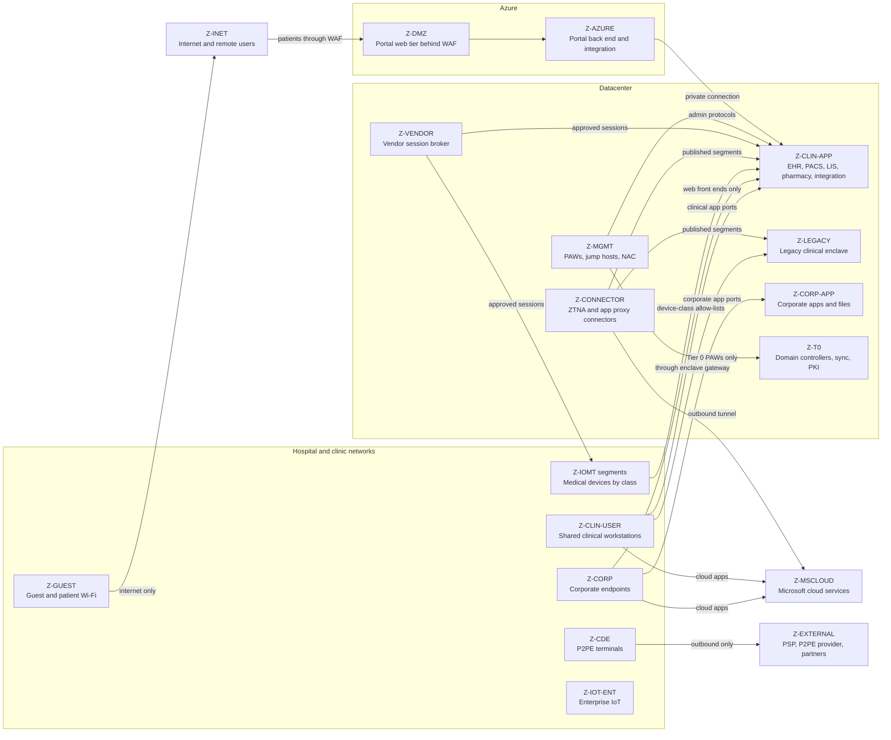
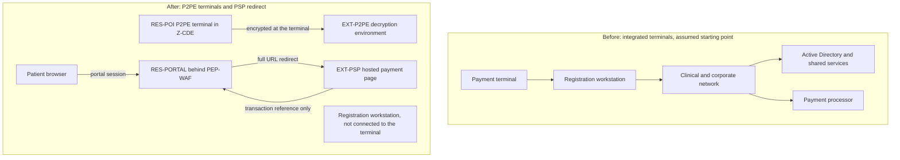

# Contoso Regional Health (fictional): segmentation and network enforcement

> **Reference work.** Fictional scenario built for a public portfolio. Not deployed in, derived from, or describing any employer environment. Not professional advice.

This document covers the network side of the Contoso Regional Health (fictional) design: the zone catalog, segmentation of medical devices, the legacy clinical enclave, the ZTNA versus VPN decision, east-west controls, and how the design shrinks the PCI DSS cardholder data environment (CDE). Component and zone IDs refer to the glossary in `02-reference-architecture.md` section 11.

## 1. Segmentation model

Segmentation is enforced in five layers. Each layer catches what the layer above cannot see.

| Layer | Enforcement points | What it decides | Typical subject |
|---|---|---|---|
| Identity-aware application access | `PEP-APP-PROXY`, `PEP-ZTNA-BROKER`, `PEP-ZTNA-CONNECTOR`, `PEP-VENDOR-BROKER` | Which user and device may reach which application, per request | Remote workforce, affiliated physicians, vendors, the outsourcer |
| Zone boundaries | `PEP-NET-ZONE`, `PEP-ENCLAVE-GW`, `PEP-CDE-BOUNDARY` | Which zone may talk to which, on which ports, logged | Every internal flow |
| Access layer | `PE-NETWORK` through `PEP-NET-ACCESS` | Which segment a connecting device joins | Every wired or wireless device, including medical devices |
| Host | `PEP-HOST` | Which peers a managed endpoint or server accepts traffic from | Managed Windows endpoints and servers |
| Cloud network | `PEP-CLOUD-NET`, `PEP-WAF` | Which Azure workloads and internet clients reach which services | Patient portal, Azure workloads |

Rules that apply to every zone:

1. **Default deny between zones.** Every allowed flow is an entry in the access matrix with an owner, a business reason, and a review date (P-5).
2. **Logging.** Allowed and denied inter-zone flows are logged to `PIP-SIEM`.
3. **No shared management.** Administrative protocols (RDP, SSH, WinRM, SMB administrative shares, device management interfaces) are accepted only from `Z-MGMT`.
4. **Egress is denied by default.** Server and device zones reach the internet only through an egress proxy with per-destination allow-lists.

## 2. Zone catalog

| Zone | Contents | May be entered from | May initiate to | Notes |
|---|---|---|---|---|
| `Z-GUEST` | Visitor and patient Wi-Fi | Nothing internal | Internet only | Separate SSID, client isolation, no internal routes |
| `Z-CORP` | Assigned corporate laptops and desktops | `Z-MGMT` only | `Z-CORP-APP`, web front ends of the EHR and clinical applications in `Z-CLIN-APP`, `Z-T0` for authentication, Microsoft cloud, filtered internet | Peer-to-peer workstation traffic blocked at the host. No direct path to the CA-11 app ports (EHR full client, PACS viewer): `Z-CORP` reaches them only through ZTNA, on site as well (ADR-008). |
| `Z-CLIN-USER` | Shared clinical workstations, workstations on wheels, Contoso-owned clinical mobile devices | `Z-MGMT` only | Clinical application ports in `Z-CLIN-APP`, listed apps in `Z-LEGACY` through `PEP-ENCLAVE-GW`, `Z-T0` for authentication, clinical printers in `Z-IOT-ENT`, Microsoft cloud, filtered internet | Admission by 802.1X EAP-TLS with a device certificate |
| `Z-CLIN-APP` | EHR application and database tiers, PACS, LIS, pharmacy system, integration engine, device-class servers | `Z-CLIN-USER`, `Z-CORP` (web front ends only), `Z-CONNECTOR`, `Z-VENDOR` (approved sessions), `Z-MGMT`, device segments for their own servers, `Z-AZURE` (portal back end over a private connection) | Device segments where a server initiates (for example, image retrieval from modalities), `Z-T0`, listed partner endpoints through the integration engine | Micro-segmented per application and tier (section 6) |
| `Z-LEGACY` | Legacy clinical applications | Listed sources through `PEP-ENCLAVE-GW` only: `Z-CLIN-USER`, `Z-CONNECTOR`, `Z-MGMT` | `Z-T0` for authentication and listed interfaces in `Z-CLIN-APP` only | Section 4 and ADR-005 |
| `Z-IOMT` segments | Medical devices by class (section 3) | Their device-class servers where required, and `Z-VENDOR` during approved sessions | Their device-class servers, and manufacturer service endpoints through the egress proxy | No lateral traffic between segments, no general internet |
| `Z-CDE` | P2PE payment terminals at registration desks | Nothing | The P2PE provider's endpoints only | Section 7 and ADR-007 |
| `Z-IOT-ENT` | Printers, badge readers, cameras, building systems | Their management servers | Their management servers | Contained. Detailed design is out of scope. |
| `Z-CORP-APP` | HR and credentialing systems, file services, configuration management database, corporate apps | `Z-CORP`, `Z-CLIN-USER` (file services), `Z-CONNECTOR`, `Z-MGMT` | `Z-T0`, Microsoft cloud | |
| `Z-CONNECTOR` | ZTNA and application proxy connector groups, one per zone they publish into | Nothing inbound | The broker in Microsoft cloud, and only the published app segments in its paired zone | At least two connectors per group. Connectors that use Kerberos constrained delegation are domain joined. |
| `Z-VENDOR` | `PEP-VENDOR-BROKER` and its session hosts | Vendor sessions brokered through the platform | Approved targets in `Z-CLIN-APP` and device segments, during approved windows only | Section 7 of `03-identity-and-access.md` |
| `Z-MGMT` | PAWs, jump hosts, NAC policy servers, IoMT sensor management, log collectors, infrastructure management interfaces | PAW subnet only | Management interfaces in every zone | Tier 0 and Tier 1 PAWs sit in separate subnets |
| `Z-T0` | Domain controllers, directory synchronization servers, PKI issuing CAs | Authentication traffic from internal zones, the domain controller segment published to `Z-CONNECTOR`, Tier 0 PAWs for administration | Microsoft cloud (synchronization, Defender for Identity), restricted | Highest trust and the highest-value target |
| `Z-DMZ` | Portal web tier behind `PEP-WAF`, managed file transfer gateway | Internet through `PEP-WAF`; partners for file transfer | `Z-AZURE` (portal back end), listed integration endpoints | No direct path to data tiers |
| `Z-AZURE` | Portal back end, integration services, analytics | `Z-DMZ` | `Z-CLIN-APP` over a private connection on listed ports; platform services through private endpoints | `PEP-CLOUD-NET` enforces |

### Diagram 5: zones and allowed flows

Authentication traffic from internal zones to `Z-T0` and management traffic from `Z-MGMT` to every zone are omitted from the diagram for readability. They are listed in the catalog above.

## 3. Medical device segmentation

Decision record: ADR-006. The CISA ZTMM v2.0 states that it does not address challenges specific to operational technologies or certain classes of internet of things devices. The medical device controls below therefore extend past the model's stated scope. Their ZTMM mapping in `05-ztmm-maturity-roadmap.md` is an interpretation, not a direct reading.

### Discovery and classification

- **Passive sensors.** `PIP-IOMT-SENSOR` sensors receive mirrored traffic (switch SPAN, RSPAN, ERSPAN, or a network TAP) at each hospital core. Microsoft documents agentless, network-layer monitoring for Defender for IoT network sensors. Its supported medical protocols include ASTM, HL7, DICOM, and POCT1. A specialist healthcare IoT platform performs the same logical function.
- **No sensors at the clinics.** The 22 clinics have no passive sensor. Their medical devices are classified through NAC profiling at admission and clinical engineering's records, and their device-to-server flows cross `PEP-NET-ZONE`, which logs them. Clinic devices therefore get no sensor-based classification or anomaly detection (RR-14 in 02). Extending coverage would take a sensor per clinic, or remote mirroring such as ERSPAN to a hospital sensor; Microsoft documents ERSPAN for extending monitored traffic across Layer 3 networks, on switches and routers that support it.
- **No active probing of medical device segments.** Defender for Endpoint device discovery is configured in one of two ways:
  - Basic mode tenant-wide. Microsoft describes Basic mode as passive observation without active probing, for sensitive or legacy networks.
  - Standard mode limited to tagged scanner devices in corporate segments. Microsoft documents that onboarded devices outside the selected tags continue to perform basic discovery, so clinical workstations stay passive. Every medical device subnet is also added as an exclusion, which stops active scans of those addresses.
- **Single inventory.** Classification results land in `PIP-ASSET-INV`, joined to clinical engineering's device records (owner, location, manufacturer, maintenance state). This becomes the single list that NAC policy, vulnerability management, and the threat model all use.

### Device-class segments

| Segment | Examples | Typical allowed flows | Owner |
|---|---|---|---|
| `Z-IOMT-IMAGING` | CT, MR, X-ray, ultrasound modalities | Image transfer to PACS, modality worklist queries, vendor service through the broker | Clinical engineering with imaging |
| `Z-IOMT-MONITORING` | Bedside monitors, central stations | To the monitoring gateway, which feeds the EHR through the integration engine | Clinical engineering with nursing |
| `Z-IOMT-INFUSION` | Smart infusion pumps | To the pump management server (drug libraries, event logs) | Clinical engineering with pharmacy |
| `Z-IOMT-LAB` | Analyzers, point-of-care testing devices | To LIS middleware | Clinical engineering with the laboratory |
| `Z-IOMT-PHARMACY` | Automated dispensing cabinets, pharmacy automation | To the pharmacy system | Pharmacy |
| `Z-IOMT-GENERAL` | Other clinical devices | Per device profile | Clinical engineering |
| `Z-IOMT-ONBOARD` | Unknown, newly connected, and quarantined devices | NAC profiling only, no internet | Security operations with clinical engineering |

### Admission

- **802.1X with certificates.** Devices that support an 802.1X supplicant and a certificate authenticate with EAP-TLS.
- **MAB with profiling.** Everything else is admitted through MAC Authentication Bypass (MAB), combined with the sensor's classification at the hospitals and with NAC profiling alone at the clinics. NAC places the device in its class segment and re-places it when its profile changes.
- **Weak device identity.** MAB identifies a device by an attribute an attacker can copy (residual risk RR-05 in 02). Narrow per-class allow-lists, and sensor anomaly detection at the hospitals, limit what an impersonator gains.

### From observation to enforcement, per segment

1. **Observe.** Run the sensor and NAC in monitor mode long enough to cover the device class's maintenance cycles (for example, 30 to 60 days).
2. **Draft.** Write the allow-list with clinical engineering, using manufacturer documentation, including the network sections of the device's MDS2 form.
3. **Simulate.** Run the rules in log-only mode and confirm there are no denies for legitimate flows.
4. **Enforce.** Switch on in a clinical change window, with a rollback plan and clinical engineering on site.
5. **Monitor.** Every deny raises an alert, and new flows need a change request.

### Manufacturer connectivity, vulnerabilities, and procurement

- **Manufacturer connectivity.** Devices that need manufacturer cloud services reach them only through the egress proxy, with a per-manufacturer destination allow-list. Inbound connections from the internet are never allowed. Interactive manufacturer service uses `PEP-VENDOR-BROKER`.
- **No active scanning.** Medical devices are never actively vulnerability-scanned. `PIP-VULN` combines sensor-derived findings with manufacturer advisories. When a patch is unavailable, the compensating control is a tighter segment allow-list, recorded as an exception with an owner and an expiry.
- **Procurement.** Every networked device purchase requests the manufacturer's MDS2 form (ANSI/NEMA HN 1-2019, Manufacturer Disclosure Statement for Medical Device Security) and a software bill of materials.
  - Section 524B of the FD&C Act places software bill of materials and postmarket vulnerability obligations on manufacturers of cyber devices, through premarket submissions. It binds manufacturers, not hospitals; Contoso uses it as procurement leverage.
  - FDA notes that conforming to the MDS2 standard may not satisfy every cybersecurity requirement in Section 524B.
- **Decommissioning.** Devices that stored ePHI are wiped or destroyed per the HIPAA device and media controls (45 CFR 164.310(d)(2)(i) disposal and 164.310(d)(2)(ii) media re-use, both required).

### Containment with a clinical safety gate

| Device state | Automated action allowed | Needs a human decision |
|---|---|---|
| Not a medical device (enterprise IoT, or unknown in `Z-IOMT-ONBOARD`) | NAC quarantine or port shutdown, with notification | No |
| Medical device not in active patient use, per clinical engineering status | Tighten the segment allow-list to cut the anomalous flow | Clinical engineering approves |
| Medical device in active patient use | Alert only. Network-side containment narrowly scoped, for example blocking the anomalous destination at the zone firewall. | Clinical engineering and the clinical lead; the device is swapped before it is disconnected |

Defender for Endpoint's "contain" action for unmanaged devices is enforced by onboarded Windows endpoints, which stop communicating with the contained device. It does not stop traffic between two medical devices. Segment controls do that.

Automatic attack disruption is configured to respect this table. Without exclusions it can contain the IP address of any device that is not onboarded to Defender for Endpoint, which includes medical devices. The address ranges of the medical device segments are therefore attack disruption IP exclusions, each with an owner and an expiry (P-5), so containment of a medical device always goes through the human decisions above (ADR-008).

## 4. Legacy clinical enclave

Decision record: ADR-005. SP 800-207 describes the enclave-based deployment (Section 3.2.2) as fitting legacy applications that cannot each have their own gateway.

- **Single entry.** `PEP-ENCLAVE-GW` is the only way in. Allowed sources:
  - Clinical workstations in `Z-CLIN-USER`, on the application ports.
  - The paired connector group in `Z-CONNECTOR`, for remote users.
  - `Z-MGMT`, for administration.

  Egress from the enclave is limited to authentication in `Z-T0` and listed interfaces in `Z-CLIN-APP`.
- **Remote web apps.** Legacy web apps that use Integrated Windows Authentication are published through `PEP-APP-PROXY` with Kerberos constrained delegation. That requires:
  - Domain-joined connectors.
  - Service principal names on the apps.
  - Constrained delegation, set to "use any authentication protocol".
- **Remote non-web apps.** Non-web legacy clients are reached through ZTNA with Kerberos SSO. Microsoft's Private Access Kerberos guidance requires publishing the domain controllers as a private resource, on ports 88, 123, 135, 389, 445, 464, 636, 3268, 3269, and 49152 to 65535. That gives connected clients a network path to Tier 0 services (RR-09). The domain controller segment is therefore:
  - Assigned only to the groups that use enclave apps.
  - Limited to the domain controllers in the connectors' AD site.
  - Watched by Defender for Identity.
- **NTLM.** Microsoft deprecated all NTLM versions in June 2024 and removed NTLMv1 starting with Windows 11 version 24H2 and Windows Server 2025. KB5066470 moves the BlockNTLMv1SSO setting from audit to enforce by default in October 2026. The enclave plan:
  1. Audit NTLM use per application.
  2. Restrict NTLM, with per-application exceptions that have owners and expiry dates.
  3. Require AES Kerberos encryption types for service accounts.
- **Retirement.** Each legacy application has an owner, a replacement or upgrade path, and a target date. Leaving the enclave is the goal, not staying in it.

## 5. ZTNA versus VPN

Decision record: ADR-002.

| Criterion | Full-tunnel VPN with MFA | Per-app access (application proxy for web apps, ZTNA for non-web) |
|---|---|---|
| Reach after authentication | Network segments, which invites lateral movement | One published application segment per policy |
| Policy evaluation | At connection time | Per application, through `PE-IDENTITY` with device compliance and risk (CA-07, CA-08, CA-10, CA-11) |
| Device posture | Limited host checks | Intune compliance as a grant control |
| Exposed listener | An internet-facing concentrator that must be patched on the attacker's schedule | Connectors make outbound connections only. The broker is a provider-operated cloud edge. |
| Revocation during a session | Usually waits for reconnection | Universal CAE can force reauthentication or drop the tunnel on the Windows client |
| Protocol coverage | Anything IP | TCP and UDP per app segment. The client tunnels IPv4 only. Tunneling by IP works only for ranges outside the device's local subnet. |
| Unmanaged devices | Usually blocked or risky | Excluded from ZTNA by policy. Browser sessions with in-session controls through the application proxy (CA-10). |
| Shared and multi-session devices | Varies | The Global Secure Access mobile clients ship inside Defender for Endpoint, which does not support shared iOS or Android devices. The Windows client does not support concurrent sessions, which rules out multi-session hosts. Shared devices use the on-site path. |
| Vendors | Vendor VPN accounts with broad reach | Global Secure Access for B2B guests is in public preview, so vendors use `PEP-VENDOR-BROKER` instead |
| Licensing | Already owned | Application proxy is included with Entra ID P1 and P2. Private Access is not included in Microsoft 365 E5 or Entra ID P2; it is sold standalone or in the Microsoft Entra Suite, and Microsoft 365 E7 includes it (checked 2026-10-04). |
| Failure behavior | Fails closed | Fails closed, with no fallback to VPN (ADR-008) |

Decision summary:
- Web apps go through the application proxy, and non-web apps through per-app ZTNA from compliant devices.
- Unmanaged devices get browser sessions only, and vendors use the broker.
- User VPN is retired after migration. Site-to-site tunnels for the WAN stay.
- The only remaining user-style VPN is the dormant emergency administrative path in ADR-008: disabled by default, enabled under incident command, PAW only.
- App segments are defined per application by host and port. Broad subnet segments are allowed only during migration, with an expiry date, because a subnet-wide segment recreates the VPN problem.

## 6. East-west controls

- **Workstations.** Host firewall policy (`PEP-HOST`) blocks inbound SMB, RDP, WinRM, and RPC from peer endpoints in `Z-CORP` and `Z-CLIN-USER`. Management traffic is accepted only from `Z-MGMT`. This is one of the cheapest controls against ransomware spreading between workstations.
- **Datacenter.** `Z-CLIN-APP` is segmented per application and tier: web to application, application to database, each on listed ports. Enforcement uses host firewalls or a distributed firewall. The integration engine is a hub: every interface is an explicit, documented flow.
- **Identity layer.** Logon is restricted by tier. Tier 0 accounts use the Protected Users group and authentication policies and silos. Windows LAPS manages local administrator passwords (`03-identity-and-access.md` section 4).
- **Egress and DNS.** Server and device zones use internal DNS resolvers and the egress proxy. DNS and proxy logs go to `PIP-SIEM`.
- **Telemetry.** Firewall allow and deny logs, NAC events, IoMT sensor alerts, and endpoint network events are correlated in `PIP-SIEM` and `PIP-XDR`. The companion detection pack queries the endpoint and identity sources. Firewall, NAC, and IoMT sensor logs are listed as gaps in its coverage map (`coverage-map.md` section 4), because their schemas depend on products this design leaves vendor-neutral.
- **Response.**
  - Managed devices are isolated through `PEP-HOST`.
  - Unmanaged devices are contained by onboarded endpoints.
  - Automatic attack disruption can contain a compromised user. For accounts in Active Directory it can disable the user through domain controllers running the Defender for Identity sensor.
  - Medical devices follow the clinical safety gate in section 3. Their segments are excluded from automatic attack disruption's IP containment (ADR-008).

## 7. CDE scope reduction

Decision record: ADR-007. The aim is to keep card data out of Contoso's systems, so that the CDE is the payment terminals and nothing else.

### Diagram 6: card data paths before and after

How the scope shrinks:

- **Card-present.** Registration desks use standalone terminals from a PCI-listed P2PE solution, implemented per the solution's P2PE Instruction Manual. The clerk keys the amount on the terminal, and the registration workstation never sees card data. PCI SSC states that merchants using PCI-listed P2PE solutions have fewer applicable PCI DSS requirements.
- **E-commerce.** The patient portal sends the patient to the payment service provider's hosted page by full URL redirect, and receives only a transaction reference. PCI SSC FAQ 1588 says the SAQ A script-attack eligibility criterion does not apply to merchants that redirect to the provider. A redirect was chosen over an embedded iframe for that reason (ADR-007).
- **No phone or mail payments.** There is no channel that would put card data into a workstation or a recording.
- **Isolated terminals.** Terminals sit in `Z-CDE` at each site. `PEP-CDE-BOUNDARY` allows outbound traffic to the P2PE provider only, with no inbound traffic and no path from any other zone. No Contoso account has access to the terminals; the P2PE provider manages them.
- **PHI is a separate question.** Payment records tied to a patient's account remain protected health information under HIPAA, because the definition of health information in 45 CFR 160.103 includes payment for the provision of health care. Taking card data out of PCI scope does not take billing data out of HIPAA scope.

PCI DSS v4.0.1 requirements for the CDE segment, by validation path. The assumed path (A-16) is SAQ P2PE for registration desks and SAQ A for the redirect, as the acquirer decides. Requirement summaries are paraphrased. SAQ P2PE contents were checked against the SAQ P2PE for PCI DSS v4.0, which the v4.0.1 SAQs superseded.

| PCI DSS v4.0.1 requirement | Design element | Under the assumed SAQ path (A-16) | Under a full assessment |
|---|---|---|---|
| 9.5.1, 9.5.1.1, 9.5.1.2, 9.5.1.3 | Terminal list in `PIP-ASSET-INV` (make, model, location, serial number). Periodic tamper inspection by registration supervisors. Staff training on tampering and substitution. | Required | Required |
| 9.5.1.2.1 | Inspection frequency set by a targeted risk analysis (with 12.3.1) | Not on SAQ P2PE; performed anyway | Required |
| 12.8.1 to 12.8.5 | Third-party service provider list, written agreements, due diligence, annual compliance monitoring, and a responsibility matrix for `EXT-P2PE` and `EXT-PSP` | Required | Required |
| 12.10.1 | Incident response plan that includes card brand and acquirer notification | Required | Required |
| 1.2.3, 1.2.4 | Network diagram and account data-flow diagram; Diagram 6 is the starting point | Not on SAQ P2PE; maintained anyway | Required |
| 1.3.1, 1.3.2 | `PEP-CDE-BOUNDARY`: no inbound traffic, outbound only to `EXT-P2PE` | Defense in depth | Required |
| 1.3.3 | Terminals are wired. Any wireless terminal would need a boundary control between wireless networks and `Z-CDE`. | Defense in depth | Required |
| 1.4.1, 1.5.1 | No CDE device reaches untrusted networks except the P2PE provider path; no dual-homed devices | Defense in depth | Required |
| 7.2.1, 7.2.2, 7.2.4 | No Contoso user holds access into `Z-CDE`. Any future access is role-based and reviewed at least every six months. | Not applicable by design | Required where access exists |
| 8.2.7, 8.4.1, 8.4.2, 8.4.3, 8.5.1 | No Contoso non-console or remote access into `Z-CDE`. Any future vendor access uses `PEP-VENDOR-BROKER` with just-in-time activation and phishing-resistant MFA. | Not applicable by design | Required where access exists |
| 10.2.1 | Logs from `PEP-CDE-BOUNDARY`, plus terminal management events from the provider | Defense in depth | Required |
| 11.4.5 | Penetration test of the segmentation controls at least every 12 months and after changes to them | Not on SAQ P2PE | Required when segmentation is used to reduce scope |
| 12.5.2 | Scope documented and confirmed at least every 12 months and on significant change | Not on SAQ P2PE; performed anyway | Required |
| 6.4.3, 11.6.1 | Payment page scripts. With a full URL redirect, the payment page belongs to the payment service provider. | Removed from SAQ A in its January 2025 revision. The replacement script-attack eligibility criterion does not apply to merchants that redirect (FAQ 1588). | Applicability to Contoso's redirecting page is confirmed with the acquirer or assessor |

The portal page that starts the redirect still matters even when the script requirements do not apply. Tampering with it could send patients to a counterfeit payment page. It sits behind `PEP-WAF`, and its content is change-monitored as defense in depth.

PCI SSC published "PCI DSS Scoping and Segmentation Guidance for Modern Network Architectures" in September 2024. It covers how zero trust and micro-segmentation affect scope. Contoso's acquirer, or an assessor if one is engaged, can use it alongside the 2017 scoping supplement. Neither document replaces the acquirer's decision on validation path.

## 8. Control mapping

| Control | ZTMM pillar: function | CSF 2.0 | HIPAA (45 CFR Part 164) | PCI DSS v4.0.1 (CDE only) |
|---|---|---|---|---|
| Zone model and default deny | Networks: Network Segmentation | PR.IR-01 | 164.312(a)(1) | 1.3.1, 1.3.2 |
| Documented flows (access matrix) | Networks: Network Traffic Management | ID.AM-03 | 164.308(a)(1)(ii)(A) | 1.2.4 |
| Medical device discovery and inventory | Devices: Asset & Supply Chain Risk Management | ID.AM-01, ID.AM-08 | 164.308(a)(1)(ii)(A) | 9.5.1.1 (terminals) |
| Device-class segments and NAC admission | Networks: Network Segmentation; Devices: Resource Access | PR.IR-01, PR.AA-03 | 164.308(a)(1)(ii)(B) | Not applicable |
| Passive monitoring and anomaly alerts | Networks: Visibility and Analytics Capability | DE.CM-01 | 164.312(b) | 10.2.1 |
| Procurement requirements (MDS2, software bill of materials) | Devices: Asset & Supply Chain Risk Management | GV.SC-05, GV.SC-06 | 164.308(a)(1)(ii)(B) | Not applicable |
| Clinically gated containment | Automation and Orchestration (cross-cutting) | RS.MI-01 | 164.308(a)(6)(ii) | 12.10.1 |
| Legacy enclave and NTLM restriction | Applications and Workloads: Application Access | PR.PS-01, PR.PS-02 | 164.312(d) | Not applicable |
| Per-app remote access replacing VPN | Applications and Workloads: Accessible Applications | PR.IR-01, PR.AA-05 | 164.312(e)(1) | 8.4.3 (design rule) |
| Host-level east-west blocking | Networks: Network Segmentation; Devices: Device Threat Protection | PR.IR-01 | 164.308(a)(5)(ii)(B) | Not applicable |
| CDE scope reduction | Networks: Network Segmentation; Data: Data Inventory Management | PR.IR-01, ID.AM-03 | Not applicable | 12.5.2, 11.4.5 |
| Terminal inspection and training | Devices: Policy Enforcement & Compliance Monitoring | DE.CM-02, PR.AT-01 | Not applicable | 9.5.1.2, 9.5.1.3 |
| Medical device decommissioning | Devices: Asset & Supply Chain Risk Management | ID.AM-08 | 164.310(d)(2)(i); 164.310(d)(2)(ii) | Not applicable |

## Sources

| Title | Publisher | URL | Date checked | Quality |
|---|---|---|---|---|
| NIST SP 800-207, Zero Trust Architecture | NIST | https://nvlpubs.nist.gov/nistpubs/SpecialPublications/NIST.SP.800-207.pdf | 2026-10-03 | Primary |
| Zero Trust Maturity Model Version 2.0 | CISA | https://www.cisa.gov/sites/default/files/2023-04/zero_trust_maturity_model_v2_508.pdf | 2026-10-03 | Primary |
| Enhance your OT security with Defender for IoT | Microsoft Learn | https://learn.microsoft.com/en-us/azure/defender-for-iot/organizations/overview | 2026-10-04 | Primary |
| Protocols supported by Microsoft Defender for IoT | Microsoft Learn | https://learn.microsoft.com/en-us/azure/defender-for-iot/organizations/concept-supported-protocols | 2026-10-03 | Primary |
| Choose a traffic mirroring methods | Microsoft Learn | https://learn.microsoft.com/en-us/azure/defender-for-iot/organizations/best-practices/traffic-mirroring-methods | 2026-10-04 | Primary |
| Configure device discovery in Microsoft Defender for Endpoint | Microsoft Learn | https://learn.microsoft.com/en-us/defender-endpoint/configure-device-discovery | 2026-10-03 | Primary |
| Take response actions on a device in Microsoft Defender for Endpoint | Microsoft Learn | https://learn.microsoft.com/en-us/defender-endpoint/respond-machine-alerts | 2026-10-03 | Primary |
| Automatic attack disruption in Microsoft Defender | Microsoft Learn | https://learn.microsoft.com/en-us/defender-xdr/automatic-attack-disruption | 2026-10-04 | Primary |
| Exclude assets from automated response in attack disruption | Microsoft Learn | https://learn.microsoft.com/en-us/defender-xdr/automatic-attack-disruption-exclusions | 2026-10-04 | Primary |
| Use Kerberos for single sign-on (SSO) with Microsoft Entra Private Access | Microsoft Learn | https://learn.microsoft.com/en-us/entra/global-secure-access/how-to-configure-kerberos-sso | 2026-10-03 | Primary |
| Kerberos Constrained Delegation for single sign-on to your apps with application proxy | Microsoft Learn | https://learn.microsoft.com/en-us/entra/identity/app-proxy/how-to-configure-sso-with-kcd | 2026-10-03 | Primary |
| Microsoft Entra Private Network Connectors | Microsoft Learn | https://learn.microsoft.com/en-us/entra/global-secure-access/concept-connectors | 2026-10-03 | Primary |
| Known Limitations for Global Secure Access | Microsoft Learn | https://learn.microsoft.com/en-us/entra/global-secure-access/reference-current-known-limitations | 2026-10-03 | Primary |
| Learn about the Global Secure Access clients for Microsoft Entra Private Access and Microsoft Entra Internet Access | Microsoft Learn | https://learn.microsoft.com/en-us/entra/global-secure-access/concept-clients | 2026-10-04 | Primary |
| Install the Global Secure Access Client for iOS | Microsoft Learn | https://learn.microsoft.com/en-us/entra/global-secure-access/how-to-install-ios-client | 2026-10-04 | Primary |
| Install the Global Secure Access Client for Android | Microsoft Learn | https://learn.microsoft.com/en-us/entra/global-secure-access/how-to-install-android-client | 2026-10-04 | Primary |
| Microsoft Entra licensing | Microsoft Learn | https://learn.microsoft.com/en-us/entra/fundamentals/licensing | 2026-10-04 | Primary |
| Deprecated features in the Windows client | Microsoft Learn | https://learn.microsoft.com/en-us/windows/whats-new/deprecated-features | 2026-10-03 | Primary |
| KB5066470, Upcoming changes to NTLMv1 in Windows 11, version 24H2 and Windows Server 2025 | Microsoft Support | https://support.microsoft.com/en-us/topic/upcoming-changes-to-ntlmv1-in-windows-11-version-24h2-and-windows-server-2025-c0554217-cdbc-420f-b47c-e02b2db49b2e | 2026-10-03 | Primary |
| FDA Recognized Consensus Standards: ANSI/NEMA HN 1-2019 | U.S. FDA | https://www.accessdata.fda.gov/scripts/cdrh/cfdocs/cfstandards/detail.cfm?standard__identification_no=43890 | 2026-10-03 | Primary |
| Cybersecurity in Medical Devices Frequently Asked Questions | U.S. FDA | https://www.fda.gov/medical-devices/digital-health-center-excellence/cybersecurity-medical-devices-frequently-asked-questions-faqs | 2026-10-03 | Primary |
| Point-to-Point Encryption standards page | PCI SSC | https://www.pcisecuritystandards.org/standards/point-to-point-encryption-p2pe/ | 2026-10-03 | Primary |
| PCI SSC FAQ 1588 (SAQ A eligibility) | PCI SSC | https://www.pcisecuritystandards.org/faqs/1588/ | 2026-10-03 | Primary |
| Important Updates Announced for Merchants Validating to Self-Assessment Questionnaire A | PCI SSC | https://blog.pcisecuritystandards.org/important-updates-announced-for-merchants-validating-to-self-assessment-questionnaire-a | 2026-10-03 | Primary |
| Self-Assessment Questionnaire P2PE for PCI DSS v4.0, superseded by the v4.0.1 SAQs and used here for its requirement list | PCI SSC | https://listings.pcisecuritystandards.org/documents/PCI-DSS-v4-0-SAQ-P2PE.pdf | 2026-10-03 | Primary |
| Guidance for PCI DSS Scoping and Network Segmentation, v1.1 (May 2017) | PCI SSC | https://listings.pcisecuritystandards.org/documents/Guidance-PCI-DSS-Scoping-and-Segmentation_v1_1.pdf | 2026-10-03 | Primary |
| New Information Supplement: PCI DSS Scoping and Segmentation Guidance for Modern Network Architectures | PCI SSC | https://blog.pcisecuritystandards.org/new-information-supplement-pci-dss-scoping-and-segmentation-guidance-for-modern-network-architectures | 2026-10-03 | Primary |
| PCI DSS v4.0.1 (document library) | PCI SSC | https://www.pcisecuritystandards.org/document_library/ | 2026-10-03 | Primary |
| 45 CFR 160.103 (definitions) | eCFR | https://www.ecfr.gov/current/title-45/subtitle-A/subchapter-C/part-160/subpart-A/section-160.103 | 2026-10-03 | Primary |
| 45 CFR 164.308, 164.310, 164.312 | eCFR | https://www.ecfr.gov/current/title-45/subtitle-A/subchapter-C/part-164/subpart-C | 2026-10-03 | Primary |
| The NIST Cybersecurity Framework (CSF) 2.0, NIST CSWP 29 | NIST | https://doi.org/10.6028/NIST.CSWP.29 | 2026-10-03 | Primary |
