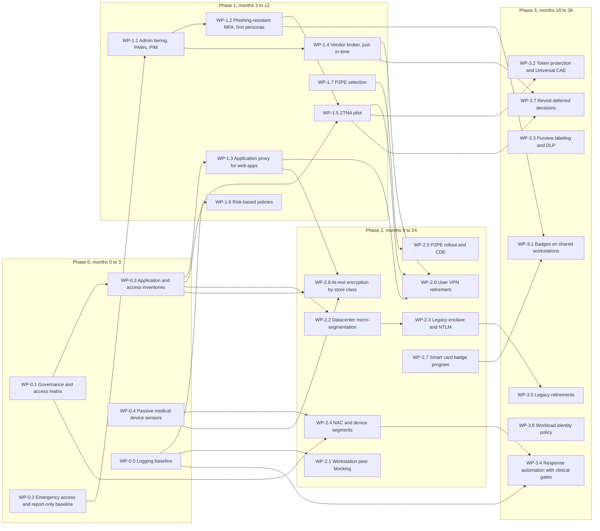

# Contoso Regional Health (fictional): CISA ZTMM v2.0 maturity map and roadmap

> **Reference work.** Fictional scenario built for a public portfolio. Not deployed in, derived from, or describing any employer environment. Not professional advice.

This document maps Contoso Regional Health (fictional) against the CISA Zero Trust Maturity Model Version 2.0 (April 2023). The model has five pillars (Identity, Devices, Networks, Applications and Workloads, Data), three cross-cutting capabilities (Visibility and Analytics, Automation and Orchestration, Governance), and four stages (Traditional, Initial, Advanced, Optimal). The phased roadmap below moves Contoso from its assumed current state to a 36-month target.

## 1. Method and honesty notes

- **Current stages are scenario assumptions,** consistent with `01-scenario-and-assumptions.md`. Contoso owns Microsoft 365 E5, Entra ID P2, Defender XDR, and Sentinel, but owning a capability is not the same as operating it. The assumed starting point:
  - MFA for every cloud sign-in, but with phishable methods. On-site Windows sign-in at shared clinical workstations is not covered: it is a password against Active Directory until certificate badges arrive in phase 3 (WP-3.1).
  - PIM licensed and partly used, with some standing admin assignments.
  - Flat clinical networks and a single biomedical VLAN.
  - VPN for remote and vendor access.
  - A medical device inventory held separately by clinical engineering, and incomplete.
  - Disk encryption on most assigned laptops, but not as a compliance condition, and no stated at-rest requirement for datacenter stores or medical devices.
  - Sentinel ingesting core identity and endpoint sources.
- **Rating rule.**
  - A function is rated at the highest stage whose CISA description it meets across most of its in-scope assets.
  - A pillar's summary stage is the stage most of its functions meet.
  - The lowest function is called out, because it sets the practical ceiling.
- **Stage descriptions are paraphrased** from the CISA ZTMM v2.0 pillar tables. Function names follow the CISA document exactly; Microsoft's mapping pages paraphrase several of them. Read the CISA PDF for the full stage text.
- **Optimal is not the goal everywhere.** Where the target stops short of Optimal, the table says why. A health system that chases Optimal in clinical zones without a patient-safety model is taking risk, not reducing it.
- **Medical devices are outside the model's stated scope.** CISA states that the ZTMM does not address challenges specific to operational technologies or certain classes of internet of things devices. Ratings that cover medical devices are an interpretation, and are labeled as such.

## 2. Summary

| Pillar or capability | Current (assumed) | Target (36 months) | Lowest function today | Main moves |
|---|---|---|---|---|
| Identity | Initial | Advanced | Authentication (phishable MFA) | ADR-003, ADR-004, Conditional Access set in 03 |
| Devices | Initial | Advanced for managed endpoints. Medical devices move from Initial toward Advanced through network controls (interpretation, beyond model scope). | Asset & Supply Chain Risk Management (incomplete medical device inventory) | ADR-006, CA-08, CA-09 |
| Networks | Traditional | Advanced | Network Segmentation | ADR-002, ADR-005, ADR-006, ADR-007 |
| Applications and Workloads | Initial | Advanced | Accessible Applications (VPN-dependent) | ADR-002, ADR-005 |
| Data | Initial | Advanced for Microsoft 365 and file services (`RES-FILES`), and for Data Encryption across every data-store class. Inventory and categorization of EHR-held data are governed by the EHR platform and assessed separately. Data Availability is not rated (ADR-009). | Data Categorization | Purview labeling and data loss prevention (phase 3). At-rest encryption by data-store class (WP-2.8, `02-reference-architecture.md` section 7). Recovery requirements (ADR-009). |
| Visibility and Analytics (cross-cutting) | Initial | Advanced | Not applicable | IoMT sensors, NAC and firewall logs, correlation in Sentinel |
| Automation and Orchestration (cross-cutting) | Traditional | Initial, with Advanced for identity and managed endpoints | Not applicable | Clinical safety gates deliberately limit automation around medical devices |
| Governance (cross-cutting) | Initial | Advanced | Not applicable | Access matrix, exception governance, joint review of both decision planes |

## 3. Function-level map

### Identity

| Function | Current | Target | What changes, and why not further | Phase |
|---|---|---|---|---|
| Authentication | Initial. MFA is required for cloud sign-ins, with a password as one factor and phishable second factors. On-site sign-in at shared clinical workstations is password-only. | Advanced. Phishing-resistant MFA for every persona in scope, including certificate badges on shared clinical workstations. | Optimal means continuous validation with phishing-resistant MFA beyond initial access. That is reached on the cloud plane only for CAE-capable resources. The local clinical plane deliberately does not re-validate continuously (ADR-008). | 1 to 3 |
| Identity Stores | Initial. AD and Entra ID are synchronized, and several clinical apps keep their own stores. | Advanced. Clinical apps integrated with Entra ID or AD Kerberos, partners through B2B, patients in a separate store by design. | Optimal is out of reach while legacy apps keep local accounts | 1 to 3 |
| Risk Assessments | Initial. Manual review of sign-in logs. | Advanced. Risk-based Conditional Access (CA-17, CA-18) with automated response. | Optimal needs real-time risk analysis on the local plane, which AD alone does not provide | 1 |
| Access Management | Initial. Some standing admin assignments; vendor accounts with long-lived access. | Advanced. Need-based and session-based access; just-in-time privileged and vendor access. | Automated just-in-time and just-enough access is reached for privileged roles only | 1 to 2 |
| Visibility and Analytics Capability | Initial | Advanced. Automated analysis across identity log types, with gaps filled. | | 0 to 1 |
| Automation and Orchestration Capability | Initial. Workforce provisioning is automated; privileged and external identities are handled manually. | Advanced. All identities orchestrated across environments; privileged elevation through PIM. | | 1 to 2 |
| Governance Capability | Initial | Advanced. Enterprise-wide identity policy with automation and periodic updates. | | 0 to 2 |

### Devices

| Function | Current | Target | What changes, and why not further | Phase |
|---|---|---|---|---|
| Policy Enforcement & Compliance Monitoring | Initial. Intune compliance is defined but not enforced in access decisions for every app. | Advanced for managed endpoints. Compliance enforced for most devices (CA-08, CA-09). | Medical devices cannot report their own characteristics; the network plane compensates (interpretation, beyond model scope) | 1 to 2 |
| Asset & Supply Chain Risk Management | Initial. Managed endpoints are inventoried; the medical device inventory is separate and incomplete. | Advanced. Automated, multi-source inventory (Intune, Defender, the IoMT sensor at the hospitals, NAC profiling at the clinics) plus procurement requirements (MDS2 form, software bill of materials). | Optimal, a near-real-time view across vendors and service providers, is not targeted in 36 months | 0 to 2 |
| Resource Access | Initial | Advanced. Initial resource access considers verified device insights. | | 1 |
| Device Threat Protection | Initial. Defender for Endpoint is present but only partly integrated with compliance. | Advanced. Machine risk feeds compliance and access decisions. | | 1 |
| Visibility and Analytics Capability | Initial | Advanced. Automated inventory and anomaly detection, including passive medical device monitoring. | | 0 to 2 |
| Automation and Orchestration Capability | Initial | Advanced. Monitoring and enforcement identify noncompliant devices, which are then disconnected or isolated with a human decision. | Optimal (fully automated isolation) is deliberately not targeted for medical devices. Automation stops at the clinical safety gate (04 section 3). | 2 to 3 |
| Governance Capability | Initial | Advanced. Lifecycle policy for all device types, with some automated enforcement. | | 0 to 2 |

### Networks

| Function | Current | Target | What changes, and why not further | Phase |
|---|---|---|---|---|
| Network Segmentation | Traditional. Large flat clinical networks and a single biomedical VLAN. | Advanced. Ingress and egress micro-perimeters, service-specific interconnections, device-class segments. | Optimal (fully distributed micro-perimeters with dynamic just-in-time connectivity) is not targeted. Per-device segments are planned for the highest-risk devices only. | 2 |
| Network Traffic Management | Traditional | Initial. Application profiles with static rules mapped to every application, plus periodic audits. | Advanced requires risk-responsive dynamic rules, more than Contoso can operate safely in clinical zones within 36 months | 2 |
| Traffic Encryption | Initial | Advanced where protocols allow. Device segments compensate where medical device protocols lack encryption. | | 2 to 3 |
| Network Resilience | Initial | Advanced. Local-first clinical design with defined failure modes (ADR-008). | | 1 to 2 |
| Visibility and Analytics Capability | Initial | Advanced. Anomaly-based detection from IoMT sensors, correlated with firewall, NAC, and endpoint telemetry. | | 0 to 2 |
| Automation and Orchestration Capability | Traditional | Initial. Automated configuration management for some networks. | | 2 to 3 |
| Governance Capability | Initial | Advanced. Segment-level policies with automation, moving away from perimeter-only protection. | | 0 to 2 |

### Applications and Workloads

| Function | Current | Target | What changes, and why not further | Phase |
|---|---|---|---|---|
| Application Access | Initial | Advanced. Automated access decisions with expanded context and enforced expiration. | Optimal (continuous authorization with real-time risk) is limited because the EHR platform does not implement CAE | 1 to 2 |
| Application Threat Protections | Initial | Advanced. Web application firewall, in-session controls, token protection where supported. | | 2 to 3 |
| Accessible Applications | Initial. Most remote access requires VPN. | Advanced. Most mission-critical apps available over public networks through brokered connections (application proxy, ZTNA, vendor broker). | | 1 to 2 |
| Secure Application Development and Deployment Workflow | Initial. Limited in-house development: integrations and portal configuration. | Initial | Out of scope. Contoso mainly buys software. | Not applicable |
| Application Security Testing | Initial | Initial | Out of scope for vendor software. Contoso tests its integrations and portal configuration before release. | Not applicable |
| Visibility and Analytics Capability | Initial | Advanced | | 1 to 2 |
| Automation and Orchestration Capability | Traditional | Initial | | 2 to 3 |
| Governance Capability | Initial | Advanced. Software asset and dependency tracking, including software bills of materials from device and software vendors. | | 1 to 3 |

### Data

| Function | Current | Target | What changes, and why not further | Phase |
|---|---|---|---|---|
| Data Inventory Management | Initial | Advanced for Microsoft 365 and file services. The EHR platform governs its own data inventory. | | 2 to 3 |
| Data Categorization | Initial. Labels defined, applied manually. | Advanced. Automated labeling for ePHI types in Microsoft 365. | | 2 to 3 |
| Data Availability | Not assessed | Not rated | ADR-009 sets recovery requirements: immutable and offline copies, isolation from Tier 0 administrative reach, tested restores with evidence, and Tier 0 monitoring. The function rates availability from redundant data stores and access to historical data, which depend on a recovery design and restore evidence that this design set does not include (A-19, RR-11). CISA also states that the model does not address recovery. The row is deliberately not rated rather than guessed. | Not applicable |
| Data Access | Initial | Advanced. Access considers identity, device risk, application, and data label, and is time-limited where applicable. | | 2 |
| Data Encryption | Initial. Most assigned laptops are encrypted, but encryption is not a compliance condition, and no at-rest requirement exists for datacenter stores or medical devices. | Advanced. Every data-store class meets its at-rest requirement in `02-reference-architecture.md` section 7 (WP-2.8 and WP-3.3), or holds an owned, dated exception. Keys are held apart from the data, rotated on a schedule, and inventoried by algorithm, which starts cryptographic agility. Data in transit follows Networks: Traffic Encryption. | Optimal adds encryption of data in use and least-privilege key management enterprise-wide, which the design does not target. Medical devices that cannot encrypt are exceptions (RR-15). Counting them within the Advanced stage's "to the maximum extent possible" is an interpretation, because the model does not address certain classes of IoT devices. | 2 to 3 |
| Visibility and Analytics Capability | Initial | Advanced | | 2 to 3 |
| Automation and Orchestration Capability | Initial | Initial | | 3 |
| Governance Capability | Initial | Advanced | | 2 to 3 |

## 4. Phased roadmap

Phases overlap on purpose: segmentation design starts while identity work is still finishing. Work packages (WP) name their exit criteria, so a phase ends on evidence, not on a date.

### Phase 0: foundations (months 0 to 3)

| WP | Work | Exit criteria |
|---|---|---|
| WP-0.1 | Zero Trust steering group with the CISO, CMIO, nursing informatics, clinical engineering, infrastructure, and compliance. Access matrix owner named. Exception process defined (owner, expiry, log). | Charter approved; exception register live |
| WP-0.2 | Emergency access accounts per `03-identity-and-access.md` section 5, with `grp-ca-emergency-access` created role-assignable and without owners before any policy excludes it (the property cannot be added later). CA-01, CA-02, and CA-20 in report-only mode. | Emergency sign-in tested; exclusion group holds only the two accounts; 30 days of report-only data |
| WP-0.3 | Inventories: applications and how each authenticates (federated, Kerberos, NTLM, local); privileged assignments; third-party access paths; data flows for the access matrix | Every clinical system in the inventory with an owner |
| WP-0.4 | Passive IoMT sensors at the three hospital cores in monitor mode. Defender for Endpoint discovery configured to avoid active probing of clinical networks. The clinics are outside sensor coverage (RR-14 in 02). | Sensors see all three hospital cores |
| WP-0.5 | Logging baseline in Sentinel: Entra, Defender XDR, firewall, NAC, sensors | Sources connected and parsed |

### Phase 1: identity and privileged access (months 3 to 12)

| WP | Work | Exit criteria |
|---|---|---|
| WP-1.1 | Admin model: cloud-only admin accounts, PAWs, PIM eligible-only assignments. `grp-admins-t0` and `grp-admins-t1` created role-assignable and without owners before any policy targets them (the property cannot be added later). CA-03 to CA-06 enforced. | No standing privileged role assignments held by user accounts outside emergency access (section 6); the admin groups hold only dedicated admin accounts |
| WP-1.2 | Phishing-resistant MFA for administrators, remote workforce, and vendors. Temporary Access Pass onboarding. CA-07 and CA-19 enforced for those personas. | Those personas in `grp-pr-enforced` |
| WP-1.3 | Application proxy for remote web apps. CA-08, CA-09, CA-10 enforced. | Remote web apps published through the proxy |
| WP-1.4 | Vendor broker with PIM for Groups just-in-time access. B2B trust due diligence. CA-13 to CA-16. | All vendor remote access through the broker |
| WP-1.5 | ZTNA pilot for non-web apps, after the Private Access licensing decision. CA-11. | Pilot group on ZTNA for the EHR full client |
| WP-1.6 | Risk-based policies CA-17 and CA-18. Device code flow block CA-20 enforced. | Enforced with tuned exclusions |
| WP-1.7 | P2PE solution selection and acquirer agreement on the validation path (A-16) | Written acquirer confirmation |

### Phase 2: segmentation and enclaves (months 9 to 24)

| WP | Work | Exit criteria |
|---|---|---|
| WP-2.1 | Block peer-to-peer traffic between workstations through host firewall policy | Enforced on `Z-CORP` and `Z-CLIN-USER` |
| WP-2.2 | Datacenter micro-segmentation of `Z-CLIN-APP` per application and tier | Every clinical application on documented flows |
| WP-2.3 | Legacy enclave behind `PEP-ENCLAVE-GW`, then NTLM audit followed by restriction | Enclave live; NTLM exceptions owned and dated |
| WP-2.4 | NAC with 802.1X EAP-TLS for workstations. Medical device segments moved from monitor to enforcement, one class at a time. NAC profiling classifies clinic medical devices, which have no passive sensor (RR-14). | Every segment enforced or covered by an owned, dated exception |
| WP-2.5 | P2PE terminal rollout, `Z-CDE`, portal redirect, scope confirmation | The CDE contains only terminals |
| WP-2.6 | User VPN retirement | No user VPN |
| WP-2.7 | Smart card badge program: PKI treated as Tier 0, revocation data on-site, readers, issuance. CA-12. Windows Hello for Business for corporate staff. | Badge issuance ready for clinical rollout |
| WP-2.8 | At-rest encryption by data-store class (`02-reference-architecture.md` section 7). Managed endpoints first, as a compliance condition, with enforcement planned around restart-time compliance checks. Then Azure verification, datacenter clinical stores in clinical change windows, and managed file transfer retention. Key custody, tier-scoped recovery-key read rights, and the key inventory. Encryption status recorded for every medical device, with exceptions under RR-15. | Every class meets its requirement or holds an owned, dated exception |

### Phase 3: continuous evaluation and optimization (months 18 to 36)

| WP | Work | Exit criteria |
|---|---|---|
| WP-3.1 | Certificate badges on all shared clinical workstations. All workforce personas in `grp-pr-enforced`. | Phishing-resistant MFA for every persona |
| WP-3.2 | Token protection (CA-21). Universal CAE on Windows ZTNA clients. | Enforced for administrators, then the workforce |
| WP-3.3 | Purview labeling and data loss prevention for ePHI in Microsoft 365 and file services (`RES-FILES`), including label encryption for labeled ePHI (`02-reference-architecture.md` section 7, data at rest) | Automated labeling live |
| WP-3.4 | Response automation with clinical safety gates. Downtime and failure-mode drills for ADR-008. | Playbooks approved by clinical leadership; drill completed |
| WP-3.5 | Legacy app retirements. NTLM restriction tightened. Per-device segments for the highest-risk devices. | Retirement milestones met or re-planned |
| WP-3.6 | Workload identity policy (CA-22) if licensed, plus app credential hygiene | No client secrets on new registrations |
| WP-3.7 | Revisit deferred decisions: synced passkeys, B2B ZTNA for vendors once generally available, Private Access for domain controllers on administrative service principal names | Decisions recorded as ADR updates |

### Diagram 7: work package dependencies

WP-3.3 and WP-3.6 have no prerequisite package in this roadmap, so they have no incoming edge. WP-3.7 follows the vendor broker and the ZTNA pilot, because two of the decisions it revisits (B2B ZTNA for vendors, Private Access for domain controllers) build on them. WP-2.8 follows the inventories (WP-0.3 and WP-0.4), because it records encryption status per store and per medical device, and compliance enforcement (WP-1.3), because endpoint encryption is enforced as a compliance condition.

## 5. Critical path and dependencies

- **Every Conditional Access change waits on emergency access and report-only data.** Nothing moves to enforcement until the emergency accounts are tested and report-only data shows who would be affected (WP-0.2).
- **Medical device enforcement is the longest chain and the most likely to slip.** It needs sensor baselines that cover maintenance cycles (WP-0.4) and clinical engineering ownership through governance (WP-0.1). Each device class then moves to enforcement inside clinical change windows (WP-2.4).
- **User VPN retirement comes last in its chain.** It needs three things in place: web apps behind the application proxy (WP-1.3), vendors on the broker (WP-1.4), and non-web apps on ZTNA (WP-1.5), which in turn waits on a licensing decision.
- **The badge program is the most expensive item and the most likely to be descoped.** If it is cut, the fallback is FIDO2 security keys on shared workstations. That fallback adds a cloud dependency at the point of care, so ADR-003 and ADR-008 would have to be revised, not just ADR-003.
- **NTLM restriction can break applications without warning.** Microsoft's enforce-by-default change for BlockNTLMv1SSO (October 2026, KB5066470) may surface NTLMv1 dependencies before Contoso's own restriction work starts. The audit in WP-0.3 should look for them first.

## 6. Measures

Targets, not results. Each measure has a phase in which it should hold.

| Measure | Target |
|---|---|
| Standing privileged role assignments held by user accounts, outside emergency access | None, from the end of phase 1. Tier 0 workload identities are not counted: their application permissions are standing grants by design (RR-16 in 02) |
| Tier 0 and Tier 1 role activations that satisfy authentication context `c1` | All, from phase 1. Vendor session-group activations are not counted: they do not use `c1`, Contoso approves each one, and vendor MFA is enforced at sign-in (CA-14) |
| Vendor sessions outside the broker | None, from the end of phase 1 |
| Remote access paths that grant network-level reach | None, from the end of phase 2 |
| Discovered medical devices with an owner and a class in the inventory | All at the three hospitals, from the end of phase 1. All at the clinics, from the end of phase 2, through NAC profiling (WP-2.4); the clinics have no passive sensor (RR-14). |
| Medical device segments in enforcement, or covered by an owned and dated exception | All, from the end of phase 2 |
| Legacy apps with an owner, a retirement path, and a recorded NTLM status | All, from the end of phase 2 |
| CDE components | P2PE terminals only, from the end of phase 2 |
| Workforce personas on phishing-resistant MFA | Administrators, remote workforce, and vendors by the end of phase 1; everyone by the end of phase 3 |
| Conditional Access exclusions without an owner and an expiry | None, continuously |
| Data-store classes that meet their at-rest requirement (`02-reference-architecture.md` section 7), or hold an owned and dated exception | All, from the end of phase 2 |
| Medical devices with a recorded encryption status | All, from the end of phase 2 |

## 7. Roadmap risks

| Risk | Effect | Response |
|---|---|---|
| Clinical change windows are narrow | Enforcement slips | Plan per device class and per application; embed clinical engineering in the program |
| The EHR vendor contract assumes VPN support access | Broker adoption stalls | Negotiate broker access at renewal; until then, a time-boxed exception with monitoring |
| Licensing approvals are delayed (Private Access, Defender for IoT site licenses, Workload ID Premium) | ZTNA, sensor coverage, or CA-22 slip | Documented fallbacks: application proxy only for web apps; a third-party ZTNA service; sign-in monitoring in place of CA-22, which the companion detection pack lists as not yet built |
| The badge program is cut or delayed | Shared clinical workstations stay on weaker methods | Fallback described in section 5, with the ADR revisions it requires |
| Medical device constraints (no 802.1X, fixed addresses, manufacturer-installed remote tools) | Weaker admission, exceptions pile up | MAB with profiling, broker replacement of remote tools, dated exceptions |
| New telemetry overwhelms security operations | Alerts ignored | Tune in phase 0, before enforcement alerts begin |
| NTLM restriction breaks clinical apps | Patient-facing outages | Audit first, per-application exceptions, and testing ahead of Microsoft's default changes |
| Database-layer encryption needs clinical application vendor support | Datacenter at-rest encryption slips | Volume-layer encryption is the baseline (`02-reference-architecture.md` section 7); database-layer encryption follows vendor support |

## Sources

| Title | Publisher | URL | Date checked | Quality |
|---|---|---|---|---|
| Zero Trust Maturity Model Version 2.0 | CISA | https://www.cisa.gov/sites/default/files/2023-04/zero_trust_maturity_model_v2_508.pdf | 2026-10-03 | Primary |
| Zero Trust Maturity Model landing page | CISA | https://www.cisa.gov/zero-trust-maturity-model | 2026-10-03 | Primary |
| CISA Zero Trust Maturity Model pillar guidance (identity, devices, networks, applications and workloads, data) | Microsoft Learn | https://learn.microsoft.com/en-us/security/zero-trust/cisa-zero-trust-maturity-model-intro | 2026-10-03 | Secondary for CISA text, which Microsoft paraphrases in places |
| NIST SP 800-207, Zero Trust Architecture | NIST | https://nvlpubs.nist.gov/nistpubs/SpecialPublications/NIST.SP.800-207.pdf | 2026-10-03 | Primary |
| KB5066470, Upcoming changes to NTLMv1 in Windows 11, version 24H2 and Windows Server 2025 | Microsoft Support | https://support.microsoft.com/en-us/topic/upcoming-changes-to-ntlmv1-in-windows-11-version-24h2-and-windows-server-2025-c0554217-cdbc-420f-b47c-e02b2db49b2e | 2026-10-03 | Primary |
| Microsoft Entra licensing | Microsoft Learn | https://learn.microsoft.com/en-us/entra/fundamentals/licensing | 2026-10-03 | Primary |
| Defender for IoT billing | Microsoft Learn | https://learn.microsoft.com/en-us/azure/defender-for-iot/organizations/billing | 2026-10-03 | Primary |
| Use Microsoft Entra groups to manage role assignments (role-assignable property set only at creation) | Microsoft Learn | https://learn.microsoft.com/en-us/entra/identity/role-based-access-control/groups-concept | 2026-10-04 | Primary |
