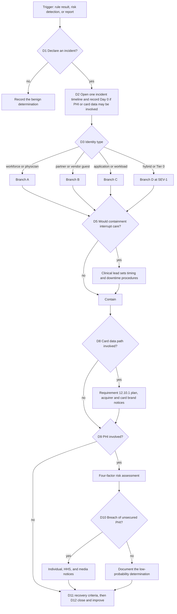

# Contoso Regional Health (fictional): incident response playbook for identity compromise

> **Reference work.** Fictional scenario built for a public portfolio. Not deployed in, derived from, or describing any employer environment. Not professional advice.

This playbook covers a suspected or confirmed compromise of an identity at Contoso Regional Health (fictional): a workforce or affiliated physician account, a partner guest account, an application or workload identity, or a Tier 0 identity. It is organized around NIST SP 800-61 Rev. 3 (April 2025), which presents incident response as a CSF 2.0 Community Profile, and it ties every decision point to the detections in this pack, the attack paths in `threat-models/zero-trust-healthcare/attack-paths.md`, and the component IDs frozen in `architecture/zero-trust-healthcare/02-reference-architecture.md` section 11.

- **Status: reference playbook.** It has not been exercised in a tabletop or a lab, and no organization has adopted it. Role names are fictional roles from the reference design.
- **Regulatory clocks** come from the companion file `grc/zero-trust-healthcare/notification-clocks.md`, which cites each clock to its primary source. This playbook does not restate them beyond what a responder needs at the decision point, and counsel decides reportability.
- **Technique references** use MITRE ATT&CK Enterprise v19.2.

## 1. Scope

| Identity type | Typical attack path | Triggers in this pack | Branch |
|---|---|---|---|
| Workforce or affiliated physician account in `IDS-ENTRA`, usually synchronized from `IDS-AD` | AP-1 (stolen session), AP-2 (help-desk MFA enrollment, then payment diversion) | DX-03, DX-04, SN-01, SN-04 | A |
| Partner guest from `IDS-PARTNER`, or a Contoso-managed vendor account | AP-3 (compromised partner tenant reaches the EHR through the broker) | SN-02 vendor activation, DX-03 for guest sessions | B |
| Application registration, service principal, or managed identity | AP-6 (illicit consent or workload identity abuse) | SN-03. Managed identity abuse has no trigger yet: managed identity sign-in monitoring is not built (`coverage-map.md` section 3, item 11) | C |
| Hybrid or Tier 0 identity: `IDS-AD`, `IDS-SYNC`, `PIP-PKI`, privileged roles in `IDS-ENTRA`, the two tenant emergency access accounts and their exclusion group, `grp-ca-emergency-access`, and the admin targeting groups `grp-admins-t0` and `grp-admins-t1` | AP-5 (Tier 0 through the sync boundary), the identity steps of AP-4 | DX-05, DX-06, DX-07, SN-02, SN-05, SN-06, SN-07, SG-05, SG-06 | D |

Out of scope here. The first item has its own playbook; `coverage-map.md` section 7 records the other two as open items:

- The encryption, containment, and restoration steps of a ransomware incident beyond its identity actions. They are in the companion ransomware playbook (`ir-ransomware.md`), which runs Branch D of this playbook for Tier 0 and Branch A for the account behind the activity (its decision point RD3).
- Medical device containment beyond the clinical safety gate (AP-7, `04-segmentation.md` section 3).
- Misuse of legitimate EHR access by authorized users (RR-01), which belongs to EHR privacy monitoring.

## 2. How this playbook follows NIST SP 800-61 Rev. 3

SP 800-61 Rev. 3 supersedes Rev. 2 (2012) and replaces its four-phase life cycle with a model built on the six CSF 2.0 Functions. Govern, Identify, and Protect are preparation. Detect, Respond, and Recover are incident response. The Improvement category within Identify (ID.IM) carries lessons learned into every Function continuously rather than only at the end (Rev. 3 section 2.1 and Fig. 2). The playbook stages below map to the CSF 2.0 outcomes in the Rev. 3 Community Profile tables; outcome wording is paraphrased.

| Playbook stage | CSF 2.0 outcomes (SP 800-61 Rev. 3, Tables 2 and 3) | Where |
|---|---|---|
| Prepare (standing work) | GV.RR-02 roles and authorities; GV.OC-03 legal, regulatory, and contractual requirements including notification; GV.SC-08 suppliers in incident planning and response; ID.IM-04 incident response plans maintained; PR.PS-04 logs available; PR.DS-11 backups created, protected, and tested | Sections 3, 3.1, 7, 8 |
| Detect and declare | DE.AE-02 analysis of adverse events; DE.AE-03 correlation across sources; DE.AE-04 impact and scope estimated; DE.AE-06 information provided to staff and tools; DE.AE-07 threat intelligence integrated; DE.AE-08 incident declared against criteria | Section 5, D1 to D4 |
| Manage the incident | RS.MA-01 plan executed with third parties; RS.MA-02 reports triaged and validated; RS.MA-03 categorized and prioritized; RS.MA-04 escalated or elevated | Sections 4 and 5 |
| Analyze and scope | RS.AN-03 what happened and root cause; RS.AN-06 actions recorded with integrity preserved; RS.AN-07 incident data collected with provenance; RS.AN-08 magnitude estimated and validated | Sections 6 and 8 |
| Contain and eradicate | RS.MI-01 contained; RS.MI-02 eradicated | Section 6 |
| Notify and communicate | RS.CO-02 stakeholders notified; RS.CO-03 information shared | Section 7 |
| Recover | RS.MA-05 recovery criteria applied; RC.RP-01 to RC.RP-06 recovery plan executed through declared end; RC.CO-03 and RC.CO-04 recovery communication | Section 9 |
| Improve | ID.IM-01 to ID.IM-03 improvements from evaluations, exercises, and operations | Section 10 |

## 3. Roles

Fictional roles, mapped to the role families in SP 800-61 Rev. 3 section 2.2.

| Role | Responsibility in this playbook | Rev. 3 role family |
|---|---|---|
| Incident commander (security operations manager on call; the CISO for SEV-1) | Declares the incident, sets severity, owns decision points D1 to D12, runs the incident timeline | Leadership, incident handlers |
| SOC analyst | Triage, scoping queries, evidence collection | Incident handlers |
| Identity responder (Tier 1 administrator; Tier 0 administrator for Branch D) | Containment in Entra ID and Active Directory, from a `PEP-PAW` only | Technology professionals |
| Directory administrator | krbtgt resets, Active Directory recovery, `IDS-SYNC` and `PIP-PKI` actions | Technology professionals |
| Clinical lead (Chief Medical Information Officer or Chief Nursing Officer delegate) | Clinical impact decisions, downtime procedures (ADR-008) | Asset owners |
| Privacy officer | HIPAA breach risk assessment and individual notices | Legal |
| Compliance officer | Acquirer and card brand notices for the CDE | Legal |
| Counsel | Reportability, law enforcement contact, business associate questions | Legal |
| Communications lead | Patient, staff, and media communication | Public affairs and media relations |
| Finance lead | Payment recall and bank contact (AP-2) | Asset owners |
| Vendor manager | Partner and business associate coordination (AP-3) | Third parties under contract |

### 3.1 Preparation checks (standing work before any incident)

- **Automatic attack disruption and the clinical safety gate.** Defender's attack disruption can contain devices, contain IP addresses of devices that are not onboarded, and disable or suspend users. Medical devices are not onboarded, so their addresses could be contained automatically. Configure attack disruption exclusions, which Microsoft supports for users, devices, and IP addresses, for medical device segments and for any account whose automatic suspension would stop clinical work. Exclusions remove automated protection from those assets, so each one routes to the human decision path in the clinical safety gate (`04-segmentation.md` section 3) and is recorded with an owner and expiry (principle P-5).
- **EHR session termination.** Keep a tested procedure for ending a user's EHR sessions through the EHR administrative function (A-07). It is the only way to end a stolen EHR browser session (Branch A).
- **Contacts on file.** Keep verified contacts for partner security teams, business associates, the acquirer, payers, banks, and the payroll provider, so no one has to trust a contact supplied during an incident.
- **Log retention.** Confirm that sign-in, audit, mailbox audit, and broker logs are retained long enough to scope an intrusion that started weeks earlier (assumption A-17 leaves retention open).
- **Tier 0 readiness.** Confirm that Tier 0 PAWs are available at more than one site and that the sealed recovery credentials and emergency access accounts are tested on schedule (`03-identity-and-access.md` section 5). Tell the SOC before each emergency access test, as Microsoft's emergency access guidance advises: every test sign-in raises SN-06 by design, and any audit activity the test produces, such as an administrative task or a passkey re-issue, raises SN-07. Each validation also confirms that `grp-ca-emergency-access` holds exactly the two accounts and has no owners (`03-identity-and-access.md` section 5).
- **Recovery assets.** Confirm that restore evidence for `SVC-BACKUP` exists before an incident. ADR-009 decision 3 defines that evidence: the copy used and its age, the elapsed time for each stage, the integrity checks and their results, the system owner's confirmation, and any failure with its remediation. Until restore tests produce it, recovery capability is unverified (RR-11), and Branch D step 5 and the section 9 criteria depend on it.

## 4. Severity and escalation

Severity drives who is engaged and how fast. Time targets in this section are example values for the reference design, not regulatory clocks.

| Severity | Criteria (any one) | Engage (example targets) |
|---|---|---|
| SEV-1 | Any criterion in the SEV-1 list below the table | Incident commander and CISO at once; directory administrator, clinical lead, privacy officer, and counsel within the first hour |
| SEV-2 | Confirmed account takeover with mailbox, file, or EHR access (DX-03, DX-04, or SN-01 at High); a vendor activation anomaly followed by a broker session to an EHR server; a sensitive OAuth grant (SN-03 at High); a completed device code sign-in (SN-04 at High) | Incident commander at once; privacy officer the same business day; finance lead at once when payment terms appear |
| SEV-3 | A single unconfirmed signal (for example DX-04 at Medium, a blocked SN-04 attempt, one DX-07 signal) | SOC analyst; escalate on confirmation |

**SEV-1 criteria (any one).**

- DX-05 chain reaching directory replication
- any DX-06 result
- an unplanned trust, federation, or sync change from SN-02
- a permanent Tier 0 role assigned outside PIM
- any assignment of a role the design never assigns (SN-02)
- backup vault deletion from SN-05
- an emergency access account sign-in from SN-06 that no scheduled test or declared emergency explains
- a change to `grp-ca-emergency-access`, `grp-admins-t0`, or `grp-admins-t1`, or audit activity by or on an emergency access account, from SN-07 that no change record, scheduled test, or declared emergency explains
- identity compromise with a clinical system affected

Escalation rules (RS.MA-04). Raise severity when any of these becomes true: a second account or a Tier 0 account is involved; PHI is confirmed accessed; the card data path is involved (D8); a business associate is involved (D7); containment would interrupt patient care (D5). Elevation to leadership follows SEV-1 automatically.

## 5. Decision points

| ID | Decision | Inputs | If yes | If no | Owner |
|---|---|---|---|---|---|
| D1 | Declare an incident? (DE.AE-08) | A High or Critical result from a rule in this pack; an Entra ID Protection attackerinTheMiddle or anomalousToken detection; a Defender XDR incident with identity evidence; a user or help desk report that the user did not make a change | Declare, name an incident lead (RS.MA-01), open the incident timeline | Record the benign determination and its evidence, tune the rule | Incident commander |
| D2 | Could PHI or card data be involved? | Mailbox, file, EHR, portal, or CDE access by the identity in the window | Record Day 0 now: the first day the breach was known, or would have been known with reasonable diligence, to any workforce member or agent (45 CFR 164.404(a)(2), `notification-clocks.md` section 2.4). Card brands apply their own triggers (section 7.2). Inform the privacy officer and counsel | Continue; revisit at every scope change | Incident commander |
| D3 | Which identity type? | Section 1 table | Run Branch A, B, C, or D (section 6). Several branches can run at once | Not applicable | Incident commander |
| D4 | Is a Tier 0 identity or Tier 0 group, `IDS-SYNC`, `PIP-PKI`, or the emergency access path involved? | DX-05, DX-06, DX-07, SN-02 results; SN-06 emergency access account sign-ins; SN-07 changes to `grp-ca-emergency-access`, `grp-admins-t0`, and `grp-admins-t1`, and audit activity by or on the emergency access accounts; PIM activation records | SEV-1; Branch D runs in parallel with any other branch | Continue at the current severity | Incident commander |
| D5 | Would containment interrupt patient care? | Clinician or shared clinical workstation account; EHR, integration, or device-class server service account; a device in clinical use | Clinical lead sets timing and the alternate workflow; automated identity actions keep the clinical notification step (ADR-008); a service account that a clinical system depends on is not disabled without a clinical impact check; medical devices follow the clinical safety gate | Contain without delay | Clinical lead with the incident commander |
| D6 | Contain now or observe? | Rev. 3 RS.MA-03 notes the trade-off between quick recovery and observing the attacker; RS.MI notes that observation delays containment and needs legal review first | Default: contain now | Observe only with counsel's approval, a defined end point, and no exposure of additional PHI | Incident commander with counsel |
| D7 | Is a partner or business associate involved? | `IDS-PARTNER` accounts, `EXT-VENDOR-EHR`, `EXT-VENDOR-BIOMED` (a business associate when it has broker access, A-13), `EXT-RCM-BA`, `EXT-TELEHEALTH` | Coordinate under GV.SC-08; apply the business associate agreement's reporting terms; ask counsel whether the business associate's knowledge is imputed to Contoso (`notification-clocks.md` section 3) | Continue | Vendor manager with counsel |
| D8 | Could card data be involved? | `Z-CDE`, `RES-POI`, the payment redirect on `RES-PORTAL`, `EXT-PSP`, `EXT-P2PE` | Run the PCI DSS v4.0.1 Requirement 12.10.1 incident response plan and the card brand and acquirer notices in section 7.2. Isolate affected systems rather than powering them off unless a PCI Forensic Investigator directs otherwise, and preserve evidence | Continue | Compliance officer |
| D9 | Could PHI be involved? | Scope results from section 6 | Run and document the four-factor risk assessment in 45 CFR 164.402: the nature and extent of the PHI, the unauthorized person, whether the PHI was actually acquired or viewed, and how far the risk is mitigated. Decide whether the PHI was secured under the HHS guidance. An impermissible use or disclosure is presumed to be a breach unless the assessment shows a low probability of compromise | Document why PHI was not involved | Privacy officer |
| D10 | Is it a breach of unsecured PHI? | D9 result, counsel's view | Run the notices in section 7.1 | Keep the documented determination; Contoso carries the burden of proof (164.414(b)) | Privacy officer with counsel |
| D11 | Are the recovery criteria met? (RS.MA-05) | Section 9 criteria | Restore access in the order the clinical lead sets | Keep containment and extend scoping | Incident commander |
| D12 | Can the incident close? (RC.RP-06) | Recovery confirmed, notices complete or scheduled | Declare the end of recovery, complete the after-action report, start section 10 | Continue | Incident commander |

## 6. Response branches

Every action is recorded in the incident timeline with the time, the actor, and the result (RS.AN-06). Containment is RS.MI-01, eradication RS.MI-02, and scoping RS.AN-03 and RS.AN-08.

### Branch A: workforce or affiliated physician account (AP-1, AP-2)

**Contain**

1. For a synchronized account, disable it in Active Directory and reset its password twice; Microsoft recommends two resets to reduce pass-the-hash risk where on-premises password replication is delayed. Then, in Entra ID, block sign-in and select Revoke sessions to revoke refresh tokens, and disable the user's registered devices if they are suspect (Microsoft's emergency revocation guidance).
2. End the user's EHR browser and portal sessions through the EHR administrative function (assumption A-07). Microsoft documents that Entra ID cannot revoke a session token that an application issued, and the EHR browser path is not enforced by continuous access evaluation (RR-03), so this step is what actually ends the attacker's session.
3. On site, an Active Directory disable stops new Kerberos tickets, but tickets already issued stay valid until they expire (`02-reference-architecture.md` section 9). Lock the user's active workstation sessions as well.
4. Mark the user as compromised in Entra ID Protection, which raises user risk so CA-18 requires remediation.
5. Block the attacker's address in Defender for Cloud Apps or as an Entra ID named location. Attackers change addresses, so treat this as friction, not containment.
6. Clinical notification (D5): when the account belongs to clinical staff, unit leadership moves the person to downtime procedures or a supervised alternate sign-in before access is cut.

**Scope**

- Other sign-ins from the same address, user agent, or session (DX-03 output; SigninLogs by IPAddress).
- Mailbox and file activity since the first suspicious sign-in: OfficeActivity by ClientIP, CloudAppEvents by account and address.
- Inbox rules and forwarding (DX-04), security-info changes (SN-01), consents the user granted (SN-03), new device registrations.
- The phishing message and its other recipients (EmailEvents in Defender XDR).
- AP-2: payment, payroll, or banking-detail change requests sent from or approved through the mailbox.

**Eradicate**

- Remove attacker inbox rules, forwarding, and mailbox delegate permissions (T1098.002 (Account Manipulation: Additional Email Delegate Permissions)).
- Delete authentication methods and devices the user did not register, through the Microsoft Graph authentication methods API (Microsoft token theft playbook).
- Require in-person or sponsor-verified identity proofing and a Temporary Access Pass before any new method is registered (CA-19, `03-identity-and-access.md` section 2). No phone-only exception (`threat-model.md` section 9 item 3).

**AP-2 payment diversion**

- The finance lead contacts the payer, bank, or payroll provider through contact details on file, never through details found in the mailbox, and asks for a recall. Speed matters for recovery of funds.
- Re-confirm any banking-detail change made in the window by callback with dual approval.

**Recover**

- Re-enable after D11, with heightened review of the account's sign-ins for 30 days (example value).

### Branch B: partner guest or vendor account (AP-3)

**Contain**

1. End the PIM-for-Groups activation and remove the account from its vendor session group (`IGA-ENTRA`): `grp-vendor-ehr-session` for the EHR vendor, or that vendor's own `grp-vendor-biomed-<vendor>-session` group for a biomedical vendor (`03-identity-and-access.md` section 7; every vendor session group matches `grp-vendor-*-session`). End any active `PEP-VENDOR-BROKER` session. For a biomedical vendor, tell clinical engineering, which approves those activations (F-07); if the session reaches a device in clinical use, D5 applies.
2. Block sign-in for the guest object in Contoso's tenant and revoke its sessions. Continuous access evaluation and risk remediation do not apply to guests (`03-identity-and-access.md` section 7), so blocking is the containment.
3. Call the partner's security contact using the contact details on file, not any supplied in the session, and ask the partner to contain the home-tenant account. Inbound MFA trust means the partner's account state is the root of the problem (RR-06).
4. Run D7 when the partner is a business associate.

**Scope**

- Broker session recordings and the hosts and ports reached (flow F-06, or F-07 for a biomedical vendor's session to an imaging modality).
- EHR audit logs for the vendor's or outsourcer's EHR roles, against minimum-necessary expectations.
- DeviceNetworkEvents and `PEP-NET-ZONE` firewall logs from broker session hosts, for data movement (AP-3 step 6).

**Recover**

- Restore vendor access only after a new approval by the Contoso system owner and a fresh due diligence check of the partner's MFA posture (assumption A-12).

### Branch C: application or workload identity (AP-6)

**Contain**

1. Revoke the consent grant or app role assignment and remove any credential added in the window (SN-03 output).
2. Disable the service principal if the application is malicious. For a single-tenant service principal, CA-22 can block it where Workload ID Premium is licensed (A-04).
3. Managed identities are outside CA-22: remove their role assignments instead.

**Scope**

- The application's sign-ins and its mailbox and file access since the consent or credential change (CloudAppEvents, OfficeActivity).
- Other users who consented to the same application.

**Eradicate and recover**

- Delete malicious registrations; rotate credentials of compromised legitimate applications.
- Move integrations to certificate credentials with a named owner and a quarterly (example) permission review (`03-identity-and-access.md` section 6).

### Branch D: hybrid or Tier 0 identity (AP-5; identity steps of AP-4)

Branch D runs under incident command at SEV-1. Every action is taken from a Tier 0 `PEP-PAW`; any administrative session from another device is presumed compromised.

1. **Cloud control plane.** Keep the emergency access accounts sealed unless normal administration fails (`03-identity-and-access.md` section 5).
   - **Compromised administrator accounts.** Disable them, revoke their sessions, and remove role assignments, PIM eligibility, Conditional Access edits, and federation or cross-tenant changes made in the window (SN-02 output).
   - **SN-06 sign-in.** If SN-06 shows an emergency access account sign-in that no scheduled test or declared emergency explains, treat that account as compromised: review its audit activity for the window (SN-07), revoke its sessions, and re-issue its passkey under split custody, keeping the other account sealed (SN-06 response notes).
   - **SN-07 change to an emergency access account.** If SN-07 shows a change made to an emergency access account that no test or incident record explains, handle that account the same way: the change comes before any sign-in it enables. Also delete any Temporary Access Pass and any method not registered under split custody. Re-enable or restore a disabled or deleted account, and give a removed Global Administrator assignment back as permanent active (Microsoft's emergency access guidance), under incident command.
   - **SN-07 change to `grp-ca-emergency-access`.** If SN-07 shows a change to `grp-ca-emergency-access` that no change record explains, remove any member or owner that was added, treat it and the actor as compromised, and review the account's sign-ins since the change (SigninLogs and AADNonInteractiveUserSignInLogs by UserId). If an emergency access account was removed from the group, add it back; if the group was deleted, restore it (Microsoft documents that a deleted role-assignable group is soft-deleted and can be restored within 30 days), or after a hard delete recreate it as a role-assignable group. Then confirm that the group holds exactly the two accounts, has no owners, and is still excluded from every enforced policy that blocks or restricts sign-in (`03-identity-and-access.md` section 5).
   - **SN-07 change to an admin group.** If SN-07 shows a change to `grp-admins-t0` or `grp-admins-t1` that no change record explains, put back any admin account that was removed (restore the group if it was deleted), remove any member or owner that was added, and treat the actor and any removed account as compromised. A removed account was outside the phishing-resistant and PAW-only policies (CA-03, and CA-04 or CA-05; `03-identity-and-access.md` section 3) until it was put back, so review its sign-ins since the change; a window with no sign-in from a device that is not a PAW does not clear it.
2. **Entra Connect (`IDS-SYNC`).** Contain the sync server rather than wiping it, and preserve it for analysis. Plan for the synchronization pause: joiners and leavers stop flowing to Entra ID while it is contained. Rotate the AD DS Connector account credential once the server is trusted again; that account holds replication rights for password hash synchronization.
3. **Active Directory.** Reset the krbtgt account password twice, waiting at least the maximum ticket lifetime between resets (10 hours by default) as Microsoft's forest recovery guidance directs. Every site re-authenticates afterward, so the clinical lead schedules the resets (D5). Use the sealed recovery credentials only under incident command (`03-identity-and-access.md` section 5).
4. **Certificates (`PIP-PKI`).** If DX-05 reached the certificate stage, revoke certificates issued in the window, review template permissions, and treat the issuing CA as suspect. Smart card badges depend on `PIP-PKI` (ADR-003), so certificate actions also need the clinical lead.
5. **Recovery assets.** Confirm that `SVC-BACKUP` is intact and unreachable from the compromised identities (SN-05, DX-01). Recovery capability is unverified in this design (RR-11), so this check comes before any restoration. Restoration starts from a copy that predates the compromise and is verified before use (ADR-009 decision 3).
6. **Total loss of Entra ID administration.** The dormant emergency administrative path is enabled only under incident command with two Tier 0 approvers (ADR-008).

## 7. Notification and communication

Counsel decides whether an incident is reportable. Contracts can set shorter clocks than those below. State breach laws vary and are mapped by counsel per incident (`notification-clocks.md` section 5.3).

`grc/zero-trust-healthcare/notification-clocks.md` is the authoritative source for every clock in this section. The tables below are a responder's summary of it as of 2026-10-04; section 6 of that file is its own decision table for playbook steps. If the two ever differ, follow `notification-clocks.md` and correct this playbook.

### 7.1 Protected health information

Clocks from `notification-clocks.md` sections 2 and 3, which cite the regulation for each.

| Notice | Clock | Citation |
|---|---|---|
| Each affected individual, breach of unsecured PHI | Without unreasonable delay, and no later than 60 calendar days after discovery | 45 CFR 164.404 |
| Prominent media outlets, breach involving more than 500 residents of a State or jurisdiction | Same as the individual notice | 164.406 |
| HHS, breach involving 500 or more individuals | At the same time as the individual notice | 164.408(b) |
| HHS, breach involving fewer than 500 individuals | No later than 60 days after the end of the calendar year of discovery, from the breach log | 164.408(c) |
| Business associate to Contoso, breach of unsecured PHI | Without unreasonable delay, and no later than 60 calendar days after the business associate's discovery | 164.410 |
| Law enforcement delay | For the period in a written statement; an oral request is documented and limited to 30 days unless a written statement follows | 164.412 |

The January 2025 HIPAA Security Rule NPRM proposes two 24-hour notices: a business associate's report to the covered entity when it activates its contingency plan, and a notice to another covered entity or business associate when a workforce member's authorization to access ePHI or systems that the other entity maintains changes or ends. Both are proposals, not in force, and this playbook schedules neither (`notification-clocks.md` section 5.1). CIRCIA reporting duties are not final (`notification-clocks.md` section 5.2).

### 7.2 Card data

PCI DSS v4.0.1 sets no notification clock of its own. Requirement 12.10.1 requires an incident response plan that covers notifying the payment brands and acquirers, and the brands and acquirers set the clocks.

| Recipient | What the playbook does | Source |
|---|---|---|
| Acquirer | Notify under Contoso's merchant agreement and the card brands' rules; Visa requires notice to the acquirer immediately | Merchant agreement (not part of this reference set); `notification-clocks.md` section 4 |
| Visa | Report within 3 calendar days of discovering evidence enough to raise a reasonable suspicion of compromise | What To Do If Compromised: Visa Supplemental Requirements, Version 10.0, Section A, as cited in `notification-clocks.md` section 4 |
| Mastercard | No time figure is given here. Notify the acquirer under the merchant agreement and follow Mastercard's rules | Mastercard Security Rules and Procedures, Merchant Edition; `notification-clocks.md` section 4 |
| American Express | Follow the cited policy | American Express Data Security Operating Policy, United States, April 2026, Sections 3 and 8; `notification-clocks.md` section 4 |
| Discover | The Discover Global Network contact page states "within 48 hours of incident"; plan on the earlier reading and confirm with the acquirer | Discover Global Network, Contact Us page for U.S. business owners (undated), as cited in `notification-clocks.md` section 4 |

A PCI Forensic Investigator, if the acquirer or a brand requires one, directs evidence handling. Until then, isolate compromised systems rather than powering them off and preserve all evidence and logs (PCI SSC guidance, as cited in `notification-clocks.md` section 4). Under ADR-007 no Contoso account can reach the P2PE terminals, so an identity incident reaches card data mainly through the portal payment redirect (R-12 in the risk register; `threat-model.md` TB-1 and TB-8) or a supplier (R-11 in the risk register).

### 7.3 Internal and sector communication

- Update leadership on SEV-1 and SEV-2 incidents at a set cadence (RS.CO-03).
- Notify human resources when insider activity is suspected (RS.CO-03).
- Share indicators and observed behavior with the sector information sharing and analysis center when counsel agrees (RS.CO-03).
- Patient and media communication goes only through the communications lead, using approved messaging (RC.CO-04).

## 8. Evidence handling

Rev. 3 treats collected incident data as evidence even when no prosecution follows (RS.AN-07).

- Export the relevant Entra sign-in and audit records, Defender XDR incident and advanced hunting results, Sentinel incident and query results, mailbox audit records, broker session recordings, and EHR audit logs before retention removes them. Retention settings are outside this design (assumption A-17), so check them at D1.
- Use chain-of-custody handling when counsel expects legal action.
- Incident records contain ePHI and details of exploited weaknesses: restrict access and protect their integrity (RS.AN-06).

## 9. Recovery and closure

Recovery criteria for D11 (RS.MA-05):

- Attacker methods, devices, rules, grants, and credentials are removed, and the scoping queries return nothing new for 24 hours (example value).
- Tokens and sessions are revoked, and the account owner has been re-proofed before new methods were registered.
- For Branch D, Tier 0 changes are reversed, krbtgt resets are complete, and `SVC-BACKUP` integrity is confirmed before any restoration (RC.RP-03). Any restoration uses a copy that predates the compromise, verified before use (ADR-009 decision 3).
- Where SN-06 or SN-07 alerted, the emergency access backstop is whole again: `grp-ca-emergency-access` holds exactly the two accounts, has no owners, and is excluded from every enforced policy that blocks or restricts sign-in, and each account is enabled, holds its permanent Global Administrator assignment, and has no authentication method other than passkeys registered under split custody (`03-identity-and-access.md` section 5).
- Where SN-07 alerted on an admin group, `grp-admins-t0` and `grp-admins-t1` hold the membership their change records show and have no owners (`03-identity-and-access.md` section 3).
- The clinical lead agrees on the order and timing of restored access; clinical services come first (RC.RP-04).

Closure (RC.RP-06): declare the end of recovery against these criteria, then complete an after-action report covering the incident, the response and recovery actions, the notices sent, and the lessons learned.

## 10. Lessons learned

- Tune or add detections for any step that was missed or noisy, and update the status column in `coverage-map.md` (ID.IM-03).
- Record architectural gaps as additions to the architectural observations in `threat-model.md` section 9 (ID.IM-03).
- Review this playbook after each SEV-1 or SEV-2 incident and after each exercise (ID.IM-04).

## 11. Exercise status

Not exercised. Suggested tabletop scenarios, in line with `purple-team-plan.md`:

1. AP-2: a help desk enrolls an attacker method, and an invoice-forwarding rule follows. Tests D2, D5, and the payment recall steps.
2. AP-1: an affiliated physician's EHR browser session is replayed from another country. Tests EHR session termination and RR-03.
3. AP-5: a replication request from a sync server by an unexpected account. Tests Branch D, the krbtgt scheduling with the clinical lead, and the backup check.
4. AP-3: an off-hours vendor activation followed by a broker session to an EHR server. Tests D7 and the partner contact process.
5. AP-5 step 8a: SN-07 reports an account added to `grp-ca-emergency-access` with no change record. Tests D4, Branch D step 1, and the emergency access recovery criterion in section 9.

## Sources

The regulatory clocks rest on primary sources that the companion file `notification-clocks.md` cites and checked on 2026-10-04; they are listed there and not repeated here.

| Title | Publisher | URL | Date checked | Quality |
|---|---|---|---|---|
| SP 800-61 Rev. 3, Incident Response Recommendations and Considerations for Cybersecurity Risk Management: A CSF 2.0 Community Profile | NIST | https://csrc.nist.gov/pubs/sp/800/61/r3/final | 2026-10-04 | primary |
| Revoke user access in an emergency in Microsoft Entra ID | Microsoft Learn | https://learn.microsoft.com/en-us/entra/identity/users/users-revoke-access | 2026-10-04 | primary |
| Token theft playbook | Microsoft Learn | https://learn.microsoft.com/en-us/security/operations/token-theft-playbook | 2026-10-04 | primary |
| Alert classification for suspicious inbox manipulation rules | Microsoft Learn | https://learn.microsoft.com/en-us/defender-xdr/alert-grading-playbook-inbox-manipulation-rules | 2026-10-04 | primary |
| AD Forest Recovery: Reset the krbtgt password | Microsoft Learn | https://learn.microsoft.com/en-us/windows-server/identity/ad-ds/manage/forest-recovery-guide/ad-forest-recovery-reset-the-krbtgt-password | 2026-10-04 | primary |
| Automatic attack disruption in Microsoft Defender | Microsoft Learn | https://learn.microsoft.com/en-us/defender-xdr/automatic-attack-disruption | 2026-10-04 | primary |
| Microsoft Entra Connect: Accounts and permissions | Microsoft Learn | https://learn.microsoft.com/en-us/entra/identity/hybrid/connect/reference-connect-accounts-permissions | 2026-10-04 | primary |
| Manage emergency access admin accounts | Microsoft Learn | https://learn.microsoft.com/en-us/entra/identity/role-based-access-control/security-emergency-access | 2026-10-04 | primary |
| Use Microsoft Entra groups to manage role assignments (role-assignable group deletion and restore) | Microsoft Learn | https://learn.microsoft.com/en-us/entra/identity/role-based-access-control/groups-concept | 2026-10-04 | primary |
| Microsoft Entra audit log activity reference | Microsoft Learn | https://learn.microsoft.com/en-us/entra/identity/monitoring-health/reference-audit-activities | 2026-10-04 | primary |
| Breach and incident notification clocks (companion artifact, with its own primary sources) | This repository | `grc/zero-trust-healthcare/notification-clocks.md` | 2026-10-04 | secondary (companion summary of primary sources) |
