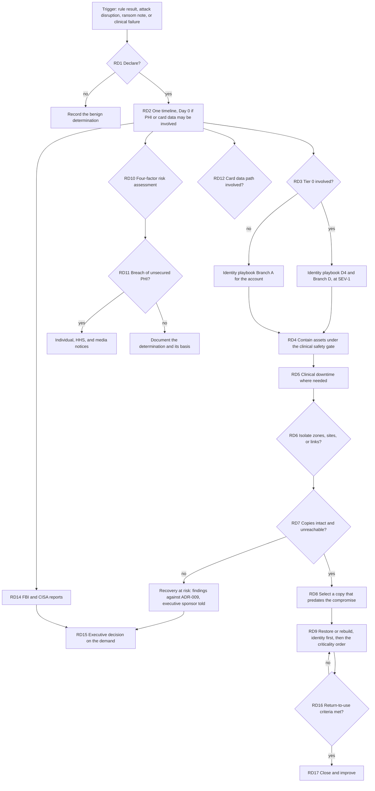

# Contoso Regional Health (fictional): incident response playbook for ransomware

> **Reference work.** Fictional scenario built for a public portfolio. Not deployed in, derived from, or describing any employer environment. Not professional advice.

This playbook covers a suspected or confirmed ransomware or data extortion incident at Contoso Regional Health (fictional), from the first staging signal through containment under the clinical safety gate, clinical downtime, restoration, the breach analysis, and closure. It is organized around NIST SP 800-61 Rev. 3 (April 2025), which presents incident response as a CSF 2.0 Community Profile. It follows attack path AP-4 in `threat-models/zero-trust-healthcare/attack-paths.md`, the top-ranked path in the companion threat model, and it ties every decision point to the detections in this pack, the component IDs frozen in `architecture/zero-trust-healthcare/02-reference-architecture.md` section 11, the failure modes in ADR-008, and the recovery requirements in ADR-009.

- **Status: reference playbook.** It has not been exercised in a tabletop or a lab, and no organization has adopted it. Role names are fictional roles from the reference design. The companion tabletop kit, `tabletop-ransomware.md`, has not been run either.
- **Recovery capability is unverified.** ADR-009 sets four requirements for `SVC-BACKUP`, but the recovery implementation is not designed and no restore has been tested (A-19, RR-11, `threat-model.md` TM-A1). Every recovery step below depends on copies and restore evidence that the reference design does not have yet, and each step that relies on an ADR-009 requirement names it.
- **Triggers are untested templates.** Every rule this playbook names is an untested template (`coverage-map.md` section 1).
- **Decision point IDs.** Decision points here are RD1 to RD17 ("ransomware decision"), so they never collide with D1 to D12 in the companion identity compromise playbook (`ir-identity-compromise.md`) or with the risk IDs R-01 to R-12. Where this playbook hands work to the identity playbook, it names that playbook's decision points and branches in full, for example "identity playbook D4 and Branch D".
- **Regulatory clocks** come from the companion file `grc/zero-trust-healthcare/notification-clocks.md`, which cites each clock to its primary source. Counsel decides reportability.
- **Technique references** use MITRE ATT&CK Enterprise v19.2.

## 1. Scope

In scope:

- Ransomware against clinical operations as AP-4 models it, from the phished workstation (step 1) through encryption and service stop (steps 11 and 12), including the data theft before encryption that AP-4 describes without a step of its own.
- Recovery inhibition that accompanies encryption, on Windows hosts (AP-4 step 10) or against Azure-native backup (the Azure part of AP-5 step 9).
- Data extortion without encryption. RD1 to RD3 and RD10 to RD15 apply in full; containment and recovery apply only as far as systems were changed.

Triggers in this pack, by AP-4 step:

| AP-4 step | Technique | Pack rules | Gap or note |
|---|---|---|---|
| 1, 2 | T1566.001 (Phishing: Spearphishing Attachment), T1204.002 (User Execution: Malicious File) | SG-03, at the file-open step | Delivery is not built; Defender for Office 365 alerts carry it (`coverage-map.md` section 3, item 14) |
| 3 to 5 | T1059 (Command and Scripting Interpreter), T1018 (Remote System Discovery), T1135 (Network Share Discovery) | None | Left to Defender for Endpoint behavioral detections (`coverage-map.md` section 4). SG-04 watches the related domain group enumeration, T1069.002 (Permission Groups Discovery: Domain Groups) |
| 6 | T1558.003 (Steal or Forge Kerberos Tickets: Kerberoasting) | DX-05, SG-05 | The identity side runs in the identity playbook (RD3) |
| 7, 8 | T1021.002 (Remote Services: SMB/Windows Admin Shares), T1570 (Lateral Tool Transfer) | DX-08 | Assurance rule for `PEP-HOST`: a result is a control gap as well as an intrusion |
| 9 | T1685 (Disable or Modify Tools) | DX-09, SG-02 | Assurance rule for tamper protection |
| 10 | T1490 (Inhibit System Recovery) | DX-01 and SG-01 on Windows hosts; SN-05 for Azure-native backup | Reaching Azure-native backup needs cloud administrative access, which `attack-paths.md` models at AP-5 step 9. Rules for the recovery plane's own logs depend on the product chosen and are not built (`coverage-map.md` section 4) |
| 11 | T1486 (Data Encrypted for Impact) | DX-02 | Rename-based; encryption in place without renaming is left to Defender's own detections, which DX-02 joins |
| 12 | T1489 (Service Stop) | None | `coverage-map.md` section 4 |
| Data theft before encryption (no step of its own) | T1567.002 (Exfiltration Over Web Service: Exfiltration to Cloud Storage), T1048 (Exfiltration Over Alternative Protocol) | None | Not built (`coverage-map.md` section 4) |

Other triggers: a Defender XDR incident whose evidence includes encryption or recovery inhibition; an automatic attack disruption action; staff reports of a ransom note or unreadable files; a clinical application failure that the service desk cannot explain; an extortion message or a claim of stolen data; a notification from law enforcement, CISA, a business associate, or another partner.

Out of scope here:

- Identity containment and eradication, which run in the identity playbook: Branch A for the account behind the activity, Branch D for Tier 0. This playbook calls them at RD3.
- Medical device containment beyond the clinical safety gate (AP-7; `coverage-map.md` section 7).
- The recovery design itself. Products, topology, recovery objectives, and restore order are Contoso's (A-19, ADR-009).
- Negotiation with a threat actor. RD15 frames the payment decision for executives, and this playbook gives no negotiation guidance.

## 2. How this playbook follows NIST SP 800-61 Rev. 3

SP 800-61 Rev. 3 supersedes Rev. 2 (2012). In place of Rev. 2's four-phase life cycle it proposes a model built on the six CSF 2.0 Functions, and notes that organizations should use the life cycle model that suits them best. Govern, Identify, and Protect are preparation. Detect, Respond, and Recover are incident response. The Improvement category within Identify (ID.IM) carries lessons learned into every Function continuously (Rev. 3 section 2.1 and Fig. 2). Rev. 3 notes that recovering from incidents now often takes weeks or months, and this playbook plans for that horizon. The stages below map to the CSF 2.0 outcomes in the Rev. 3 Community Profile tables. Outcome wording is paraphrased; for GV.RM-03, ID.IM-04, RS.MA-01, and RS.CO-02 the entry summarizes a Rev. 3 recommendation on that row (R1, R1, R3, and R5) rather than the outcome itself.

| Playbook stage | CSF 2.0 outcomes (SP 800-61 Rev. 3, Tables 2 and 3) | Where |
|---|---|---|
| Prepare (standing work) | GV.RR-02 roles and authorities; GV.OC-03 legal, regulatory, and contractual requirements; GV.OC-04 services that external stakeholders depend on; GV.RM-03 incident decisions informed by other risk types; GV.SC-08 suppliers in incident planning and response; ID.IM-04 incident response plans maintained and synchronized with business continuity plans; PR.DS-11 backups created, protected, maintained, and tested; PR.PS-04 logs available | Sections 3, 3.1, 7 |
| Detect and declare | DE.AE-02 analysis of adverse events; DE.AE-03 correlation across sources; DE.AE-04 impact and scope estimated; DE.AE-08 incident declared against criteria | Section 5 (RD1 to RD3), 6.1 |
| Manage the incident | RS.MA-01 plan executed with third parties, including continuity and disaster recovery plans; RS.MA-02 reports triaged and validated; RS.MA-03 categorized and prioritized; RS.MA-04 escalated or elevated | Sections 4 and 5 |
| Analyze and scope | RS.AN-03 what happened and root cause; RS.AN-06 actions recorded with integrity preserved; RS.AN-07 incident data collected with provenance; RS.AN-08 magnitude estimated and validated | Sections 6.1 and 8 |
| Contain and eradicate | RS.MI-01 contained; RS.MI-02 eradicated | Sections 6.2 to 6.4 |
| Notify and communicate | RS.CO-02 stakeholders notified, law enforcement included; RS.CO-03 information shared | Section 7 |
| Recover | RS.MA-05 criteria for initiating recovery applied (RD9); RC.RP-01 to RC.RP-06 recovery plan executed through declared end, including RC.RP-03 restoration assets verified before use and RC.RP-05 restored assets verified; RC.CO-03 and RC.CO-04 recovery communication | Sections 6.5 and 9 |
| Improve | ID.IM-01 to ID.IM-04, including ID.IM-02 improvements from tests and exercises | Sections 10 and 11 |

## 3. Roles

Fictional roles, mapped to the example roles and responsibilities in SP 800-61 Rev. 3 section 2.2 (the vendor manager's entry also draws on that section's paragraph on third parties under contract). Rev. 3 notes that leadership may have decision-making authority on high-impact response actions, such as shutting down or rebuilding critical services, and that is where RD5, RD6, RD9, and RD15 sit.

| Role | Responsibility in this playbook | Rev. 3 role |
|---|---|---|
| Incident commander (security operations manager on call; the CISO for SEV-1) | Declares the incident, sets severity, owns RD1 to RD17 unless another owner is named, runs the incident timeline | Leadership, incident handlers |
| Executive sponsor (Chief Executive Officer or delegate) | Convenes the executive decision group for RD15, with the governing board as Contoso's governance documents set; approves enterprise-wide shutdown or rebuild decisions with the incident commander and the clinical lead | Leadership |
| SOC analyst | Triage, scoping queries, evidence collection | Incident handlers |
| Identity responder (Tier 1 administrator; Tier 0 administrator for identity playbook Branch D) | Identity containment and eradication, from a `PEP-PAW` only | Technology professionals |
| Infrastructure lead (VP Infrastructure or delegate) | Server and zone containment at `PEP-NET-ZONE` and `PEP-HOST`; the clean restore environment; rebuilds | Technology professionals |
| Recovery-plane administrators (at least two) | Act on `SVC-BACKUP` only from recovery-plane devices; a destructive operation needs a second recovery-plane administrator (ADR-009 decision 2); export the recovery plane's own audit trail | Technology professionals |
| System owners | Confirm that each restored application works, sign-in included, before it returns to clinical use (ADR-009 decision 3) | Asset owners |
| Clinical lead (Chief Medical Information Officer or Chief Nursing Officer delegate) | Clinical impact decisions at RD4 to RD6, downtime procedures (ADR-008), applying the restore order from Contoso's criticality analysis, and return from downtime (RD9, RD16) | Asset owners |
| Emergency management lead | Activates Contoso's emergency operations plan across sites; diversion and regional coordination with clinical leadership | Leadership |
| Clinical engineering | Medical device decisions under the clinical safety gate (`04-segmentation.md` section 3) | Asset owners |
| Privacy officer | Breach risk assessment and individual notices (RD10, RD11) | Legal |
| Compliance officer | Acquirer and card brand notices, and any change to how cards are taken during downtime (RD12) | Legal |
| Counsel | Reportability, law enforcement contact (RD14), advice on RD15, business associate questions | Legal |
| Communications lead | Patient, staff, and media communication, holding statements | Public affairs and media relations |
| Finance lead | Cyber insurer contact if Contoso holds a policy (the scenario does not say); the financial inputs the executive decision group asks for at RD15 | Asset owners |
| Vendor manager | Business associates, the EHR vendor's restore support, the P2PE provider and the payment service provider (RD13) | Asset owners (as business process owner for supplier relationships); coordinates the third parties under contract |

### 3.1 Preparation checks (standing work before any incident)

- **Restore evidence.** ADR-009 decision 3 defines the evidence a restore test leaves: the copy used and its age, the elapsed time for each stage, the integrity checks and their results, the system owner's confirmation, and any failure with its remediation. Without it, RD7 to RD9 run on estimates, and the executive group at RD15 has no measured answer to how long the clinical systems will stay down. Until restore tests produce that evidence, recovery capability is unverified (RR-11).
- **Criticality analysis and restore order.** ADR-008 and ADR-009 leave recovery objectives and the restore order among clinical applications to Contoso's applications and data criticality analysis (45 CFR 164.308(a)(7)(ii)(E)). RD9 needs that order before an incident, not during one. The identity systems come first or must already be available: the clinical applications cannot be restored to working order without `IDS-AD`, and badge sign-in needs `PIP-PKI` (ADR-009).
- **Keys recoverable without production.** Two kinds of key matter. The keys that encrypt the copies must be recoverable without production Tier 0 (ADR-009 decision 1). The keys, certificates, and recovery keys inside the data, such as the certificate that protects a transparent data encryption (TDE) database key, are themselves in scope of the copies and kept apart from the data they unlock (ADR-009, scope of the copies). A recovery key escrowed only in `IDS-AD` or `IDS-ENTRA` is lost or exposed along with the directory (`02-reference-architecture.md` section 7). Confirm before an incident that both kinds, for every in-scope restore, are held apart from the data and the directory.
- **Downtime procedures.** Clinical downtime procedures are Contoso's clinical procedures, outside this design set. ADR-008 defines when they start. A loss of internet or Entra ID starts them only for remote staff and on-site `Z-CORP` laptop users, because on-site access to the local-first set continues. A site that loses its WAN path loses the whole set there: `RES-EHR`, `RES-PACS`, `RES-LIS`, `RES-PHARM`, the `RES-INTEGRATION` flows among them, and the device-to-server flows (F-08). A site that loses every reachable domain controller loses on-site clinical sign-in to the set; device admission depends only on `PE-NETWORK`. ADR-008 applies clinical downtime procedures in both cases. Ransomware adds three conditions: the set can be lost at every site at once, for weeks rather than hours, and data entered after the copy a restore uses may have to be re-entered from downtime records. Confirm that the procedures cover those conditions, that they do not rely on downtime tools the same intrusion can reach (for example downtime report viewers on domain-joined workstations), and that they include reconciliation of downtime records afterward (RR-13).
- **Out-of-band communication.** Keep a response team channel that does not depend on Microsoft 365, Entra ID, or the hospital networks. CISA's #StopRansomware Guide advises isolating systems in a coordinated manner and using out-of-band communication, because an intruder may monitor the victim's own communications. Keep a hard copy and an offline copy of this playbook, the contact list, and `notification-clocks.md`, as the same guide recommends for the incident response plan.
- **Attack disruption exclusions.** Configure exclusions for the medical device segments and for named accounts whose automatic suspension would stop clinical work, such as service accounts that clinical interfaces depend on, each with an owner and an expiry (ADR-008, P-5). ADR-008 limits exclusions to the medical device segments and named clinical accounts. This playbook proposes adding device-class servers that `PIP-ASSET-INV` records as part of a medical device system at ADR-008's next revision (Microsoft supports exclusions for users, devices, and IP addresses). Until then, a device-class server follows the `Z-CLIN-APP` server row in section 6.2: attack disruption may contain it, the clinical lead is told at once, and release is a decision for the incident commander and the clinical lead. No server in `Z-CLIN-APP` or `Z-LEGACY` is excluded, so attack disruption can contain them on its own (section 6.2). Review the list at every change to a clinical interface or a device-class server, and treat an unexplained change to it as a signal. A missing exclusion shows up in an incident as an interface that stops when attack disruption acts; an exclusion moves containment to a person, it does not make the account safe.
- **Contacts on file.** Keep verified contacts for the local FBI field office, CISA, outside counsel, a forensic firm, the cyber insurer if any, the acquirer, the P2PE provider, the payment service provider, the EHR vendor, and the other business associates, so no one has to trust a contact supplied during an incident.
- **The payment decision process, not the decision.** Agree in advance who sits on the executive decision group for RD15, who advises it, and how its decision is recorded. Section 6.6 lists the considerations.
- **Log retention.** Confirm that endpoint, sign-in, audit, firewall, egress-proxy, and workstation web filter logs are retained long enough to scope an intrusion that began weeks before encryption (assumption A-17 leaves retention open). The copies' retention must also reach back past the likely start of an undetected intrusion (ADR-009 decision 1).
- **Exercise.** Run the companion tabletop kit, `tabletop-ransomware.md`, and record what it changes here (ID.IM-02).

## 4. Severity and escalation

Severity drives who is engaged and how fast. Time targets in this section are example values for the reference design, not regulatory clocks.

| Severity | Criteria (any one) | Engage (example targets) |
|---|---|---|
| SEV-1 | Any criterion in the SEV-1 list below the table | Incident commander and CISO at once; clinical lead, emergency management lead, infrastructure lead, privacy officer, and counsel within the first hour; executive sponsor within the first hour when a clinical application is affected or an extortion demand arrives |
| SEV-2 | DX-01 or SG-01 with one behavior on one workstation; DX-08 showing an executable written over SMB from another workstation; DX-09 or SG-02 together with any second signal from section 1 on the same device or account; DX-02 on one workstation that attack disruption has already contained | Incident commander at once; infrastructure lead within the hour |
| SEV-3 | A single unconfirmed signal, for example a DX-09 tamper attempt that tamper protection blocked, DX-08 peer SMB with no file written, or SG-03 alone | SOC analyst; escalate on confirmation |

**SEV-1 criteria (any one).**

- DX-02 confirmed on any server, or on workstations at more than one site
- DX-01 or SG-01 with two or more behaviors on one device (the staging pattern in DX-01's logic), or any DX-01 result on a server in `Z-CLIN-APP`, `Z-LEGACY`, or `Z-CORP-APP` that no change record explains
- backup vault deletion from SN-05, or, in the recovery plane's own audit trail, any deletion of a copy, change to retention, immutability, or encryption settings, denied attempt at any of these, or connection attempt from a production zone that no change record explains (ADR-009 decision 4; no pack rule reads that trail yet)
- a clinical application in the local-first set, or a device-class server, unavailable for a reason the service desk cannot explain while any section 1 signal is open
- a ransom note, an extortion message, or a claim of stolen data
- any section 1 signal together with a Tier 0 signal from the identity playbook's SEV-1 list (for example a DX-05 chain reaching replication, or any DX-06 result)

Escalation rules (RS.MA-04). Raise severity when any of these becomes true: a Tier 0 system or identity is involved (RD3); copies in `SVC-BACKUP` are reachable from production credentials or have been touched (RD7); evidence of data theft appears (RD10); containment would interrupt patient care (RD4 to RD6); a business associate is involved (RD13); the card data path is involved (RD12). Elevation to the executive sponsor follows SEV-1 automatically when a clinical application is affected.

## 5. Decision points

| ID | Decision | Inputs | If yes | If no | Owner |
|---|---|---|---|---|---|
| RD1 | Declare a ransomware incident? (DE.AE-08) | A section 1 trigger; a Defender XDR incident with encryption or recovery-inhibition evidence; an attack disruption action; a ransom note, extortion message, or unexplained clinical application failure | Declare, set severity (section 4), name an incident lead (RS.MA-01), open one incident timeline, move the response team to the out-of-band channel | Record the benign determination and its evidence, tune the rule | Incident commander |
| RD2 | Could PHI or card data be involved? | Encrypted or reached systems: `RES-EHR`, `RES-PACS`, `RES-LIS`, `RES-PHARM`, `RES-FILES`, `RES-LEGACY`, `RES-PORTAL`, `RES-M365`; any data theft evidence | Record Day 0 now: the first day the breach was known, or would have been known with reasonable diligence, to any workforce member or agent (45 CFR 164.404(a)(2), `notification-clocks.md` section 2.4). An alert that sat unworked in a queue can set an earlier Day 0, if reasonable diligence would have revealed the breach from it. Card brands apply their own triggers (section 7.2). Inform the privacy officer and counsel | Continue; revisit at every scope change | Incident commander |
| RD3 | Is a Tier 0 system or identity involved? | DX-05, DX-06, DX-07, SN-02, SN-06, SN-07; SG-05, SG-06; the account behind the activity (DX-02 gives the initiating account for local encryption, and the remote address and account for renames over SMB); how the intruder reached any server it ran a process on (section 6.1 step 4) | SEV-1. Run identity playbook D4 and Branch D in parallel; run identity playbook Branch A for the account behind the activity | Run identity playbook Branch A for the account behind the activity | Incident commander |
| RD4 | Contain which assets, and how? (RS.MI-01) | Section 6.2 asset table; `PIP-ASSET-INV` (medical device flag, owner, location); attack disruption actions already taken | Contain each asset as its row in section 6.2 allows. Medical devices follow the clinical safety gate and are never contained automatically (section 3.1). Attack disruption may contain any server in `Z-CLIN-APP` on its own, device-class servers included, because ADR-008's exclusions cover only medical devices and named clinical accounts (section 3.1 proposes adding device-class servers at ADR-008's next revision); tell the clinical lead at once. Containment or isolation that a person starts, and release from any containment, are decisions for the incident commander and the clinical lead. Downtime starts for what the server serves (RD5) | Record why an asset stays connected and what watches it | Incident commander with the clinical lead |
| RD5 | Start clinical downtime procedures, where, and for which applications? | Affected applications against the local-first set (ADR-008); the containment actions at RD4 and RD6; Contoso's criticality analysis | Clinical lead starts downtime for the named applications and sites; the emergency management lead activates the emergency operations plan when more than one application or site is affected; diversion and regional coordination are decided by clinical leadership and emergency management | Record the clinical lead's decision and the trigger that would change it | Clinical lead with the emergency management lead |
| RD6 | Isolate zones, sites, or links? (broad containment) | Spread evidence across sites or zones; the clinical consequence of each candidate action (section 6.3 table) | Apply the zone, site, or link isolation at `PEP-NET-ZONE`, after the clinical lead has heard the consequence from the section 6.3 table; isolate rather than power off (section 6.2) | Contain per asset only (RD4) and record the reason | Incident commander with the clinical lead and the infrastructure lead |
| RD7 | Are the recovery copies intact and out of the attacker's reach? | The recovery plane's own audit trail, read from recovery-plane devices; SN-05 and DX-01 results; whether any production credential can reach a copy (ADR-009 decision 2) | Proceed to RD8 | Treat recovery as at risk: SEV-1, record any copy that production credentials can reach as a finding against ADR-009 decision 2 and any copy deleted or altered before its retention ended as a finding against decision 1, and tell the executive sponsor that RD9 may have no clean copy | Infrastructure lead with the recovery-plane administrators |
| RD8 | Which copy predates the compromise? | Earliest evidence that the intruder reached this system or its data, or of the intrusion where scoping cannot establish that (section 6.1); retention reach (ADR-009 decision 1); integrity checks (RC.RP-03) | Select that copy and verify it before use (ADR-009 decision 3) | If no in-scope copy predates the compromise, the system is rebuilt (RD9) and data is recovered only from what can be verified; record the gap against ADR-009 decision 1 | Incident commander with the infrastructure lead and the system owner |
| RD9 | Restore or rebuild, and in what order? (RS.MA-05, RC.RP-02, RC.RP-04) | RD7 and RD8 results; Contoso's restore order; identity dependencies; whether persistence could sit in the system image; the operational disruption that recovery work itself causes | Restore data into rebuilt or verified systems in a clean environment, identity systems first, then the order from Contoso's criticality analysis as the clinical lead applies it to the incident (section 6.5) | Keep the system down and keep downtime in force | Incident commander with the clinical lead |
| RD10 | Could PHI be involved, and what does the breach risk assessment show? | Section 7.1 analysis; data theft evidence; systems encrypted | Run and document the four-factor risk assessment in 45 CFR 164.402, starting from the presumption of breach, and decide whether the PHI was secured under the HHS guidance (section 7.1) | Document why PHI was not involved | Privacy officer |
| RD11 | Is it a breach of unsecured PHI? | RD10 result, counsel's view | Run the notices in section 7.1 | Keep the documented determination and its basis (an exclusion, secured PHI, or a low probability of compromise); Contoso carries the burden of proof (164.414(b)) | Privacy officer with counsel |
| RD12 | Could card data be involved? | `Z-CDE`, `RES-POI`, the payment redirect on `RES-PORTAL`, `EXT-PSP`, `EXT-P2PE` (section 7.2) | Run the PCI DSS v4.0.1 Requirement 12.10.1 incident response plan and the card brand and acquirer notices in section 7.2; isolate rather than power off unless a PCI Forensic Investigator directs otherwise | Record why card data was out of reach (ADR-007), including the redirect page's change monitoring check when `RES-PORTAL` was affected | Compliance officer |
| RD13 | Is a business associate or other supplier involved? | Business associate data or systems affected; a supplier as the source; vendor help needed for restore (`EXT-VENDOR-EHR`, `EXT-VENDOR-BIOMED`, `EXT-RCM-BA`, `EXT-TELEHEALTH`) | Coordinate under GV.SC-08; apply the business associate agreement's reporting terms; ask counsel whether a business associate's knowledge is imputed to Contoso (`notification-clocks.md` section 3); vendor broker access for restore support needs a new activation approved by the Contoso system owner (F-06) | Continue | Vendor manager with counsel |
| RD14 | Report to law enforcement and government? (RS.CO-02) | Section 7.3; counsel's view | Report to the FBI and CISA as section 7.3 describes; ask about decryptors; record any law enforcement request to delay HIPAA notices (164.412) | Record counsel's reason | Counsel with the incident commander |
| RD15 | What does Contoso do about the ransom demand? | Section 6.6 considerations | The executive decision group decides and records the decision, its inputs, and its rationale. This playbook makes no recommendation | Not applicable | Executive sponsor, advised by counsel |
| RD16 | Are the return-to-use criteria met for this system? (RC.RP-04, RC.RP-05) | Section 9 criteria, per system | Return the system to use in the order the clinical lead applies, end downtime for it after reconciliation (RR-13) | Keep downtime and containment, extend scoping | Incident commander with the clinical lead |
| RD17 | Can the incident close? (RC.RP-06) | All systems past RD16; notices complete or scheduled; RD14 follow-ups closed | Declare the end of recovery, complete the after-action report, start section 10 | Continue | Incident commander |

RD10 to RD15 run alongside containment and recovery, not after them. The flowchart shows where each one starts, not a sequence.

## 6. Response procedures

Every action is recorded in the incident timeline with the time, the actor, and the result (RS.AN-06).

### 6.1 First hours: triage and scoping (RD1 to RD3)

1. **Open one timeline.** Open the Defender XDR incident and the incident timeline. Record which automatic attack disruption actions have already run. Microsoft documents that attack disruption can contain devices, contain the IP addresses of devices that are not onboarded, isolate devices, contain users on onboarded devices, and disable or suspend users, and that the security team can undo every automatic action. Automatic device isolation is in preview and works only on end-user workstations onboarded to Defender for Endpoint, so attack disruption does not isolate a server automatically; its device action for a server is containment. Check every action against the exclusions in section 3.1: a medical device address or an excluded clinical account that was acted on is a finding, and the clinical lead is told at once. Tell the clinical lead at once of every server in `Z-CLIN-APP` or `Z-LEGACY` that attack disruption contained. A disruption action on one asset does not end scoping: check for activity elsewhere, data theft included (step 6).
2. **Place the intrusion on AP-4.** Map the open alerts to the section 1 table. Signals from steps 6 to 10 with no encryption yet mean containment can still prevent encryption (step 11). Step 10 is itself an Impact technique, so a DX-01 result may mean the host's local shadow copies are already gone. Two or more DX-01 behaviors on one device is the staging pattern (DX-01 logic step 3).
3. **Find the account and source behind encryption.** DX-02 records the initiating account for local encryption and, for renames over SMB on a file server, the remote workstation's address and the account (DX-02 logic step 4). Isolate the writing workstation before the server it writes to, where the clinical gate allows.
4. **Scope lateral movement and Tier 0.** DX-08 for peer SMB and tool transfer, DX-05 and SG-05 for Kerberoasting, DX-06, SG-06, and DX-07 for Tier 0 (RD3). DX-05 joins stages only inside its chain window (24 hours by default), so look for earlier single-stage results from the same source. Servers in `Z-CLIN-APP` accept administrative protocols only from `Z-MGMT` (`04-segmentation.md` section 1), so a DX-01 or DX-02 result from a process running on one of them, as distinct from renames arriving over SMB, means the intruder reached it some other way: Tier 0, `Z-MGMT`, a vendor session, or an exploited application service. Ask which at RD3.
5. **Scope recovery inhibition.** DX-01 and SG-01 on Windows hosts, SN-05 for Azure-native backup, and the recovery plane's own audit trail, read by the recovery-plane administrators from recovery-plane devices (RD7).
6. **Scope data theft.** No pack rule watches it (`coverage-map.md` section 4). Look at workstations as well as servers: workstation zones reach filtered internet, while server zones reach the internet only through the egress proxy's per-destination allow-lists, and `Z-CORP-APP` initiates only to `Z-T0` and Microsoft cloud (`04-segmentation.md` sections 1 and 2). DeviceNetworkEvents shows which hosts connected to cloud storage and file-sharing destinations, but it records connections, not bytes. CloudAppEvents shows activity in cloud apps connected to Defender for Cloud Apps (`coverage-map.md` section 5). For transfer volume, where the products record it, pull the egress-proxy and `PEP-NET-ZONE` firewall logs for server and device zones from `PIP-SIEM` for the weeks before encryption, and for workstations the web filter logs from whatever provides their filtered internet, which the design does not specify (this playbook assumes it logs transfers). Treat absence of evidence as unknown, not as no theft (RD10).
7. **Name the clinical impact.** List affected applications against the local-first set and Contoso's criticality analysis, and hand the list to the clinical lead (RD5).
8. **Estimate magnitude (RS.AN-08).** Look for the same indicators on hosts not yet alerting. Rev. 3 warns that superficial scoping can underestimate an incident and let it continue on other targets.

### 6.2 Containment (RD4, RD6)

Isolate rather than power off. CISA's guide advises powering down only when a device cannot be disconnected, because powering down loses evidence in volatile memory; PCI SSC guidance says the same for card systems unless a PCI Forensic Investigator directs otherwise (section 7.2). For medical devices, the clinical safety gate decides.

| Asset | Containment | Clinical safety gate | Source |
|---|---|---|---|
| Corporate workstation in `Z-CORP` | Isolation through `PEP-HOST`; automated action allowed | None | ADR-008; `04-segmentation.md` section 6 |
| Shared clinical workstation in `Z-CLIN-USER` | Isolation through `PEP-HOST`; automated action allowed | Clinical notification step: unit leadership moves staff to another workstation or to downtime procedures | ADR-008; DX-01 response notes |
| Server in `Z-CLIN-APP` (EHR tiers, PACS, LIS, pharmacy, integration engine, device-class servers) | Containment takes a clinical system offline for the onboarded devices that use it. Attack disruption may already have contained it, because ADR-008's exclusions cover only medical devices and named clinical accounts: tell the clinical lead at once. Containment or isolation that a person starts, and release, are decisions for the incident commander and the clinical lead; release follows evidence that the attacker's access to the server is removed. A device-class server recorded in `PIP-ASSET-INV` as part of a medical device system follows this row until ADR-008's next revision decides the exclusion that section 3.1 proposes | Downtime starts for what it serves (RD5) | ADR-008; DX-01 response notes; this playbook (section 3.1, RD4) |
| File server (`RES-FILES`) in `Z-CORP-APP` | Isolate the writing workstation first (6.1 step 3), then the server | Incident commander decides; clinical impact where shares hold clinical documents | DX-02 response notes |
| Legacy enclave (`Z-LEGACY`) | Restrict entry at `PEP-ENCLAVE-GW`. Attack disruption may contain an enclave server on its own, as in `Z-CLIN-APP`: tell the clinical lead at once | Clinical lead, because legacy clinical applications live there | `04-segmentation.md` section 4; ADR-008 |
| Medical device in a `Z-IOMT` segment | Never automatic. Not in patient use: tighten the segment allow-list with clinical engineering's approval. In active patient use: alert only, with network-side containment narrowly scoped (for example blocking the anomalous destination at the zone firewall), and the device is swapped before it is disconnected | Clinical engineering and the clinical lead | `04-segmentation.md` section 3; ADR-008 |
| Tier 0 servers in `Z-T0` | Identity playbook Branch D. The design does not yet state Defender for Endpoint on `Z-T0` servers (`threat-model.md` TM-A4), so device isolation there may not be available; zone containment at `PEP-NET-ZONE` is the fallback. Containing a domain controller affects authentication on the local clinical plane | Clinical lead schedules | `threat-model.md` section 9 item 8 |
| Azure workloads in `Z-AZURE`, portal tier in `Z-DMZ` | Restrict at `PEP-CLOUD-NET` and `PEP-WAF`; if `RES-PORTAL` is affected, run RD12 | None directly; patient portal outage is communicated | `04-segmentation.md` section 1 |
| `SVC-BACKUP` | Never acted on from production. Recovery-plane administrators act from recovery-plane devices, and destructive operations need a second recovery-plane administrator | None | ADR-009 decision 2 |

**Accounts.** Identity playbook Branch A for the account behind the activity, and Branch D for Tier 0 (RD3). Accounts excluded from automatic disable because a clinical interface depends on them are contained by the identity responder after a clinical impact check (ADR-008; identity playbook D5).

**Broad containment (RD6).** Site and link isolation at `PEP-NET-ZONE`, suspension of vendor sessions at `PEP-VENDOR-BROKER`, and suspension of remote access through `Z-CONNECTOR` each have a clinical consequence that ADR-008 defines. Zone isolation has no ADR-008 row of its own; section 6.3 states what it stops. The clinical lead hears the consequence before the action unless spread is in progress and the incident commander records why the action could not wait. The dormant emergency administrative path stays disabled unless Entra ID administration is lost (identity playbook Branch D step 6).

### 6.3 Clinical continuity (RD5, RD6)

ADR-008 keeps on-site clinical access to the local-first set running without internet or Entra ID. Ransomware differs from an outage: it can encrypt the local-first set itself, and then the local plane being up does not help. Two questions decide downtime: which applications are unusable, and which containment actions will make more of them unusable.

What each broad containment action does to care, from ADR-008 where it has a row:

| Action | Effect on clinical access |
|---|---|
| A hospital's internet circuit cut | Like an Entra ID outage for that site: the local plane continues; Microsoft 365 is unavailable there; on-site `Z-CORP` laptops lose the CA-11 apps and staff move to `Z-CLIN-USER` workstations under downtime procedures |
| A site's WAN path to the datacenter cut | Clinical downtime procedures apply at that site for the local-first set |
| Hospital domain controllers unavailable | Clients fall back to other sites' domain controllers over the WAN; if none is reachable, clinical downtime procedures apply |
| Zone isolation at `PEP-NET-ZONE` | No ADR-008 row of its own: every path through the cut boundary stops. `Z-CLIN-APP` cut off from `Z-CLIN-USER` makes the local-first set unavailable at every site, and cut off from the device segments it stops F-08. `Z-T0` cut off from every other zone leaves no domain controller reachable, which ADR-008 answers with clinical downtime procedures |
| ZTNA service or connectors suspended | Remote access fails closed and remote staff follow downtime procedures; on-site `Z-CORP` laptops lose the CA-11 apps and staff move to `Z-CLIN-USER` workstations. The connectors are shared by Private Access and the application proxy (`02-reference-architecture.md` section 11), so suspending them stops F-03, F-04, and F-05, the affiliated physicians' EHR browser path included, and the outsourcer's billing access (F-09). Connector groups are one per published zone (`04-segmentation.md` section 2), so suspending only the group for an affected zone limits the loss to that zone's apps |
| Vendor broker suspended | Urgent vendor work happens on site, or through a Contoso engineer following vendor guidance |
| `PIP-SIEM` or `PIP-XDR` degraded | Detection gap only; enforcement does not change |

- **Device-class servers.** ADR-008's failure table has no row for the loss of a server, device-class or otherwise. Encryption or isolation of a device-class server stops the device-to-server flow (F-08) without touching the devices, and what each device does without its server is device-specific, so clinical engineering and the clinical lead decide the workaround. Containment by attack disruption is different. Microsoft documents that it applies a policy on all onboarded devices to block communication from the contained device, so the other onboarded devices enforce it; Microsoft does not say that it stops traffic from devices that are not onboarded. This playbook therefore infers that a contained server keeps exchanging traffic with the medical devices it serves, which are not onboarded: plan on the device-to-server flows (F-08) continuing, and confirm the behavior in the isolated lab alongside `purple-team-plan.md` PX-02, which exercises attack disruption containment. Cutting those flows is done at `PEP-NET-ZONE`, through the clinical safety gate for devices in patient use (`04-segmentation.md` section 3).
- **The integration engine.** Containing or losing `RES-INTEGRATION` stops the orders and results flows among the EHR, PACS, the LIS, and pharmacy at every site, even while each application stays up (ADR-008 alternative F). The clinical lead hears it as a loss affecting all four.
- **Cutting a site's internet circuit can also cut it off from the cloud tools.** `PIP-XDR` and `PIP-SIEM` are cloud services (`02-reference-architecture.md` section 11), so the site's endpoint telemetry may stop reaching them, and response actions sent to its devices may not arrive. Further containment at that site is done at `PEP-NET-ZONE`.
- **Downtime creates unmanaged ePHI** (RR-13): paper and downtime viewers need physical safeguards, and their records are reconciled before an application leaves downtime (RD16).
- **Diversion and regional coordination.** The companion threat model records that ransomware at one health system measurably affected neighboring emergency departments (`threat-model.md` section 7). Diversion and coordination with regional partners are clinical and emergency management decisions that this playbook flags and does not make.
- **Business continuity plans run alongside.** Rev. 3 recommends initiating business continuity and disaster recovery plans as needed (RS.MA-01) and synchronizing them with incident response plans (ID.IM-04). This playbook does not replace Contoso's emergency mode operation plan (45 CFR 164.308(a)(7)(ii)(C)).

### 6.4 Eradication (RS.MI-02)

- **Find the way in and the persistence before restoring.** CISA's guide warns that a ransomware event may be evidence of an earlier, unresolved compromise, and that precursor malware must be found before rebuilding from backups. Look for persistence that reaches in from outside and persistence inside the network, as the guide describes, using the scoping in section 6.1.
- **Identity eradication runs in the identity playbook.** Containment of known compromised accounts happens at once (identity playbook Branches A and D). The broad credential reset comes after compromised systems are cleaned and rebuilt, as CISA's guide sequences it, or the intruder can collect the new credentials. For Tier 0 this includes the krbtgt resets that the clinical lead schedules and the `IDS-SYNC` and `PIP-PKI` steps (identity playbook Branch D).
- **Close the entry point and the control gaps.** Every DX-08 or DX-09 result is a control gap in `PEP-HOST` or tamper protection as well as evidence (detections index, design choices). Record each with an owner.
- **Keys.** Rotate keys after any suspected exposure and after any recovery key is used (`02-reference-architecture.md` section 7, rotation).

### 6.5 Recovery (RD7 to RD9, RD16)

Recovery capability is unverified in this design (RR-11). Each step that relies on an ADR-009 requirement names it, and none of the four is implemented.

1. **Confirm the copies (RD7).** Recovery-plane administrators confirm, from recovery-plane devices, that the in-scope copies exist, are unaltered, and were not reachable from the compromised identities. A denied attempt to delete a copy or shorten its retention means someone holding credentials prepared the recovery-inhibition step (ADR-009 decision 4). Depends on: ADR-009 decisions 1, 2, and 4.
2. **Choose the restore point (RD8).** Start from a copy that predates the compromise and is verified before use (ADR-009 decision 3; RC.RP-03). Copies keep whatever was true when they were taken, including an intruder's persistence or altered data (`threat-model.md` section 9 item 1), so for each system the earliest evidence that the intruder reached it or its data sets the latest acceptable copy, and where scoping cannot establish that, the earliest evidence of the intrusion does. A restore from the offline copy needs a deliberate, recorded action outside production administration to bring it online (decision 1) and a second recovery-plane administrator to take it out of custody (decision 2). Depends on: retention set from detection evidence (decision 1), and log retention long enough for scoping to place the intruder (A-17).
3. **Prepare a clean environment.** Restore onto a clean network and add only clean systems to it, as CISA's guide advises, so restored systems are not reinfected. Restore or confirm the identity systems first: `IDS-AD`, and `PIP-PKI` for badge sign-in (ADR-009 scope). If Tier 0 was compromised, directory recovery follows the identity playbook Branch D and its sources. Depends on: copies of `IDS-AD` and `PIP-PKI` that meet decisions 1 and 2.
4. **Restore or rebuild (RD9).** Rebuild systems from known-good images where persistence could sit in the system itself, and restore data into them. Rev. 3 notes that against a highly capable intruder whose full scope is not known, recovery may go as far as replacing hardware. Have the keys and certificates each restore needs: for example, Microsoft documents that a SQL Server database protected by TDE cannot be restored without the certificate that protects its key (ADR-009 context). Depends on: the copies' keys recoverable without production Tier 0 (decision 1), and the keys and certificates inside the data copied and kept apart from it (ADR-009, scope of the copies).
5. **Verify before clinical use (RC.RP-05).** Check restored assets for indicators of compromise, and have the system owner confirm the application works, sign-in included (ADR-009 decision 3). Any data recovered by any other means, including a decryptor, passes the same checks.
6. **Record restore evidence.** For each restore, record what ADR-009 decision 3 asks of a test: the copy used and its age, the elapsed time for each stage, the integrity checks and their results, the owner's confirmation, and any failure. The measured times become inputs to Contoso's recovery objectives. This evidence covers that system and that copy only: it does not close RR-11, which waits for a recovery design and the scheduled restore tests in ADR-009 decision 3.
7. **Return to use (RD16).** Reconnect in the order the clinical lead applies (RC.RP-04), with heightened monitoring of restored systems, and end downtime for an application only after its downtime records are reconciled (RR-13).

### 6.6 Executive decision: the ransom demand (RD15)

RD15 is an executive decision. This playbook makes no recommendation to pay or not to pay, and it gives no guidance on negotiation or on contact with the threat actor; whether anyone communicates with the actor, and who, is decided under counsel's direction. Rev. 3 recommends that incident decisions be informed by other types of risk the organization faces, such as privacy, operational, safety, and reputational risk (GV.RM-03), and these considerations are the inputs the executive decision group should have in front of it.

| Consideration | What it means here | Source |
|---|---|---|
| Patient safety and the length of downtime | The decisive clinical input. A measured answer needs restore evidence (ADR-009 decision 3), which the design does not yet have, so any estimate is unverified (RR-11) | ADR-008, ADR-009, RR-11 |
| Recovery viability | The results of RD7 to RD9: whether a clean, verified copy exists for each critical system | Section 6.5 |
| No guarantee | CISA's guide states that paying ransom "will not ensure your data is decrypted, that your systems or data will no longer be compromised, or that your data will not be leaked". Treasury's OFAC advisory says there is no guarantee that companies will regain access to their data or be free from further attacks | CISA #StopRansomware Guide; OFAC advisory |
| The breach analysis does not change | Data taken before encryption stays taken, so neither a payment nor a successful restore changes the breach analysis (AP-4). RD10 and RD11 run on their own evidence; a threat actor's assurance is an unverified claim | `attack-paths.md` AP-4; section 7.1 |
| The U.S. government's stated position | OFAC: the U.S. government "strongly discourages all private companies and citizens from paying ransom or extortion demands". CISA's guide: its authoring organizations "do not recommend paying ransom". The FBI's IC3 ransomware page: "The FBI does not support paying a ransom in response to a ransomware attack." | OFAC advisory; CISA #StopRansomware Guide; FBI IC3 |
| Sanctions exposure | OFAC may impose civil penalties for sanctions violations based on strict liability, even where a person did not know or have reason to know a transaction was prohibited. License applications involving ransomware payments are reviewed case by case with a presumption of denial. OFAC asks victims to contact it if there is any reason to suspect a sanctions nexus | OFAC advisory |
| Reporting and cooperation | Where a payment may have a sanctions nexus, OFAC treats a self-initiated, complete report to law enforcement or another relevant agency, such as CISA or Treasury's Office of Cybersecurity and Critical Infrastructure Protection (OCCIP), made as soon as possible after discovery, as a voluntary self-disclosure and a significant mitigating factor, and treats full and ongoing cooperation with law enforcement as a significant mitigating factor. CISA's guide advises contacting the local FBI field office, in consultation with OFAC, for guidance on mitigating factors | OFAC advisory; CISA #StopRansomware Guide; RD14 |
| Alternatives | CISA's guide advises consulting federal law enforcement about possible decryptors even when other mitigation is possible | CISA #StopRansomware Guide |
| Reporting of any payment | OFAC asks victims to report ransomware attacks and payments to Treasury's OCCIP. CIRCIA's 24-hour ransom payment report is in the statute but not in effect (section 7.3) | OFAC advisory; `notification-clocks.md` section 5.2 |
| Insurance | Policy terms apply if Contoso holds a cyber policy; the scenario does not say. CISA's guide lists the cyber insurance company among relevant stakeholders | CISA #StopRansomware Guide |
| Record | The executive decision group records the decision, who made it, the inputs above as they stood, and the rationale, in the incident timeline (RS.AN-06) | Rev. 3 |

The OFAC advisory states that it is explanatory only and does not have the force of law. Counsel advises on how it applies.

## 7. Notification and communication

Counsel decides whether an incident is reportable. Contracts can set shorter clocks than those below. State breach laws vary and are mapped by counsel per incident (`notification-clocks.md` section 5.3).

`grc/zero-trust-healthcare/notification-clocks.md` is the authoritative source for every clock in this section. The tables below are a responder's summary of it as of 2026-10-07; section 6 of that file is its own decision table for playbook steps. If the two ever differ, follow `notification-clocks.md` and correct this playbook.

### 7.1 Protected health information (RD10, RD11)

**The breach analysis for ransomware.** The Breach Notification Rule's definitions apply to ransomware as to any other impermissible use or disclosure (`notification-clocks.md` sections 2.1 and 2.2):

- An impermissible acquisition, access, use, or disclosure of PHI is presumed to be a breach, unless one of the definition's three narrow exclusions applies (`notification-clocks.md` section 2.1) or the covered entity demonstrates a low probability that the PHI has been compromised, based on a risk assessment of at least four factors (45 CFR 164.402): the nature and extent of the PHI, including identifiers and the likelihood of re-identification; the unauthorized person who used it or received it; whether the PHI was actually acquired or viewed; and how far the risk has been mitigated.
- HHS applies that presumption to ransomware. In a May 2017 cyber threat update, HHS wrote: "As outlined in its guidance available on its website, OCR presumes a breach in the case of ransomware attack." (HHS Update #4 (Revised), May 16, 2017.) HHS's separate ransomware fact sheet is not quoted here, because its current text could not be retrieved from hhs.gov.
- The notice duties apply to unsecured PHI. The same HHS update adds: "If the data is not encrypted by the entity to at least NIST specifications when the ransomware attack is deployed, then OCR presumes a breach occurred, due to the ransomware attack. As such, the entity would need to prove, through forensic or other evidence, that the ePHI was encrypted when the attack occurred, and the ransomware containerized (or encrypted again) already-encrypted ePHI." Encryption at rest does not protect data read through a running system: an attacker who reads ePHI through a compromised identity or process takes it in readable form, so the at-rest encryption does not render that copy unreadable to the person who took it (`notification-clocks.md` section 2.2, design note).
- Data theft before encryption is its own evidence for the third factor. No pack rule watches it (section 6.1 step 6), so the assessment records what was searched, over which period, and what was not available.
- Document the assessment either way: Contoso carries the burden of proof (164.414(b)).

Clocks from `notification-clocks.md` sections 2 and 3, which cite the regulation for each:

| Notice | Clock | Citation |
|---|---|---|
| Each affected individual, breach of unsecured PHI | Without unreasonable delay, and no later than 60 calendar days after discovery | 45 CFR 164.404 |
| Substitute notice, when contact information is insufficient or out of date for 10 or more individuals | Same as the individual notice: a conspicuous 90-day website posting or major print or broadcast media notice, plus a toll-free number active for at least 90 days | 164.404(d)(2) |
| Prominent media outlets, breach involving more than 500 residents of a State or jurisdiction | Same as the individual notice | 164.406 |
| HHS, breach involving 500 or more individuals | At the same time as the individual notice | 164.408(b) |
| HHS, breach involving fewer than 500 individuals | No later than 60 days after the end of the calendar year of discovery, from the breach log | 164.408(c) |
| Business associate to Contoso, breach of unsecured PHI | Without unreasonable delay, and no later than 60 calendar days after the business associate's discovery | 164.410 |
| Law enforcement delay | For the period in a written statement; an oral request is documented and limited to 30 days unless a written statement follows | 164.412 |

The January 2025 HIPAA Security Rule NPRM proposes a 24-hour business associate report to the covered entity when the business associate activates its contingency plan. It is a proposal, not in force: as of 2026-10-07 no final rule has been published, and the 2026 Unified Agenda lists it under Long-Term Actions. This playbook schedules nothing from it (`notification-clocks.md` section 5.1).

### 7.2 Card data (RD12)

Under ADR-007 the cardholder data environment is the P2PE terminals (`RES-POI` in `Z-CDE`). `PEP-CDE-BOUNDARY` allows no inbound traffic and no path from any other zone, no Contoso account can reach the terminals, and registration workstations never handle card data. No card data is stored, processed, or transmitted in Contoso's other zones, so ransomware that encrypts or steals data there does not touch card data by design. A card data incident is still possible. An intruder who reaches `RES-PORTAL` could change the payment redirect to send patients to a counterfeit payment page (R-12; ADR-007 decision 6), and a compromise at the P2PE provider or the payment service provider (R-11), or terminal tampering or substitution (R-10), can happen whatever the intruder does in Contoso's zones (`notification-clocks.md` section 4). If `RES-PORTAL` or the systems that serve it are affected, check the redirect page's change monitoring before ruling card data out.

PCI DSS v4.0.1 sets no notification clock of its own. Requirement 12.10.1 requires an incident response plan that covers notifying the payment brands and acquirers, and the brands and acquirers set the clocks.

| Recipient | What the playbook does | Source |
|---|---|---|
| Acquirer | Notify under Contoso's merchant agreement and the card brands' rules; Visa requires notice to the acquirer immediately | Merchant agreement (not part of this reference set); `notification-clocks.md` section 4 |
| Visa | Report within 3 calendar days of discovering evidence enough to raise a reasonable suspicion of compromise | What To Do If Compromised: Visa Supplemental Requirements, Version 10.0, Section A, as cited in `notification-clocks.md` section 4 |
| Mastercard | No time figure is given here. Notify the acquirer under the merchant agreement and follow Mastercard's rules | Mastercard Security Rules and Procedures, Merchant Edition; `notification-clocks.md` section 4 |
| American Express | Follow the cited policy | American Express Data Security Operating Policy, United States, April 2026, Sections 3 and 8; `notification-clocks.md` section 4 |
| Discover | The Discover Global Network contact page states "within 48 hours of incident"; plan on the earlier reading and confirm with the acquirer | Discover Global Network, Contact Us page for U.S. business owners (undated), as cited in `notification-clocks.md` section 4 |

Until a PCI Forensic Investigator directs otherwise, isolate compromised card systems rather than powering them off, and preserve all evidence and logs (PCI SSC guidance, as cited in `notification-clocks.md` section 4). Broad containment that cuts a site's outbound path can also stop its terminals from reaching the P2PE provider. Taking card payments any other way during downtime would change the card data design that ADR-007 rests on: Contoso takes no phone or mail payments (A-15; ADR-007 decision 4), and SAQ P2PE eligibility allows no electronic account data handling outside the P2PE solution's terminals (ADR-007, Context). A fallback payment method is therefore a finance decision that the compliance officer clears before use, with the acquirer where the validation path could change (A-16; ADR-007 decision 5). Deferring collection until the terminals reconnect leaves the design unchanged.

### 7.3 Law enforcement and government (RD14)

No federal cyber incident reporting clock is scheduled in this playbook. Reporting to the FBI and CISA is voluntary here, and both CISA's guide and Treasury's OFAC advisory encourage it; counsel confirms whether any other duty applies.

| Recipient | When and how | Source |
|---|---|---|
| FBI | Local FBI field office, and a complaint through the Internet Crime Complaint Center (IC3), as soon as counsel approves. Ask about decryptors | CISA #StopRansomware Guide, steps 7 and 10; FBI IC3 ransomware page; OFAC advisory |
| CISA | Report through cisa.gov/report, and consider requesting assistance | CISA #StopRansomware Guide, step 7 and contact information |
| U.S. Secret Service | A local field office is an alternative recipient that CISA's guide and the OFAC advisory both name | CISA #StopRansomware Guide; OFAC advisory |
| Treasury OCCIP and OFAC | Report ransomware attacks and any payment to Treasury's OCCIP; contact OFAC if there is any reason to suspect a sanctions nexus (section 6.6) | OFAC advisory |
| CISA under CIRCIA | Not final as of 2026-10-07 (the final rule has been under OIRA review since 2026-10-01). The statute sets 72 hours for a covered cyber incident and 24 hours after a ransom payment, but the duties take effect only on the dates a final rule prescribes, and whether Contoso would be a covered entity cannot be determined until then. Re-check the Federal Register before relying on this row | `notification-clocks.md` section 5.2 |
| Law enforcement delay of HIPAA notices | A written statement delays notices for the period it specifies; an oral request is documented, with the official's identity, and limited to 30 days unless a written statement follows | 164.412; `notification-clocks.md` section 2.3 |

Rev. 3 recommends notifying law enforcement based on criteria in the incident response plan and management approval, through designated individuals (RS.CO-02). Here the designated individual is counsel, with the incident commander. CISA's guide lists information that CISA and law enforcement may be interested in, such as a copy of the ransom note, encrypted file samples, log files, and copies of any communications with the actor; section 8 preserves them.

### 7.4 Internal, patient, and sector communication

- Update leadership on SEV-1 incidents at a set cadence (RS.CO-03, RC.CO-03), through the out-of-band channel while Microsoft 365 is suspect.
- Patient, staff, and media communication goes only through the communications lead, using approved messaging and prepared holding statements, as CISA's guide recommends for the communications plan (RC.CO-04).
- Tell staff which applications are in downtime and how they will hear that downtime has ended, through channels that do not depend on the affected systems.
- Share indicators and observed behavior with the sector information sharing and analysis center and with CISA when counsel agrees (RS.CO-03).

## 8. Evidence handling

Rev. 3 treats collected incident data as evidence even when no prosecution follows (RS.AN-07).

- Take a system image and memory capture of a sample of affected devices, and snapshot cloud volumes for later forensic review, as CISA's guide describes, before rebuilding them.
- Do not remove the ransomware's readme file: CISA's guide warns that decryption may not be possible if it is removed. Keep a copy of the ransom note and encrypted file samples, which the guide lists separately among the information CISA and law enforcement may want.
- Export Defender XDR incident and advanced hunting results, Sentinel incident and query results, Entra sign-in and audit records, firewall logs, egress-proxy logs, workstation web filter logs, and the recovery plane's own audit trail before retention removes them (A-17; ADR-009 decision 4).
- Use chain-of-custody handling when counsel expects legal action. For card systems, a PCI Forensic Investigator directs evidence handling once engaged (section 7.2).
- Incident records contain ePHI and details of exploited weaknesses, and RD15 records are sensitive: restrict access and protect their integrity (RS.AN-06).

## 9. Recovery and closure

Return-to-use criteria for RD16, per system (RC.RP-04, RC.RP-05):

- The entry point and the persistence are removed, and the scoping in section 6.1 returns nothing new for 24 hours (example value) across the systems that the restored one depends on.
- The system was restored from a copy that predates the compromise and was verified before use, or rebuilt from a known-good image with verified data (ADR-009 decision 3; RC.RP-03).
- The restored system passed checks for indicators of compromise, and the system owner confirmed it works, sign-in included (RC.RP-05).
- The restore evidence for this system is recorded (section 6.5 step 6; ADR-009 decision 3).
- Where the identity playbook ran, its section 9 criteria are met for the identities this system depends on.
- The recovery plane is confirmed intact, and any finding against ADR-009 decisions 1 and 2 is recorded.
- Downtime records for the application are reconciled (RR-13), and the clinical lead agrees the order and timing of the return to use (RC.RP-04).

Closure (RC.RP-06): declare the end of recovery against these criteria, then complete an after-action report covering the incident, the response and recovery actions, the decisions at RD1 to RD17 with their inputs, the notices sent, the measured restore times, and the lessons learned.

## 10. Lessons learned

- Tune or add detections for any step that was missed or noisy, and update the status column in `coverage-map.md` (ID.IM-03). The known gaps on this path are phishing delivery (step 1; `coverage-map.md` section 3, item 14); execution and discovery (steps 3 to 5, left to Defender for Endpoint's own detections); peer RDP, WinRM, and RPC between workstations, which DX-08 does not watch (item 12); data theft, T1567.002 (Exfiltration Over Web Service: Exfiltration to Cloud Storage) and T1048 (Exfiltration Over Alternative Protocol); the recovery plane's own logs; and service stop, T1489 (Service Stop) (`coverage-map.md` section 4).
- Feed measured restore times and any restore failure into Contoso's recovery objectives. ADR-009 lists an incident or exercise that shows a path from production identities to the copies as a revisit trigger.
- Record architectural gaps as additions to the architectural observations in `threat-model.md` section 9 (ID.IM-03).
- Review this playbook after each SEV-1 incident and after each exercise (ID.IM-04).

## 11. Exercise status

Not exercised. The companion kit `tabletop-ransomware.md` is a facilitator-ready discussion exercise on the AP-4 scenario, with injects mapped to RD1 to RD17. It tests the decisions in this playbook. It restores nothing, so it does not count as a restore test under ADR-009 decision 3, in the same way that ADR-008's failure-mode drills do not. Lab validation of the rules that trigger this playbook is designed separately, for an isolated lab, in `purple-team-plan.md` exercises PX-01 to PX-04 and PX-18, and PX-05 for the Tier 0 signal DX-06. None has been run, so every rule is still an untested template (`coverage-map.md` section 1). SG-03 has no exercise in the plan.

## Sources

The regulatory clocks rest on primary sources that the companion file `notification-clocks.md` cites; they are listed there and not repeated here. Microsoft sources for the identity actions are listed in `ir-identity-compromise.md`.

| Title | Publisher | URL | Date checked | Quality |
|---|---|---|---|---|
| SP 800-61 Rev. 3, Incident Response Recommendations and Considerations for Cybersecurity Risk Management: A CSF 2.0 Community Profile (April 2025) | NIST | https://csrc.nist.gov/pubs/sp/800/61/r3/final | 2026-10-07 | primary |
| #StopRansomware Guide, version 3.0 (October 2023; version from the PDF change record) | CISA, FBI, NSA, and MS-ISAC | https://www.cisa.gov/resources-tools/resources/stopransomware-guide (PDF: https://www.cisa.gov/sites/default/files/2025-03/StopRansomware-Guide%20508.pdf) | 2026-10-07 | primary |
| Updated Advisory on Potential Sanctions Risks for Facilitating Ransomware Payments (September 21, 2021) | U.S. Department of the Treasury, Office of Foreign Assets Control | https://ofac.treasury.gov/media/912981/download | 2026-10-07 | primary |
| Ransomware (crime information page, undated) | FBI Internet Crime Complaint Center (IC3) | https://www.ic3.gov/CrimeInfo/Ransomware | 2026-10-07 | primary |
| HHS Update #4: International Cyber Threat to Healthcare Organizations (Revised), May 16, 2017 | HHS, hosted by ASPR TRACIE | https://files.asprtracie.hhs.gov/documents/hhs-update-4-international-cyber-threat-to-healthcare-orgs.pdf?cb=4339 | 2026-10-07 | primary |
| 45 CFR 164.308(a)(6) and (a)(7), read through the eCFR versioner API at point in time 2026-09-30 | Office of the Federal Register, eCFR | https://www.ecfr.gov/current/title-45/subtitle-A/subchapter-C/part-164/subpart-C/section-164.308 | 2026-10-07 | primary |
| Automatic attack disruption in Microsoft Defender (automated response actions; exclusions; undoing actions) | Microsoft Learn | https://learn.microsoft.com/en-us/defender-xdr/automatic-attack-disruption | 2026-10-07 | primary |
| Take response actions on a device in Microsoft Defender for Endpoint (automatic device isolation, preview, end-user workstations only; containing devices) | Microsoft Learn | https://learn.microsoft.com/en-us/defender-endpoint/respond-machine-alerts | 2026-10-07 | primary |
| Breach and incident notification clocks (companion artifact, with its own primary sources) | This repository | `grc/zero-trust-healthcare/notification-clocks.md` | 2026-10-07 | secondary (companion summary of primary sources) |
