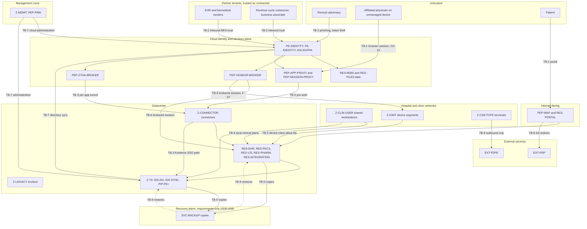

# Contoso Regional Health (fictional): threat model

> **Reference work.** Fictional scenario built for a public portfolio. Not deployed in, derived from, or describing any employer environment. Not professional advice.

This is the companion threat model for the Zero Trust reference architecture of Contoso Regional Health (fictional). It takes the finished architecture as the system under analysis and asks how a realistic adversary would get in, move, and reach what matters. It reuses the component and zone IDs frozen in `02-reference-architecture.md` section 11, and the residual risk IDs (RR-01 to RR-16) from section 13. The attack paths that follow from it are in `attack-paths.md`; the detection priorities, in three tiers, are in `detection-priorities.md`; the exercise design is in `purple-team-plan.md`.

Technique references use MITRE ATT&CK Enterprise v19.2, the current sub-release as of the date below. Every technique ID, name, status, and tactic mapping was checked against MITRE's official ATT&CK STIX data for v19.2. v19 split the former Defense Evasion tactic into Stealth (TA0005) and Defense Impairment (TA0112), so some older mappings are remapped to their current IDs here (for example, log and tool tampering now sits under the Defense Impairment tactic rather than the former one).

PCI DSS references are to v4.0.1. Sourced threat context was gathered on 2026-10-04 and is cited inline with a quality label.

## 1. Scope and method

### In scope

The logical Zero Trust architecture as designed: the cloud identity plane (`PE-IDENTITY`, `PA-IDENTITY`, `IGA-ENTRA`), the local clinical plane (`IDS-AD`, `PE-NETWORK`), the enforcement points (`PEP-*`), the policy information points (`PIP-*`), the protected resources (`RES-*`), the external parties (`EXT-*`), and the zones (`Z-*`). The subjects named in section 11 of the architecture are the actors whose access is modeled.

### Out of scope

- Controls and failures internal to vendor products (EHR application logic, the P2PE solution's internals, the payment service provider's environment). These appear only as trust assumptions and as supplier risk (RR-12).
- The detailed network engineering excluded by `01-scenario-and-assumptions.md` (addressing, routing, firewall rule bases).
- Physical intrusion beyond the payment terminal tampering that PCI DSS already covers, and the badge and card issuance process beyond its role as an identity-proofing control.
- A quantified risk score. This model reasons about likelihood and impact in stated bands (see `attack-paths.md`); the numeric risk register is the companion GRC artifact.
- Backup and recovery implementation. ADR-009 sets four requirements for `SVC-BACKUP` (immutable and offline copies, isolation from Tier 0 administrative reach, tested restores with evidence, and Tier 0 monitoring), but products, topology, and recovery objectives are not designed (A-19). This model reasons about the requirements and treats recovery capability as unverified (TM-A1). That assumption is load-bearing for the ransomware and Tier 0 paths, so it is called out rather than hidden.

### Method

Three lenses, used together:

- **Data flow and trust boundaries (STRIDE).** The architecture's data flows (F-01 to F-14) are grouped into trust boundaries. STRIDE (Spoofing, Tampering, Repudiation, Information disclosure, Denial of service, Elevation of privilege) is applied per boundary in section 5, with the architecture control that addresses each threat and the residual risk where one remains.
- **Attack trees and attack paths.** Section 8 summarizes the prioritized attack paths; `attack-paths.md` develops each as a chain of ATT&CK tactics and techniques with the telemetry a defender needs and the component that breaks the path.
- **Risk-centric prioritization.** Likelihood and impact reasoning is informed by current, sourced sector threat data, so that the highest-ranked paths are the ones the evidence points to for a health system. The bands remain judgments.

## 2. Assets

The crown jewels, in the order an adversary would value them for a health system.

| Asset ID | Asset | Where it lives | Why it matters |
|---|---|---|---|
| AS-AVAIL | Availability of clinical systems and connected medical devices | `RES-EHR`, `RES-PACS`, `RES-LIS`, `RES-PHARM`, `RES-INTEGRATION`, `RES-IOMT` | Loss of availability is a patient-safety event. Peer-reviewed studies tie a ransomware attack on a health system to measurable disruption and worse cardiac arrest outcomes at neighboring hospitals that were not attacked (section 7). |
| AS-EPHI-CLIN | ePHI in clinical systems | `RES-EHR`, `RES-PACS`, `RES-LIS`, `RES-PHARM`, `RES-INTEGRATION` | The clinical record, orders, images, and results. Confidentiality and integrity obligations under the HIPAA Security Rule. |
| AS-IDENTITY | Tier 0 identity and trust fabric | `IDS-ENTRA`, `IDS-AD`, `IDS-SYNC`, `PIP-PKI` | Whoever holds Tier 0 holds everything (RR-07). The hybrid sync boundary is a documented pivot from on-premises to cloud. |
| AS-EPHI-M365 | ePHI in collaboration data | `RES-M365`, `RES-FILES` | Mailboxes, Teams, SharePoint, OneDrive, and file shares hold ePHI outside the EHR, often with weaker in-app controls. |
| AS-PAYMENT | Payment and billing integrity | `RES-EHR` billing work queues, `RES-RCM-EXCHANGE`, payer portals, payroll | Revenue-cycle and payroll fraud monetizes access with no malware. The outsourcer (`EXT-RCM-BA`) works here daily. |
| AS-CARD | Cardholder data | `RES-POI`, `EXT-P2PE`, `EXT-PSP` | Minimized by design (ADR-007) to P2PE terminals and a redirect. In PCI DSS scope; small but regulated. |
| AS-PORTAL | Patient portal and patient identities | `RES-PORTAL`, `IDS-CIAM` | Patient-facing trust and a separate identity store. A tampered redirect page could send patients to a counterfeit payment page. |

## 3. Threat actors

Characterized from sourced reporting gathered on 2026-10-04 (section 10). Attribution caveats are carried as stated by the publisher.

| Actor class | Motivation | Why Contoso fits | Representative sourced reporting |
|---|---|---|---|
| Ransomware operators and their affiliates | Financial (extortion) | Healthcare and Public Health is the most-reported ransomware sector among critical infrastructure in current federal data | FBI IC3 2025 Internet Crime Report (primary); CISA/FBI/HHS #StopRansomware advisories for Medusa (AA25-071A), Interlock (AA25-203A), ALPHV (AA23-353A) (primary) |
| Access brokers and help-desk social engineers | Financial (sell or use access) | Callers impersonating revenue-cycle or administrative staff get the IT help desk to enroll an attacker's device in MFA. HC3 documents this against health-sector help desks, with no public attribution, and Scattered Spider uses the same move across sectors | HHS HC3 Sector Alert 202404031000 (primary); CISA AA23-320A (Scattered Spider, primary; not health-specific) |
| Adversary-in-the-middle and token-theft phishing crews | Financial | One phishing-as-a-service operation's kits were used against at least 20 US healthcare organizations, and the kit works as an adversary-in-the-middle proxy that captures the session cookie, which bypasses MFA | Microsoft Digital Crimes Unit on RaccoonO365 (2025-09-16, primary; the healthcare count); Cloudflare on RaccoonO365 (2025-09-10, primary for its own analysis; the mechanism); Microsoft Digital Defense Report 2025 (primary) |
| Hybrid cloud intrusion actors | Financial (cloud ransomware) | A documented actor, already holding domain administrator access on-premises, pivoted to the cloud through an Entra Connect Sync server that was not onboarded to Defender for Endpoint, then deleted cloud backups | Microsoft Threat Intelligence on Storm-0501 (2025-08-27, primary; targeted healthcare November 2023) |
| Nation-state-aligned device code phishing | Espionage | Device code phishing campaigns list health among targets | Microsoft on Storm-2372 (2025-02-13, primary; attribution Microsoft, moderate confidence) |
| Business email compromise and payment-fraud actors | Financial | Revenue-cycle and payroll fraud diverts ACH and direct-deposit payments; BEC losses exceed 3 billion US dollars in the latest IC3 report | FBI IC3 2025 report (primary); FBI PIN 20220914-001 on healthcare payment processors (primary); IC3 PSA I-042425-PSA on payroll direct-deposit diversion (primary; not health-specific) |
| Malicious or negligent insiders | Curiosity, fraud, grievance | About 9,500 workforce members with legitimate EHR access; Zero Trust decides whether a session may exist, not whether each record lookup is appropriate (RR-01) | Treated as a design-acknowledged residual (RR-01); EHR privacy monitoring is out of scope |

## 4. Trust boundaries

A trust boundary is any point where the confidence in a request changes: a different network, a different identity authority, a different operator of the enforcement point. The data flow diagram marks the boundaries the rest of the model reasons about.

### Diagram 1: data flow and trust boundaries

### Boundary catalog

| Boundary | Between | What changes | Primary residual risks |
|---|---|---|---|
| TB-1 | Internet and untrusted devices to the cloud identity plane and the portal edge | Unauthenticated to authenticated; untrusted device to evaluated session | RR-03 (token theft against non-CAE apps) |
| TB-2 | Partner tenants to the Contoso cloud, under inbound MFA and device trust | Contoso accepts a partner's authentication claim | RR-06 (partner tenant compromise), RR-12 (upstream supplier) |
| TB-3 | Cloud plane to on-premises resources through connectors, app proxy, and ZTNA | Cloud identity decision reaches datacenter resources; Kerberos SSO publishes domain controllers | RR-08 (connector foothold), RR-09 (DC network path) |
| TB-4 | Clinical user zone to clinical application zone, on the local plane | Authentication by `IDS-AD` Kerberos with fewer signals than the cloud plane | RR-02 (local plane evaluates fewer signals) |
| TB-5 | Medical device segments to device-class servers | Network admission without an identity; weak device identity on MAB ports | RR-04 (device reaches its own servers), RR-05 (MAC impersonation), RR-14 (no passive sensor at the 22 clinics) |
| TB-6 | Vendor broker zone to approved targets | Time-bound, approved, recorded privileged session | RR-06, RR-12 |
| TB-7 | Management and cloud administration to Tier 0 | Highest-trust control plane; hybrid sync couples on-premises and cloud | RR-07 (Tier 0 concentration), RR-10 (dormant emergency path), RR-16 (standing Tier 0 access that no approval gates) |
| TB-8 | CDE and portal to external payment services | Card data leaves Contoso scope by design | RR-12 (PSP or P2PE provider compromise) |
| TB-9 | Production zones to the recovery plane (`SVC-BACKUP`), defined at the requirements level by ADR-009 decision 2 | A separate administrative domain and identity authority. Copies flow in; restores write back into production; no management connection from production. | RR-11 (recovery unverified) |

TB-9 is in the catalog because ADR-009 decision 2 already defines it, and `02-reference-architecture.md` section 7 refers to it by this ID. Its STRIDE table waits for the recovery design; section 5 gives the reason.

## 5. STRIDE per trust boundary

Each table lists the threats that matter at the boundary, the architecture control that addresses the threat, and the residual risk where the control is partial. Technique IDs point to the attack paths that develop the threat. SN-02, SN-03, SN-06, and SN-07, named in the TB-7 table, are untested templates as of 2026-10-04 (`coverage-map.md` section 1).

### TB-1: Internet to cloud identity plane and portal

| STRIDE | Threat at this boundary | Architecture control | Residual |
|---|---|---|---|
| Spoofing | Credential phishing to impersonate a workforce or physician identity | Phishing-resistant MFA by persona (ADR-003), CA-07, CA-02 | Help-desk method reset is a non-technical bypass (AP-2); number-matching push interim method is relayable |
| Spoofing | Adversary-in-the-middle proxy captures a live session after valid MFA: T1557 (Adversary-in-the-Middle), then T1539 (Steal Web Session Cookie) | CA-10 session controls on unmanaged browsers, token protection CA-21 on Windows native apps | RR-03: the EHR browser path and guest or unmanaged sessions are not CAE-enforced (AP-1) |
| Tampering | Tampering with the portal page that starts the payment redirect | `PEP-WAF`, change monitoring of the page (ADR-007) | Supplier-side tampering at `EXT-PSP` is RR-12 |
| Repudiation | A user denies an action taken in a stolen session | Sign-in logs, `PIP-SIEM` correlation, EHR audit logs | Replayed tokens can look like the legitimate user until correlated (AP-1) |
| Information disclosure | ePHI read or exfiltrated through a hijacked cloud session: T1114.002 (Email Collection: Remote Email Collection), T1530 (Data from Cloud Storage), T1567.002 (Exfiltration Over Web Service: Exfiltration to Cloud Storage) | In-session download, print, and copy restrictions (CA-10), Purview labeling and DLP (`PEP-DATA`) | DLP maturity is a phase-3 target; browser session exfiltration is constrained, not prevented |
| Denial of service | Volumetric or application attacks on the portal | `PEP-WAF`, cloud edge scale | Portal availability depends on cloud and WAF provider |
| Elevation of privilege | Risky sign-in escalates to broader access | Risk-based policies CA-17, CA-18; ID Protection | Guests are not risk-remediated in Contoso's tenant (AP-3) |

### TB-2: Partner tenants to Contoso cloud

| STRIDE | Threat | Control | Residual |
|---|---|---|---|
| Spoofing | A compromised partner account signs in under inbound MFA trust: T1199 (Trusted Relationship), T1078.004 (Valid Accounts: Cloud Accounts) | Contoso confirms partner phishing-resistant MFA in due diligence (A-12), CA-14 short sign-in frequency, CA-16 location | RR-06: Contoso accepts the partner's authentication claim; CAE does not cover guests |
| Tampering | A partner integration token is abused to alter data, or an approved vendor session changes data or configuration on its target | Minimum-necessary EHR roles for the outsourcer, documented interface flows; for vendor sessions, a narrow target host and ports (F-06), each biomedical vendor limited to its own devices (F-07), and session recording | Token abuse from a trusted integration is hard to distinguish from use (AP-6). An approved session can still change whatever its target allows, including data on an imaging modality (AP-3 biomedical variant) |
| Repudiation | Actions in a vendor session are disputed | `PEP-VENDOR-BROKER` session recording, PIM activation logs to `PIP-SIEM` | Recording covers the brokered session, not actions in the partner's own tenant |
| Information disclosure | A vendor session reads ePHI beyond its task | Narrow target host and ports (F-06), one session group per biomedical vendor limited to its own devices (F-07), billing-only roles for the outsourcer | A broad approval or a wide window widens exposure (AP-3) |
| Denial of service | A partner account is used to disrupt | Just-in-time activation bounds the window; brokered, approved sessions | Availability impact is bounded by the narrow target set |
| Elevation of privilege | A guest gains more than brokered access | PIM for Groups activation approved by a Contoso owner, no network-level access for vendors | Social engineering of the approver is the weak point (AP-3) |

### TB-3: Cloud plane to on-premises through connectors and ZTNA

| STRIDE | Threat | Control | Residual |
|---|---|---|---|
| Spoofing | A stolen compliant-device session reaches a private app | CA-11 phishing-resistant MFA plus compliant device for ZTNA | Universal CAE mitigates token theft on the Global Secure Access client for Windows (version 1.8.239.0 or later); on other platforms the client uses regular access tokens (RR-03; `02-reference-architecture.md` section 9) |
| Tampering | A connector host is used to tamper with published apps | Hardened, Tier 1 administered connectors, one group per zone | RR-08: connectors are footholds behind the zone boundary |
| Repudiation | Actions through the proxy are disputed | Pre-authentication logging, sign-in logs | Correlation needed to tie proxy traffic to a principal |
| Information disclosure | A published app exposes ePHI to an over-broad segment | Per-app segments by host and port, no broad subnet segments | A migration-era subnet segment recreates VPN reach if left in place |
| Denial of service | Loss of the broker stops remote non-web access | Fails closed, downtime procedures (ADR-008) | No fallback to VPN by design; remote work stops |
| Elevation of privilege | Kerberos SSO path to domain controllers is abused | DC segment assigned only to enclave-app groups, limited to the connectors' AD site, watched by Defender for Identity | RR-09: remote Kerberos needs a network path to Tier 0 (AP-5) |

### TB-4: Local clinical plane (clinical user zone to clinical app zone)

| STRIDE | Threat | Control | Residual |
|---|---|---|---|
| Spoofing | A workstation foothold reuses on-site credentials without cloud risk evaluation | Certificate badges, 802.1X device admission, managed devices | RR-02: on-site EHR sign-ins have no Conditional Access risk evaluation (AP-4) |
| Tampering | Kerberos ticket theft or forgery on the local plane, such as T1558.003 (Steal or Forge Kerberos Tickets: Kerberoasting) | Protected Users, authentication policies and silos, AES encryption types | Service-account exposure to Kerberoasting remains where silos are incomplete |
| Repudiation | Shared-workstation actions are hard to attribute | Individual badges, no shared logins, EHR audit logs | Fast user switching plus short sessions limit but do not remove ambiguity |
| Information disclosure | Lateral reach to clinical ePHI from a workstation | Host east-west blocking (`PEP-HOST`), micro-segmented `Z-CLIN-APP` | A compromised workstation still reaches the clinical app front ends it is allowed to use |
| Denial of service | Ransomware encrypts clinical systems: T1486 (Data Encrypted for Impact), with T1490 (Inhibit System Recovery) | East-west blocking, EDR and attack disruption, segmentation | RR-11: recovery requirements are set (ADR-009) but not implemented or restore-tested, so capability is unverified; backup deletion is a documented actor move (section 7, AP-4) |
| Elevation of privilege | Kerberoasting to a service account, then lateral escalation | Tiering, LAPS, Defender for Identity | The local plane is the weakest-signal plane by design (RR-02) |

### TB-5: Medical device segments to device-class servers

| STRIDE | Threat | Control | Residual |
|---|---|---|---|
| Spoofing | MAC impersonation on a MAB port to join a device-class segment | Profiling plus sensor classification at the hospitals, NAC profiling alone at the clinics; per-class allow-lists | RR-05: MAB identifies a device by an attribute an attacker can copy (AP-7); at the clinics no sensor checks the device against its profile (RR-14) |
| Tampering | Tampering with device data or configuration: T1565.001 (Data Manipulation: Stored Data Manipulation) | Device-class segmentation, passive anomaly detection at the three hospitals | RR-04: a compromised device can still reach its own allowed servers; clinic devices get no anomaly detection (RR-14) |
| Repudiation | Device actions are not attributable to a person | Passive sensor records (hospitals only), `PEP-NET-ZONE` flow logs, asset inventory | Devices have no user identity by design |
| Information disclosure | Plain-text patient data read from or sent by a device | Segment allow-lists, no general internet, egress proxy | Device firmware weaknesses are manufacturer-controlled; documented examples exist (section 7). A device that cannot encrypt the ePHI it stores exposes it if the device or a drive leaves the building, which segmentation does not cover (RR-15) |
| Denial of service | A device is made unavailable, or disconnected unsafely | Clinical safety gate: a device in active use is never auto-disconnected | A device in use that an attacker disables is a safety event; containment needs a human decision |
| Elevation of privilege | A device foothold is used to reach a device-class server: T1210 (Exploitation of Remote Services) | Narrow allow-lists, no lateral traffic between segments | The one allowed flow (device to its server) is the path that remains (AP-7) |

### TB-7: Management and cloud administration to Tier 0

| STRIDE | Threat | Control | Residual |
|---|---|---|---|
| Spoofing | Admin impersonation from a non-PAW device | Cloud-only admin accounts, CA-04 and CA-05 PAW device filters, CA-06 phishing-resistant reauthentication on a compliant device at activation (note 1) | Friction is accepted; the method plus the device are both required, except for the two emergency access accounts (next row) (note 1) |
| Spoofing | Sign-in as an emergency access account after a reset of its password or authentication methods, developed in AP-5 step 8b: T1098 (Account Manipulation), then T1078.004 (Valid Accounts: Cloud Accounts) (note 2) | Only Tier 0 identities can reset a Tier 0 account; the reset raises an alert (SN-07) before the sign-in it enables, which raises another (SN-06) (note 2) | Where no approval applies, the alerts are the only control (RR-16); an activated Tier 0 role needs no further gate (RR-07); response time decides the outcome (note 2) |
| Tampering | Directory, policy, or trust tampering once Tier 0 is reached: T1484.002 (Domain or Tenant Policy Modification: Trust Modification), T1556.009 (Modify Authentication Process: Conditional Access Policies) | PIM eligible-only, Tier 0 activation approved by one of two named approvers, Defender for Identity on DCs, AD CS, and Entra Connect | RR-07: Tier 0 compromise is a full compromise by definition (AP-5); Conditional Access changes are Tier 0 work, and the standing paths need no approval (RR-16) (note 3) |
| Tampering | An attacker-held account added to `grp-ca-emergency-access`, developed in AP-5 step 8a: T1556.006 (Modify Authentication Process: Multi-Factor Authentication) (note 4) | Role-assignable group, no owners; Tier 0 alert on every change (ADR-004 decision 9; SN-07) (note 4) | Detective only on three paths: two standing paths that no approval gates (RR-16), and an attacker who already holds an activated Tier 0 role (RR-07) (note 4) |
| Tampering | An admin account removed from `grp-admins-t0` or `grp-admins-t1`: T1556.006 (Modify Authentication Process: Multi-Factor Authentication), as in AP-5 step 8a; an owner or role added to either group: T1098.003 (Account Manipulation: Additional Cloud Roles) (note 5) | Role-assignable groups with no owners and no role; Tier 0 alert on every change (`detection-priorities.md` item 20) (note 5) | Detective only on the standing paths, which need no approval (RR-16); an attacker who already holds an activated Tier 0 role needs no further gate (RR-07) (note 5) |
| Repudiation | Privileged actions disputed | PIM activation logs, directory audit logs, and emergency-access and admin-group alerting (ADR-004 decisions 6 and 9) (note 6) | Detective, not preventive, during an active Tier 0 compromise (note 6) |
| Information disclosure | Credential material harvested at Tier 0: T1003.006 (OS Credential Dumping: DCSync), T1649 (Steal or Forge Authentication Certificates) | Protected Users, tiering, PKI as Tier 0 with monitored CAs | DCSync and certificate abuse remain the classic Tier 0 objectives |
| Denial of service | Destruction of identity services or cloud backups: T1490 (Inhibit System Recovery) | Sealed AD recovery credentials, emergency access accounts; ADR-009 decision 2 puts recovery-plane administration outside Tier 0's reach (a requirement, not implemented) | RR-11: requirements set (ADR-009), implementation not designed, capability unverified; cloud backup deletion is a documented actor move (section 7) |
| Denial of service | The lockout backstop removed: an emergency account taken out of `grp-ca-emergency-access`, the group deleted, or an emergency account disabled, deleted, or reset; T1531 (Account Access Removal) for account changes (note 7) | Tier 0 access to change the group; Tier 0 alert on every change (ADR-004 decision 9; SN-07); 30-day restore of a deleted group; 90-day validation (note 7) | No approval on the standing paths (RR-16); a missed alert leaves the loss unseen until the next validation or the lockout (note 7) |
| Elevation of privilege | Hybrid pivot from on-premises to cloud administration: T1556.007 (Modify Authentication Process: Hybrid Identity) | Privileged accounts are not synchronized (ADR-004); Defender for Identity sensors on the Entra Connect servers (`03-identity-and-access.md` section 4) | RR-07, RR-09; the sync boundary is the documented pivot (AP-5), whose missing control, Defender for Endpoint on the sync server, the design does not state for `Z-T0` servers (TM-A4; section 9 item 8) |
| Elevation of privilege | A holder of a credential-management role, or an application with a credential-management permission, resets a Tier 0 account's password or authentication methods and takes it over: T1098 (Account Manipulation) | Privileged Authentication Administrator and pass-issuing applications are Tier 0; admin accounts are members of role-assignable groups; SN-02 and SN-03 alert (note 8) | The route from outside Tier 0 is closed for these roles and permissions; inside Tier 0 the reach remains (RR-07); nothing gates an application already holding one (RR-16) (note 8) |
| Elevation of privilege | A credential added to an existing Tier 0 application lets whoever holds it act as the application: T1098.001 (Account Manipulation: Additional Cloud Credentials) | Only Tier 0 identities can add one; SN-03 alerts at High on every credential added to a Tier 0 workload identity, whoever adds it (note 9) | A credential outlives the activation or automation run that added it, and nothing gates its later use, so the alert is the control (RR-16) (note 9) |

**Notes to the TB-7 table.**

1. **Spoofing, admin impersonation.** For CA-06, Microsoft documents a 10-minute window in which a further activation does not prompt again (ADR-004 decision 4). Which accounts the PAW-only rules cover is itself guarded as Tier 0 (the admin-group row under Tampering). Which devices count as PAWs rests on the device tag the filters read (`extensionAttribute1`); which roles and applications can write it, and the lab test on whether Windows 365 Administrator or a device's registered owner can, are in `03-identity-and-access.md` section 3 (Device tags). If the owner can, the tag alone cannot mark a PAW (ADR-004 decision 6).
2. **Spoofing, emergency account sign-in after a reset.** The accounts are permanent Global Administrators excluded from every enforced policy that blocks or restricts sign-in, the PAW-only rules included, so the sign-in works from any device. Who can reset the accounts is in `03-identity-and-access.md` section 4: Privileged Authentication Administrator is Tier 0 (ADR-004 decision 1), Partner Tier2 Support is never assigned, and applications that can issue a Temporary Access Pass are Tier 0 workload identities, none of which holds such a permission by default (sections 4 and 6). SN-02 alerts on any assignment or activation of either role. The reset alerts whoever makes it (ADR-004 decision 9). The paths with no approval: one emergency account can reset the other, and a Tier 0 workload identity holding a pass-issuing permission can issue a pass to either account with no activation. The reset alert leads the sign-in alert only by however long the attacker waits between them.
3. **Tampering, directory, policy, or trust.** Changing Conditional Access is Tier 0 work: Microsoft's PIM documentation calls any principal that can manage Conditional Access highly privileged (section 10), so Conditional Access Administrator, Security Administrator, and an application holding Policy.ReadWrite.ConditionalAccess are all Tier 0 (`03-identity-and-access.md` sections 4 and 6). The emergency accounts, and a Tier 0 workload identity holding Policy.ReadWrite.ConditionalAccess, can change a policy with no approval (RR-16). SN-02 alerts on every policy change.
4. **Tampering, the exclusion group.** Membership exempts the account from every enforced policy that blocks or restricts sign-in (CA-01, CA-02, CA-04, CA-05, CA-17, CA-18, and others). No policy is edited, so an alert on Conditional Access policy changes does not see it. Who can change the group is in `03-identity-and-access.md` section 5: for every administrator except the two emergency accounts, an approved Tier 0 activation from a Tier 0 PAW. The two standing paths are an emergency account (a permanent Global Administrator) and a Tier 0 workload identity (an application granted RoleManagement.ReadWrite.Directory).
5. **Tampering, the admin groups.** Removing an admin account takes it out of the phishing-resistant and PAW-only policies (CA-03, CA-04, CA-05) without editing a policy, the same exemption move as AP-5 step 8a. Deleting either group makes the same move for every member at once. As for the exclusion group, an owner added to either group, or a role assigned to it, is T1098.003 (Account Manipulation: Additional Cloud Roles): owners of a role-assignable group can manage its membership, so an owner can make the removal later with no Tier 0 activation (step 8a's owner variant), and a role assigned to a group reaches every member (step 8). `grp-admins-t0` and `grp-admins-t1` are role-assignable Tier 0 groups; a change needs Tier 0 access and alerts at Tier 0 priority (`03-identity-and-access.md` sections 3 and 4; ADR-004 decisions 4 and 6). CA-06 targets all users, so activation still needs a phishing-resistant sign-in on a compliant device whatever the account's groups. The standing paths are an emergency account, or a Tier 0 workload identity granted RoleManagement.ReadWrite.Directory.
6. **Repudiation.** The alerting covers every sign-in by the two emergency accounts (SN-06), all audit activity by or on them (method changes, password resets, disabling, deletion, removal of the Global Administrator assignment) and every change to `grp-ca-emergency-access` (SN-07), and every change to the admin groups (SN-07; `detection-priorities.md` item 20).
7. **Denial of service, the lockout backstop.** The account changes include an emergency account stripped of its Global Administrator assignment, or reset so its custodians can no longer use it. The Tier 0 alert covers every change to the group or to the accounts. Microsoft documents that a deleted role-assignable group is soft-deleted and can be restored within 30 days (section 10). Every 90-day validation confirms that the group holds exactly the two accounts and has no owners (`03-identity-and-access.md` section 5). The emergency accounts can make these changes without approval, and so can a Tier 0 workload identity for the changes its permissions allow (RR-16). If the alert is missed, nothing shows the backstop is gone until the next validation, or until the lockout it was kept for.
8. **Elevation of privilege, credential-management roles and permissions.** Privileged Authentication Administrator, which can manage every user's authentication methods and reset a Global Administrator's password, is Tier 0 (ADR-004 decision 1). Helpdesk, Password, Authentication, and User Administrators cannot reset a Global Administrator's password (ADR-004 Context), and Partner Tier2 Support, which can, is never assigned (`03-identity-and-access.md` section 4). Every admin account is a member of `grp-admins-t0` or `grp-admins-t1`, role-assignable groups, so changing its credentials or resetting its MFA needs at least Privileged Authentication Administrator whether or not a role is active (`03-identity-and-access.md` section 3; ADR-004 decision 6). Applications holding a permission that can issue a Temporary Access Pass, which the design reads as able to issue one to any user (section 9 item 7), are Tier 0 workload identities, and none holds such a permission by default (ADR-004 decision 1 and alternative G; 03 sections 4 and 6). SN-02 alerts on any assignment or activation of either role, and SN-03 at High on a grant of any permission in 03 section 6's table, the four Temporary Access Pass permissions included (`detection-priorities.md` items 10 and 11). The route from outside Tier 0 is closed because an administrator needs a Tier 0 role, and an application needs a grant that only a Tier 0 administrator or a Tier 0 workload identity can make (03 section 4). The next row covers taking over such an application instead of granting one.
9. **Elevation of privilege, a credential added to a Tier 0 application.** Microsoft documents that Application Administrator and Cloud Application Administrator can add credentials to an application and use them to act as it (section 10), so both are Tier 0 at tenant scope; an app-scoped assignment is Tier 1 only for an application that is not Tier 0; Tier 0 applications have no owners in the directory; and an application holding Application.ReadWrite.All or Directory.ReadWrite.All, which can add a credential to any application, is Tier 0 (03 sections 4 and 6; ADR-004 alternative I). Partner Tier1 Support and Partner Tier2 Support, whose definitions can update any application's credentials and owners, are never assigned (03 section 4). Microsoft places a managed identity's security boundary at the resource it is attached to (section 10), so Tier 0 managed identities are system-assigned and every Azure role that can write to their resources is Tier 0 (03 section 4). A Tier 0 workload identity holding Application.ReadWrite.All or Directory.ReadWrite.All can add a credential with no approval (RR-16).

### TB-8: CDE and portal to external payment services

| STRIDE | Threat | Control | Residual |
|---|---|---|---|
| Spoofing | A counterfeit payment page is substituted for the redirect target | WAF, page change monitoring, full URL redirect (no embedded fields) | Spoofing at or of `EXT-PSP` is supplier risk (RR-12) |
| Tampering | Terminal tampering or substitution | PCI DSS terminal inspection and staff training (9.5.1 to 9.5.1.3) | Physical tampering is addressed by inspection cadence |
| Information disclosure | Card data capture | P2PE encryption at the terminal, `PEP-CDE-BOUNDARY` outbound-only, no card data in workstations (ADR-007) | Billing records remain ePHI under HIPAA even when card data leaves PCI scope |
| Denial of service | Loss of the payment path | Multiple terminals, redirect resilience | Dependence on `EXT-P2PE` and `EXT-PSP` availability |
| Elevation of privilege | Pivot from the CDE into clinical zones | No inbound path to `Z-CDE`, no path from other zones, no Contoso account on the terminals | CDE is isolated by design; the elevation path is closed |

TB-6 has no table of its own. The brokered session is the second half of the same partner path, so all six STRIDE categories for TB-6 are analyzed in the TB-2 table: spoofing by a compromised partner account, tampering on the session's target, repudiation of session actions, information disclosure beyond the task, disruption through a partner account, and elevation beyond brokered access. AP-3 develops the path end to end.

TB-9 has no table yet, deliberately. ADR-009 decision 2 defines the boundary and `02-reference-architecture.md` section 7 records it, but nothing at it is designed: no product, topology, recovery-plane identity authority, or restore path exists to analyze. Every row in the tables above pairs a threat with the control that answers it and the residual it leaves, so a TB-9 table written now would have to invent its control column. The threats it will need to answer are listed in section 9, item 1, and the table follows the recovery design.

## 6. Assumptions this model depends on

Inherited from `01-scenario-and-assumptions.md` (A-01 to A-19), plus four the model adds:

- **TM-A1: Recovery capability is unverified.** ADR-009 sets four requirements for `SVC-BACKUP` (decisions 1 to 4), but its implementation is not designed and no restore has been tested (A-19, RR-11). The ransomware path (AP-4) and the Tier 0 path (AP-5) both assume an adversary will try to destroy recovery capability, because that removes the victim's alternative to paying or rebuilding, and the sourced context includes an actor deleting cloud backups (section 7). AP-4's impact band drops, by one band at most, only for data sets whose copies are shown to meet ADR-009, including a passing restore test (decision 3); a requirement proves none of that, so the band stands. AP-5's band does not rest on recovery: a full Tier 0 compromise exposes every ePHI store whether or not restores succeed (RR-07). Section 9, item 1 gives the reasoning. This is the single most consequential open assumption.
- **TM-A2: The architecture is operating as designed, not merely licensed.** The maturity roadmap (`05-ztmm-maturity-roadmap.md`) shows many controls are phased. Where a control is still in report-only or monitor mode, the residual risk it addresses is live. Attack-path likelihood is reasoned for the target state and noted where a phase gap raises it.
- **TM-A3: Partner due diligence holds in practice.** A-12 and A-14 assume partner tenants enforce phishing-resistant MFA and (for the outsourcer) device compliance, and `03-identity-and-access.md` section 7 relies on the same home-tenant methods for biomedical vendors that have an Entra tenant. If a partner's control lapses between reviews, TB-2 weakens without Contoso seeing it directly (RR-06).
- **TM-A4: Endpoint telemetry from Tier 0 servers is a dependency, not a designed control.** The design puts Defender for Identity sensors on the domain controllers, the AD CS servers, and the Entra Connect servers (`03-identity-and-access.md` section 4; ADR-004 decision 7). It does not state Defender for Endpoint on any `Z-T0` server, and `PEP-HOST`'s zones exclude `Z-T0` (`02-reference-architecture.md` section 11). Process and logon telemetry from those servers (DeviceProcessEvents, DeviceLogonEvents) needs Defender for Endpoint with server licensing, and `detection-priorities.md` item 9, `purple-team-plan.md` PX-06, and the detection pack's DX-07 rely on it. In the documented hybrid case, the missing control was exactly this: a sync server not onboarded to Defender for Endpoint (section 7). Until the architecture documents record a decision (section 9 item 8), this model treats that gap as open, not closed.

## 7. Sourced threat context that drives prioritization

The likelihood and impact bands in `attack-paths.md` rest on this evidence (gathered 2026-10-04; sources and quality labels in section 10).

- **Hacking is the most common cause of reported healthcare breaches.** HHS OCR's annual report to Congress on breaches in 2024 names hacking and IT incidents as the most common cause of breaches (HIPAA Journal relaying the report; secondary, primary blocked at source). This supports the model's focus on adversary-driven intrusion paths; insider misuse of legitimate access is carried as residual RR-01 (section 3).
- **Healthcare is the most-reported ransomware sector in critical infrastructure.** FBI IC3 2025 recorded more ransomware complaints for Healthcare and Public Health than any other critical infrastructure sector (primary). The FBI, CISA, and HHS advisory on Medusa names Healthcare and Public Health a frequent victim, and the one on ALPHV names healthcare the most commonly victimized sector among nearly 70 leaked victims since mid-December 2023 (primary). The Interlock advisory, co-sealed by HHS, gives Healthcare and Public Health organizations specific mitigation and reporting guidance but names no victim sector (primary). This lifts the availability paths (AP-4, AP-7) and the paths that commonly precede ransomware.
- **Ransomware harm reaches neighboring hospitals that were not attacked.** Two peer-reviewed studies measured hospitals next to a health system under ransomware attack, not the targeted hospitals. Emergency departments next to the attacked system saw higher census and ambulance arrivals, with resource constraints on time-sensitive care such as acute stroke, and the authors conclude that such attacks should be considered a regional disaster (Dameff et al., JAMA Network Open 2023). Hospitals next to an attacked system saw more cardiac arrests and lower survival with favorable neurologic outcome, driven by out-of-hospital cardiac arrest mortality (Pham et al., Critical Care Explorations 2024). Both are secondary (peer-reviewed). This is why AP-4's impact is a patient-safety event, not only a data event.
- **Initial access is mostly identity and exposed remote access.** Documented entry points include credential abuse on remote access without MFA (the Change Healthcare testimony), exploited public-facing applications, social engineering, and valid accounts (Microsoft Digital Defense Report 2025, primary). This lifts AP-1, AP-2, AP-3, and AP-4.
- **MFA-bypass is operational.** Callers impersonating revenue-cycle or administrative staff have got health-sector IT help desks to enroll an attacker's device in MFA (HHS HC3 Sector Alert 202404031000, primary; no public attribution). The RaccoonO365 phishing-as-a-service kits were used against at least 20 US healthcare organizations (Microsoft, primary), and Cloudflare, which took part in disrupting the service, describes the kit as an adversary-in-the-middle proxy that captures the resulting session cookie and so bypasses MFA (Cloudflare, primary for its own analysis). This is the basis for AP-1 and AP-2.
- **The hybrid sync server is a documented pivot.** An intrusion set already holding domain administrator access on-premises pivoted to the cloud through an Entra Connect Sync server that was not onboarded to Defender for Endpoint, reached a synced administrator account with no registered MFA method, and deleted cloud backups (Microsoft on Storm-0501, primary; healthcare targeted November 2023). Microsoft says the limited deployment of Defender for Endpoint significantly hindered detection. AP-5 models this. The design's choice not to synchronize privileged accounts (ADR-004) removes the synced-administrator step. Its Defender for Identity sensors on the Connect servers add identity telemetry there, but they are not the control Microsoft names as missing, and whether Defender for Endpoint covers the Tier 0 servers is not yet decided (TM-A4, section 9 item 8).
- **Third-party and business-associate compromise is a leading breach driver.** The Change Healthcare clearinghouse breach reached a very large population (secondary, primary filing blocked at source); peer-reviewed analysis finds a third of healthcare ransomware filings involved a business associate (secondary, peer-reviewed). AP-3 models the partner path.
- **Medical device harm is mostly through unavailability, not device manipulation.** Read together, the sources point mostly to legacy devices that cannot be patched, rather than to attacks on device function. That weighting is this model's synthesis across the sources below, not a claim any one of them makes. The FBI describes devices running outdated software without manufacturer patches, devices left in default configurations, and devices not designed with security in mind, and where replacing a device is not feasible it recommends isolating the device from the network or auditing its network activity (FBI PIN 20220912-001, primary). Specific firmware exposures add to this, such as the Contec patient-monitor advisories (CISA and FDA, primary). No 2024 to 2026 primary report of ransomware deliberately manipulating device function was found; documented clinical harm came through IT and EHR outages. AP-7 weights impact toward availability and lateral staging accordingly.
- **Revenue-cycle and payment fraud monetizes access without malware.** BEC losses exceed 3 billion US dollars in the latest IC3 report (primary). The FBI separately documents payment diversion through healthcare payment processors (PIN 20220914-001, primary) and direct-deposit diversion through compromised employee payroll accounts (IC3 PSA I-042425-PSA, primary; not health-specific). AP-2 ends here.

## 8. Prioritized attack paths

Developed in full in `attack-paths.md`. Ranked by combined likelihood and impact for this health system. Likelihood reflects both adversary prevalence (section 7) and how much of the path the architecture already blocks. AP numbers are identifiers that other files cite, not ranks; the Rank column gives the order.

| Rank | ID | Path in one line | Likelihood | Impact | Primary residual risks |
|---|---|---|---|---|---|
| 1 | AP-4 | Ransomware against clinical operations from a phished managed workstation | High | Critical | RR-02, RR-11 |
| 2 | AP-1 | Adversary-in-the-middle phishing steals a live session to ePHI on an unmanaged device | High | High | RR-03 |
| 3 | AP-2 | Help-desk social engineering enrolls attacker MFA, then diverts revenue-cycle payments | High | High | Identity-proofing process, RR-01 |
| 4 | AP-3 | A compromised partner tenant abuses inbound trust to reach the EHR or an imaging modality through the vendor broker | Medium to High | Very High | RR-06, RR-12 |
| 5 | AP-5 | Hybrid identity Tier 0 compromise via the Entra Connect sync boundary | Medium | Critical | RR-07, RR-09, RR-11, RR-16 |
| 6 | AP-6 | Illicit OAuth consent or workload-identity abuse reaches ePHI in Microsoft 365 | Medium | High | Workload-identity coverage gap |
| 7 | AP-7 | Medical device compromise with constrained lateral reach and availability impact | Medium | High | RR-04, RR-05, RR-14 |

## 9. Architectural observations handed back to the design

A prioritized list of gaps the threat model surfaces for the architecture documents to answer. These are design questions, not detection items (those are in `detection-priorities.md`). Each item ends with its disposition in the design set as of 2026-10-04.

1. **Recovery capability is the decisive control (RR-11, TM-A1).** The ranked threats most likely to cause patient harm (AP-4, AP-5) both turn on whether recovery survives the attack, and the sourced context includes an actor deleting cloud backups (Storm-0501, section 7). Recommend that `SVC-BACKUP` be designed with immutable and offline copies, isolation from Tier 0 administrative reach, and tested restores, and that it be treated as Tier 0 for monitoring. Highest priority.
   - **Disposition:** requirements set in ADR-009 (decisions 1 to 4); implementation not designed; capability unverified until restore-tested (RR-11).
   - **What ADR-009 would close, once implemented and restore-tested.** The recovery-inhibition step of AP-4 (step 10) and AP-5 (step 9) stops being decisive for in-scope copies, because no production credential could delete or alter them (decisions 1 and 2). The step still runs. Host shadow copies and production snapshots stay within reach (ADR-009 keeps snapshots only as a convenience layer, alternative E), so the step still costs fast operational restores, and it remains the last high-confidence signal before encryption (`detection-priorities.md` item 1). Decision 4 adds a sharper signal once a product is chosen: a denied attempt to delete a copy or shorten its retention.
   - **What it would not close.**
     - Encryption and service stop (AP-4 steps 11 and 12). Recovery bounds how long the outage lasts, not whether it happens, and offline copies restore slowly (ADR-009 Consequences).
     - Data theft before encryption. Both sourced cases took data first. In the Change Healthcare testimony, the intruder moved laterally and exfiltrated data, and ransomware followed nine days after entry. Storm-0501 began its mass deletion only after its exfiltration phase was complete. The ePHI breach stands whether or not restores succeed (`attack-paths.md` AP-4).
     - Microsoft 365 data where Contoso keeps no separate copy, and any copy that production Global Administrators can delete (ADR-009 Consequences).
     - Production data encrypted with a key the attacker controls. When existing protections blocked some of its deletions, Storm-0501 created its own key and encrypted the remaining cloud storage with it. Decisions 1 and 2 protect the copies against that move, because changing their encryption settings needs a second recovery-plane administrator and cannot start from production. Nothing in ADR-009 protects the production stores.
     - The cloud identity plane's own configuration after a destructive Tier 0 compromise, which ADR-009 leaves to the recovery design.
   - **Where the attack moves next.** The recovery plane becomes a target equal to Tier 0, with its own administrators. It holds a copy of `IDS-AD` and writes into every system it restores, so a compromise of that separate domain could restore a state the attacker chose. Decision 4's watch on restores started outside a test or incident record is the only control ADR-009 states for that direction. Copies also keep whatever was true when they were taken, including an intruder's persistence or clinical data altered before the copy, T1565.001 (Data Manipulation: Stored Data Manipulation). Retention set from detection evidence (decision 1) and a verified pre-compromise copy (decision 3) answer this, and both depend on knowing when the intrusion began.
   - **Effect on the impact bands.** None yet (TM-A1). Once a data set's copies pass restore tests against ADR-009, AP-4's impact for that data set can fall one band, from Critical to High, and no further: steps 11 and 12 still take clinical systems offline until restores finish, and data taken before encryption stays taken. AP-5 stays Critical, because recovery decides how Contoso comes back from a Tier 0 compromise, not whether that compromise exposed every ePHI store (RR-07).
   - **Trust boundary.** ADR-009 decision 2 already defines one: a separate identity authority, management closed to production, copies in and restores out. It is recorded as TB-9 (section 4), and `02-reference-architecture.md` section 7 refers to it by that ID. Its STRIDE table waits for the recovery design, because no control at the boundary is designed yet (section 5).
2. **The EHR browser and guest or unmanaged session path has no preventive control against token theft (RR-03, AP-1).** Compensation is detective and session-scoped (CA-10, Defender for Cloud Apps). Recommend pursuing EHR-vendor support for continuous access evaluation or token binding at contract renewal (already a revisit trigger in ADR-001 and ADR-002), and widening token protection (CA-21) coverage as app support allows.
   - **Disposition:** accepted residual (RR-03). The revisit triggers are in ADR-001 (the EHR platform supports continuous access evaluation or token binding) and ADR-002 (the EHR vendor's support contract comes up for renewal).
3. **The help-desk identity-proofing process is the weakest link on the identity plane (AP-2).** It sits outside Zero Trust enforcement. Recommend that any MFA method change require in-person or sponsor-verified proofing with no phone-only exception, and that the number-matching push interim window (ADR-003) be kept as short as the phased rollout allows, since it is relayable.
   - **Disposition:** answered. `03-identity-and-access.md` section 2 and ADR-003 decision 6 state that onboarding and method recovery use a Temporary Access Pass issued only after in-person or sponsor-verified proofing, with no phone-only path, and the interim number-matching push method ends with each persona's rollout phase. The process still sits outside Zero Trust enforcement, so AP-2's likelihood stays High until the tabletop in `purple-team-plan.md` (PX-09) shows the process holding.
4. **CA-22 does not cover managed identities (AP-6).** Workload-identity Conditional Access excludes managed identities and multitenant apps, so their sign-ins need monitoring instead, and managed identity sign-in monitoring is not built (`coverage-map.md` section 3, item 11). Recommend building that monitoring before Azure workloads expand, and tightening app-consent governance (admin consent workflow, user consent restricted) as a preventive layer.
   - **Disposition:** open. `03-identity-and-access.md` section 6 records the same gap. The consent governance layer is already in the design (admin consent workflow, restricted user consent, and permission reviews in 03 section 6).
5. **The remote Kerberos SSO path publishes domain controllers to connected clients (RR-09, AP-5).** The design already narrows this to enclave-app groups and the connectors' AD site and watches it with Defender for Identity. Recommend confirming the phase-3 evaluation of Private Access for domain controllers on administrative service principal names only (WP-3.7), so the clinical path is never routed through the cloud.
   - **Disposition:** carried by the design. `05-ztmm-maturity-roadmap.md` WP-3.7 revisits Private Access for domain controllers on administrative service principal names, and ADR-005 alternative C already rejects it for clinical ones.
6. **The emergency access exclusion group needs its own monitoring, and no route to the emergency accounts may sit outside Tier 0 (AP-5 steps 8a and 8b).** An account added to `grp-ca-emergency-access` escapes every enforced policy that blocks or restricts sign-in, and removing an emergency account from it breaks the lockout backstop, so the group needs a rule of its own. Privileged Authentication Administrator can reset any account's credentials, Global Administrators included, so a holder of it outside Tier 0 could take over an emergency account and sign in as a permanent Global Administrator from any device. Recommend placing the role in Tier 0 and alerting on every change to the group and on all audit activity by or on the emergency accounts.
   - **Disposition:** answered in ADR-004 decisions 1 and 9 and `03-identity-and-access.md` sections 4 and 5. The role is Tier 0 and, beyond the recommendation, the group is role-assignable with no owners, so a change to it needs Tier 0 access; every change to the group, and all audit activity by or on the accounts, alerts at Tier 0 priority. The standing paths that need no approval, the emergency accounts and Tier 0 workload identities, are RR-16: on them the alert is the only control. Detection: `detection-priorities.md` items 10 and 19 (SN-02 for the roles, SN-06 and SN-07 for the accounts and the group). Validation: `purple-team-plan.md` PX-17, PX-19, and PX-20.
7. **Application permissions may offer a route to step 8b that no approval gates (AP-5).** The design already treats an application granted RoleManagement.ReadWrite.Directory as a Tier 0 workload identity, because it can change the exclusion group without PIM (`03-identity-and-access.md` section 5). The credential-reset path needs the same check. Microsoft's reference for creating a Temporary Access Pass lists application permissions that can write one (UserAuthMethod-TAP.ReadWrite.All and UserAuthenticationMethod.ReadWrite.All) and states a role requirement only for delegated access (section 10). Recommend confirming whether app-only access can issue a Temporary Access Pass to a Global Administrator. If it can, applications holding those permissions belong in Tier 0 alongside applications granted RoleManagement.ReadWrite.Directory.
   - **Disposition:** answered in ADR-004 decision 1 and alternative G, and `03-identity-and-access.md` sections 4 and 6, which place in Tier 0 applications granted either permission and, until a lab test shows they cannot create a pass, applications granted either of the two read permissions Microsoft's reference also lists for the call. No application holds any of the four by default; where one must, the alert on the change it makes is the only control (RR-16; SN-07 for the emergency accounts). Evidence level, as ADR-004's Context records it: Microsoft does not state the Global Administrator case explicitly; the conclusion follows from Microsoft's documentation, a community write-up states it directly (secondary; section 10), and nothing has been lab-tested. `purple-team-plan.md` PX-20 includes an optional application step that would test it, and the read-permission lab test.
8. **Endpoint telemetry from Tier 0 servers is not designed (AP-5, TM-A4).** Microsoft attributes the Storm-0501 visibility gap to an Entra Connect Sync server that was not onboarded to Defender for Endpoint (section 7). The design puts Defender for Identity sensors on the domain controllers, the AD CS servers, and the Entra Connect servers (`03-identity-and-access.md` section 4), but states no endpoint detection and response on `Z-T0` servers (`PEP-HOST`'s zones exclude `Z-T0`, `02-reference-architecture.md` section 11). `detection-priorities.md` item 9, `purple-team-plan.md` PX-06, and the detection pack's DX-07 rely on process telemetry from the sync servers, which needs Defender for Endpoint. Recommend a design decision on whether Defender for Endpoint, with server licensing, is required on `IDS-SYNC`, the domain controllers, and the `PIP-PKI` issuing CAs, and on which automated response actions may act on those hosts, because containing a domain controller would affect authentication on the local clinical plane (ADR-001, ADR-008).
   - **Disposition:** open. Until it is decided, this model carries the dependency as assumption TM-A4 and does not treat the documented gap as closed.

## 10. Sources

Technique data: MITRE ATT&CK Enterprise v19.2, verified against MITRE's official ATT&CK STIX data (attack.mitre.org), 2026-10-03 to 2026-10-04. The ATT&CK versions page listed v19.2 as the current version on 2026-10-04.

Threat context was gathered and quality-labeled on 2026-10-04. In the threat context table, two kinds of source carry the secondary label. The HIPAA Journal and CyberInsider rows relay HHS OCR figures whose primary pages could not be retrieved by automated means on 2026-10-04. This model also labels peer-reviewed analyses secondary. The two clinical studies measure effects at hospitals next to a health system under ransomware attack, not at the attacked hospitals, and the third analyzes breach filings made to HHS OCR.

### Threat context

| Title | Publisher | URL | Date checked | Quality |
|---|---|---|---|---|
| 2025 Internet Crime Report | FBI IC3 | https://www.ic3.gov/AnnualReport/Reports/2025_IC3Report.pdf | 2026-10-04 | Primary |
| AA25-071A #StopRansomware: Medusa | CISA, FBI, HHS | https://www.cisa.gov/news-events/cybersecurity-advisories/aa25-071a | 2026-10-04 | Primary |
| AA25-203A #StopRansomware: Interlock | CISA, FBI, HHS, MS-ISAC | https://www.cisa.gov/news-events/cybersecurity-advisories/aa25-203a | 2026-10-04 | Primary |
| AA23-353A #StopRansomware: ALPHV Blackcat | CISA, FBI, HHS | https://www.cisa.gov/news-events/cybersecurity-advisories/aa23-353a | 2026-10-04 | Primary |
| AA23-320A Scattered Spider | CISA, FBI and partners | https://www.cisa.gov/news-events/cybersecurity-advisories/aa23-320a | 2026-10-04 | Primary |
| Social Engineering Attacks Targeting IT Help Desks in the Health Sector (HC3 Sector Alert 202404031000, 2024-04-03) | HHS HC3 (AHA-hosted copy of the original) | https://www.aha.org/system/files/media/file/2024/04/hc3-tlp-clear-analyst-note-social-engineering-attacks-targeting-it-help-desks-in-the-health-sector-4-3-2024.pdf | 2026-10-04 | Primary |
| Testimony of Andrew Witty, Senate Finance Committee (2024-05-01) | UnitedHealth Group via U.S. Senate | https://www.finance.senate.gov/imo/media/doc/0501_witty_testimony.pdf | 2026-10-04 | Primary |
| Microsoft Digital Defense Report 2025, CISO Executive Summary | Microsoft | https://cdn-dynmedia-1.microsoft.com/is/content/microsoftcorp/microsoft/bade/documents/products-and-services/en-us/security/CISO-Executive-Summary-MDDR-2025.pdf | 2026-10-04 | Primary (Microsoft telemetry) |
| Microsoft seizes 338 websites to disrupt rapidly growing "RaccoonO365" phishing service | Microsoft On the Issues | https://blogs.microsoft.com/on-the-issues/2025/09/16/microsoft-seizes-338-websites-to-disrupt-rapidly-growing-raccoono365-phishing-service/ | 2026-10-04 | Primary |
| Cloudflare participates in global operation to disrupt RaccoonO365 (2025-09-10) | Cloudflare | https://www.cloudflare.com/en-gb/threat-intelligence/research/report/cloudflare-participates-in-global-operation-to-disrupt-raccoono365/ | 2026-10-04 | Primary (Cloudflare's own analysis of the kit; no healthcare figures) |
| Storm-2372 conducts device code phishing campaign | Microsoft Threat Intelligence | https://www.microsoft.com/en-us/security/blog/2025/02/13/storm-2372-conducts-device-code-phishing-campaign/ | 2026-10-04 | Primary (attribution: Microsoft, moderate confidence) |
| Storm-0501's evolving techniques lead to cloud-based ransomware | Microsoft Threat Intelligence | https://www.microsoft.com/en-us/security/blog/2025/08/27/storm-0501s-evolving-techniques-lead-to-cloud-based-ransomware/ | 2026-10-04 | Primary |
| Cyber Criminal Groups UNC6040 and UNC6395 Compromising Salesforce Instances for Data Theft and Extortion (FLASH-20250912-001) | FBI | https://www.ic3.gov/CSA/2025/250912.pdf | 2026-10-04 | Primary |
| Ransomware Attack Associated With Disruptions at Adjacent Emergency Departments in the US (Dameff et al., JAMA Netw Open 2023;6(5):e2312270) | JAMA Network | https://jamanetwork.com/journals/jamanetworkopen/fullarticle/2804585 ; open-access copy: https://pmc.ncbi.nlm.nih.gov/articles/PMC10167570/ | 2026-10-04 | Secondary (peer-reviewed) |
| Ransomware Cyberattack Associated With Cardiac Arrest Incidence and Outcomes at Untargeted, Adjacent Hospitals (Pham et al., Crit Care Explor 2024;6(4):e1079) | Wolters Kluwer | https://doi.org/10.1097/CCE.0000000000001079 ; open-access copy: https://pmc.ncbi.nlm.nih.gov/articles/PMC11008621/ | 2026-10-04 | Secondary (peer-reviewed) |
| OCR Reports to Congress on HIPAA Compliance and Data Breaches in 2024 | HIPAA Journal (relaying the HHS OCR report) | https://www.hipaajournal.com/ocr-reports-congress-hipaa-compliance-data-breaches-2024/ | 2026-10-04 | Secondary |
| Change Healthcare Revises Breach Impact to 192.7 Million Individuals | CyberInsider (relaying the HHS OCR update) | https://cyberinsider.com/change-healthcare-revises-breach-impact-to-192-7-million-individuals/ | 2026-10-04 | Secondary |
| Third-party risk in U.S. health care ransomware incidents: business associate involvement and breach size (Munoz Cornejo, Health and Technology, 2025) | Springer | https://doi.org/10.1007/s12553-025-01036-9 | 2026-10-04 | Secondary (peer-reviewed) |
| Unpatched and Outdated Medical Devices Provide Cyber Attack Opportunities (PIN 20220912-001) | FBI | https://www.ic3.gov/CSA/2022/220912.pdf | 2026-10-04 | Primary (embedded statistics vendor-sourced) |
| "CISA Releases Fact Sheet Detailing Embedded Backdoor Function of Contec CMS8000 Firmware" (CISA's title; "backdoor" is CISA's characterization) | CISA | https://www.cisa.gov/news-events/alerts/2025/01/30/cisa-releases-fact-sheet-detailing-embedded-backdoor-function-contec-cms8000-firmware | 2026-10-04 | Primary |
| Cybersecurity Vulnerabilities with Certain Patient Monitors from Contec and Epsimed: FDA Safety Communication | FDA | https://www.fda.gov/medical-devices/safety-communications/cybersecurity-vulnerabilities-certain-patient-monitors-contec-and-epsimed-fda-safety-communication | 2026-10-04 | Primary |
| Cyber Criminals Targeting Healthcare Payment Processors, Costing Victims Millions in Losses (PIN 20220914-001) | FBI | https://www.ic3.gov/CSA/2022/220914-2.pdf | 2026-10-04 | Primary |
| Cyber Criminals Impersonating Employee Self-Service Websites to Steal Victim Information and Funds (PSA I-042425-PSA, 2025-04-24) | FBI IC3 | https://www.ic3.gov/PSA/2025/PSA250424 | 2026-10-04 | Primary |

### Product documentation

Documentation that specific cells and notes rely on: the TB-7 table and its notes (restoring a deleted role-assignable group, who can manage Conditional Access, application credentials, and the managed identity boundary), section 9 item 7, and the risk detections and table named in `attack-paths.md` AP-1 step 4. Every row is Microsoft Learn (primary) except the community write-up that section 9 item 7 cites (secondary; it describes no test).

| Title | Publisher | URL | Date checked | Quality |
|---|---|---|---|---|
| Use Microsoft Entra groups to manage role assignments (delete and restore behavior of role-assignable groups) | Microsoft Learn | https://learn.microsoft.com/en-us/entra/identity/role-based-access-control/groups-concept | 2026-10-04 | Primary |
| Create temporaryAccessPassMethod, Microsoft Graph v1.0 (permissions section, including the two read permissions in the Application row) | Microsoft Learn | https://learn.microsoft.com/en-us/graph/api/authentication-post-temporaryaccesspassmethods?view=graph-rest-1.0 | 2026-10-04 | Primary |
| Least privilege for Temporary Access Pass creation (Jan Bakker, 2026-01-25) | JanBakker.tech | https://janbakker.tech/least-privilege-for-temporary-access-pass-creation/ | 2026-10-04 | Secondary (community write-up; no test described) |
| Configure Microsoft Entra role settings in PIM (principals that can manage Conditional Access and activation requirements) | Microsoft Learn | https://learn.microsoft.com/en-us/entra/id-governance/privileged-identity-management/pim-how-to-change-default-settings | 2026-10-04 | Primary |
| Microsoft Entra built-in roles (Application Administrator, Cloud Application Administrator) | Microsoft Learn | https://learn.microsoft.com/en-us/entra/identity/role-based-access-control/permissions-reference | 2026-10-04 | Primary |
| Managed identities for Azure resources frequently asked questions (security boundary) | Microsoft Learn | https://learn.microsoft.com/en-us/entra/identity/managed-identities-azure-resources/managed-identities-faq | 2026-10-04 | Primary |
| What are risk detections? (Microsoft Entra ID Protection) | Microsoft Learn | https://learn.microsoft.com/en-us/entra/id-protection/concept-identity-protection-risks | 2026-10-04 | Primary |
| Azure Monitor Logs reference: AADUserRiskEvents | Microsoft Learn | https://learn.microsoft.com/en-us/azure/azure-monitor/reference/tables/aaduserriskevents | 2026-10-04 | Primary |
